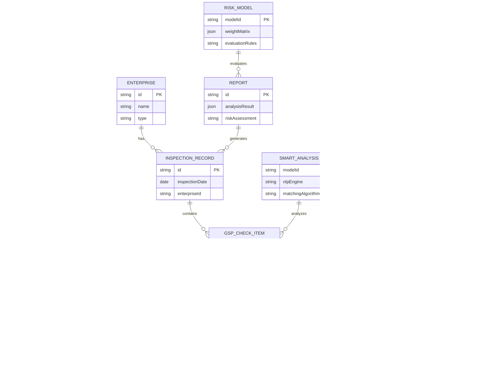

<think>
好的，用户需要帮助他们的项目在中国进行软件著作权登记。首先，我需要了解软件著作权登记的基本要求和流程。根据中国国家版权局的规定，登记需要准备哪些材料呢？通常包括申请表、源代码、用户手册、身份证明等。

接下来，查看用户提供的代码库内容。他们有一个Vue 3项目，包含多个组件和数据文件。例如，有GspReportInterface.vue组件，以及多个数据文件如gspCheckItems.js和pgspCheckItems.js。这些文件中的代码结构是否适合作为登记材料？需要确保代码具有独创性和一定的创造性，不能是简单的功能实现。

用户提供的代码中，主要涉及药品质量管理的缺陷分析和报告生成功能。例如，在gspCheckItems.js中有大量缺陷项的数据结构，这可能展示了系统的核心功能。但著作权保护的是代码的表达形式，而不是功能本身，所以需要挑选能体现独创性的代码部分。

考虑到需要提供部分源代码作为样本，通常要求提交前30页和后30页，或者全部代码如果不足60页。用户可能需要从关键组件中选择有代表性的代码片段。例如，GspReportInterface.vue中的模板和逻辑处理部分，或者数据文件中的复杂结构，这些都能展示项目的独创性。

另外，用户手册或设计文档也是必要的。README.md文件已经存在，但可能需要补充更详细的功能说明和系统架构图。例如，在README中增加系统模块图、主要功能流程图，以及各模块的交互说明，这有助于审查人员理解软件的结构和创意。

还需要注意代码的整理，比如去除注释中的敏感信息，确保所有代码文件有清晰的注释和规范的格式。例如，在Register.vue组件中，表单处理部分展示了用户注册功能，这部分代码结构清晰，适合作为示例。

最后，提醒用户进行在线提交和可能的补正流程。确保所有材料符合格式要求，避免因材料不全或格式错误被退回。可能需要指导用户如何准备和打包这些材料，以及后续的提交步骤。
</think>

在中国进行软件著作权登记，需要准备以下材料并进行以下操作。根据提供的代码库内容，我为您整理具体操作步骤和注意事项：

### 一、核心登记材料准备
1. **源代码准备**（需提供前后各30页，每页50行）

```1:1936:src/data/gspCheckItems.js
export const gspCheckItems = [
  {
    "id": 1,
    "level": "serious",
    "levelName": "严重缺陷",
    "clauseNumber": "**00201",
    "checkItem": "企业应当在药品采购、储存、销售、运输等环节采取有效的质量控制措施，确保药品质量，并按照国家有关要求建立药品追溯系统，实现药品可追溯。",
    "category": "总则",
    "enterpriseType": "零售",
    "appendixContent": "",
    "appendixTitle": ""
  },
  {
    "id": 2,
    "level": "serious",
    "levelName": "严重缺陷",
    "clauseNumber": "**00401",
    "checkItem": "药品经营企业应当依法经营。",
    "category": "总则",
    "enterpriseType": "零售",
    "appendixContent": "",
    "appendixTitle": ""
  },
  {
    "id": 3,
    "level": "serious",
    "levelName": "严重缺陷",
    "clauseNumber": "**00402",
    "checkItem": "药品经营企业应当坚持诚实守信，禁止任何虚假、欺骗行为。",
    "category": "总则",
    "enterpriseType": "零售",
    "appendixContent": "",
    "appendixTitle": ""
  },
  {
    "id": 4,
    "level": "minor",
    "levelName": "一般缺陷",
    "clauseNumber": "12001",
    "checkItem": "企业应当按照有关法律法规及《药品经营质量管理规范》（以下简称《规范》）的要求制定质量管理文件，开展质量管理活动，确保药品质量。",
    "category": "质量管理与职责",
    "enterpriseType": "零售",
    "appendixContent": "",
    "appendixTitle": ""
  },
  {
    "id": 5,
    "level": "serious",
    "levelName": "严重缺陷",
    "clauseNumber": "**12101",
    "checkItem": "企业应当具有与其经营范围和规模相适应的经营条件，包括组织机构、人员、设施设备、质量管理文件，并按照规定设置计算机系统。",
    "category": "质量管理与职责",
    "enterpriseType": "零售",
    "appendixContent": "",
    "appendixTitle": ""
  },
  {
    "id": 6,
    "level": "major",
    "levelName": "主要缺陷",
    "clauseNumber": "*12201",
    "checkItem": "企业负责人是药品质量的主要责任人，负责企业日常管理，负责提供必要的条件，保证质量管理部门和质量管理人员有效履行职责，确保企业按照《规范》要求经营药品。",
    "category": "质量管理与职责",
    "enterpriseType": "零售",
    "appendixContent": "",
    "appendixTitle": ""
  },
{
  "id": 7,
  "level": "major",
  "levelName": "主要缺陷",
  "clauseNumber": "*12301",
  "checkItem": "企业应当设置质量管理部门或者配备质量管理人员。",
  "category": "质量管理与职责",
  "enterpriseType": "零售",
  "appendixContent": "",
  "appendixTitle": ""
},
{
  "id": 8,
  "level": "minor",
  "levelName": "一般缺陷",
  "clauseNumber": "12302",
  "checkItem": "质量管理部门或者质量管理人员负责督促相关部门和岗位人员执行药品管理的法律法规及《规范》要求。",
  "category": "质量管理与职责",
  "enterpriseType": "零售",
  "appendixContent": "",
  "appendixTitle": ""
},
{
  "id": 9,
  "level": "minor",
  "levelName": "一般缺陷",
  "clauseNumber": "12303",
  "checkItem": "质量管理部门或者质量管理人员负责组织制订质量管理文件，并指导、监督文件的执行。",
  "category": "质量管理与职责",
  "enterpriseType": "零售",
  "appendixContent": "",
  "appendixTitle": ""
},
{
  "id": 10,
  "level": "major",
  "levelName": "主要缺陷",
  "clauseNumber": "*12304",
  "checkItem": "质量管理部门或者质量管理人员负责对供货单位及其销售人员资格证明的审核。",
  "category": "质量管理与职责",
  "enterpriseType": "零售",
  "appendixContent": "",
  "appendixTitle": ""
},
{
  "id": 11,
  "level": "major",
  "levelName": "主要缺陷",
  "clauseNumber": "*12305",
  "checkItem": "质量管理部门或者质量管理人员负责对所采购药品合法性的审核。",
  "category": "质量管理与职责",
  "enterpriseType": "零售",
  "appendixContent": "",
  "appendixTitle": ""
},
{
  "id": 12,
  "level": "major",
  "levelName": "主要缺陷",
  "clauseNumber": "*12306",
  "checkItem": "质量管理部门或者质量管理人员负责药品的验收，指导并监督药品采购、储存、陈列、销售等环节的质量管理工作。",
  "category": "质量管理与职责",
  "enterpriseType": "零售",
  "appendixContent": "",
  "appendixTitle": ""
},
{
  "id": 13,
  "level": "minor",
  "levelName": "一般缺陷",
  "clauseNumber": "12307",
  "checkItem": "质量管理部门或者质量管理人员负责药品质量查询及质量信息管理。",
  "category": "质量管理与职责",
  "enterpriseType": "零售",
  "appendixContent": "",
  "appendixTitle": ""
},
{
  "id": 14,
  "level": "minor",
  "levelName": "一般缺陷",
  "clauseNumber": "12308",
  "checkItem": "质量管理部门或者质量管理人员负责药品质量投诉和质量事故的调查、处理及报告。",
  "category": "质量管理与职责",
  "enterpriseType": "零售",
  "appendixContent": "",
  "appendixTitle": ""
},
{
  "id": 15,
  "level": "major",
  "levelName": "主要缺陷",
  "clauseNumber": "*12309",
  "checkItem": "质量管理部门或者质量管理人员负责对不合格药品的确认及处理。",
  "category": "质量管理与职责",
  "enterpriseType": "零售",
  "appendixContent": "",
  "appendixTitle": ""
},
{
  "id": 16,
  "level": "minor",
  "levelName": "一般缺陷",
  "clauseNumber": "12310",
  "checkItem": "质量管理部门或者质量管理人员负责假劣药品的报告",
  "category": "质量管理与职责",
  "enterpriseType": "零售",
  "appendixContent": "",
  "appendixTitle": ""
},
{
  "id": 17,
  "level": "minor",
  "levelName": "一般缺陷",
  "clauseNumber": "12311",
  "checkItem": "质量管理部门或者质量管理人员负责药品不良反应的报告。",
  "category": "质量管理与职责",
  "enterpriseType": "零售",
  "appendixContent": "",
  "appendixTitle": ""
},
{
  "id": 18,
  "level": "minor",
  "levelName": "一般缺陷",
  "clauseNumber": "12312",
  "checkItem": "质量管理部门或者质量管理人员负责开展药品质量管理教育和培训。",
  "category": "质量管理与职责",
  "enterpriseType": "零售",
  "appendixContent": "",
  "appendixTitle": ""
},
{
  "id": 19,
  "level": "minor",
  "levelName": "一般缺陷",
  "clauseNumber": "12313",
  "checkItem": "质量管理部门或者质量管理人员负责计算机系统操作权限的审核、控制及质量管理基础数据的维护。",
  "category": "质量管理与职责",
  "enterpriseType": "零售",
  "appendixContent": "1.负责指导设定系统质量控制功能。2.负责系统操作权限的审核、并定期跟踪检查。3.监督各岗位人员严格按规定流程及要求操作系统。4.负责质量管理基础数据的审核、确认生效及锁定。5.负责经营业务数据修改申请的审核，符合规定要求的方可按程序修改。6.负责处理系统中涉及药品质量的有关问题。",
  "appendixTitle": "计算机系统"
},
{
  "id": 20,
  "level": "minor",
  "levelName": "一般缺陷",
  "clauseNumber": "12314",
  "checkItem": "质量管理部门或者质量管理人员负责组织计量器具的校准及检定工作。",
  "category": "质量管理与职责",
  "enterpriseType": "零售",
  "appendixContent": "",
  "appendixTitle": "计算机系统"
},
{
  "id": 21,
  "level": "major",
  "levelName": "主要缺陷",
  "clauseNumber": "*12315",
  "checkItem": "质量管理部门或者质量管理人员负责指导并监督药学服务工作。",
  "category": "质量管理与职责",
  "enterpriseType": "零售",
  "appendixContent": "",
  "appendixTitle": "计算机系统"
},
{
  "id": 22,
  "level": "minor",
  "levelName": "一般缺陷",
  "clauseNumber": "12316",
  "checkItem": "质量管理部门或者质量管理人员负责其他应当由质量管理部门或者质量管理人员履行的职责。",
  "category": "质量管理与职责",
  "enterpriseType": "零售",
  "appendixContent": "",
  "appendixTitle": "计算机系统"
},
{
  "id": 23,
  "level": "major",
  "levelName": "主要缺陷",
  "clauseNumber": "12401",
  "checkItem": "企业从事药品经营和质量管理工作的人员，应当符合有关法律法规及《规范》规定的资格要求，不得有相关法律法规禁止从业的情形。",
  "category": "人员管理",
  "enterpriseType": "零售",
  "appendixContent": "",
  "appendixTitle": ""
},
{
  "id": 24,
  "level": "major",
  "levelName": "主要缺陷",
  "clauseNumber": "*12501",
  "checkItem": "企业法定代表人或者企业负责人应当具备执业药师资格。",
  "category": "人员管理",
  "enterpriseType": "零售",
  "appendixContent": "",
  "appendixTitle": ""
},
{
  "id": 25,
  "level": "major",
  "levelName": "主要缺陷",
  "clauseNumber": "*12502",
  "checkItem": "企业应当按照国家有关规定配备执业药师，负责处方审核，指导合理用药。",
  "category": "人员管理",
  "enterpriseType": "零售",
  "appendixContent": "",
  "appendixTitle": ""
},
{
  "id": 26,
  "level": "minor",
  "levelName": "一般缺陷",
  "clauseNumber": "12601",
  "checkItem": "质量管理、验收、采购人员应当具有药学或者医学、生物、化学等相关专业学历或者具有药学专业技术职称。",
  "category": "人员管理",
  "enterpriseType": "零售",
  "appendixContent": "",
  "appendixTitle": ""
},
{
  "id": 27,
  "level": "minor",
  "levelName": "一般缺陷",
  "clauseNumber": "12602",
  "checkItem": "从事中药饮片质量管理、验收、采购人员应当具有中药学中专以上学历或者具有中药学专业初级以上专业技术职称。",
  "category": "人员管理",
  "enterpriseType": "零售",
  "appendixContent": "",
  "appendixTitle": ""
},
{
  "id": 28,
  "level": "minor",
  "levelName": "一般缺陷",
  "clauseNumber": "12603",
  "checkItem": "营业员应当具有高中以上文化程度或者符合省级药品监督管理部门规定的条件。",
  "category": "人员管理",
  "enterpriseType": "零售",
  "appendixContent": "",
  "appendixTitle": ""
},
{
  "id": 29,
  "level": "minor",
  "levelName": "一般缺陷",
  "clauseNumber": "12604",
  "checkItem": "中药饮片调剂人员应当具有中药学中专以上学历或者具备中药调剂员资格。",
  "category": "人员管理",
  "enterpriseType": "零售",
  "appendixContent": "",
  "appendixTitle": ""
},
{
  "id": 30,
  "level": "major",
  "levelName": "主要缺陷",
  "clauseNumber": "*12701",
  "checkItem": "企业各岗位人员应当接受相关法律法规及药品专业知识与技能的岗前培训和继续培训，以符合《规范》的要求。",
  "category": "人员管理",
  "enterpriseType": "零售",
  "appendixContent": "",
  "appendixTitle": ""
},
{
  "id": 31,
  "level": "minor",
  "levelName": "一般缺陷",
  "clauseNumber": "12801",
  "checkItem": "企业应当按照培训管理制度制定年度培训计划并开展培训，使相关人员能正确理解并履行职责。",
  "category": "人员管理",
  "enterpriseType": "零售",
  "appendixContent": "",
  "appendixTitle": ""
},
{
  "id": 32,
  "level": "minor",
  "levelName": "一般缺陷",
  "clauseNumber": "12802",
  "checkItem": "培训工作应当做好记录并建立档案。",
  "category": "人员管理",
  "enterpriseType": "零售",
  "appendixContent": "",
  "appendixTitle": ""
},
{
  "id": 33,
  "level": "minor",
  "levelName": "一般缺陷",
  "clauseNumber": "12901",
  "checkItem": "企业应当为销售特殊管理的药品、国家有专门管理要求的药品、冷藏药品的人员接受相应培训提供条件，使其掌握相关法律法规和专业知识。",
  "category": "人员管理",
  "enterpriseType": "零售",
  "appendixContent": "",
  "appendixTitle": ""
},
{
  "id": 34,
  "level": "minor",
  "levelName": "一般缺陷",
  "clauseNumber": "13001",
  "checkItem": "在营业场所内，企业工作人员应当穿着整洁、卫生的工作服。",
  "category": "人员管理",
  "enterpriseType": "零售",
  "appendixContent": "",
  "appendixTitle": ""
},
{
  "id": 35,
  "level": "minor",
  "levelName": "一般缺陷",
  "clauseNumber": "13101",
  "checkItem": "企业应当对直接接触药品岗位的人员进行岗前及年度健康检查，并建立健康档案。",
  "category": "人员管理",
  "enterpriseType": "零售",
  "appendixContent": "",
  "appendixTitle": ""
},
{
  "id": 36,
  "level": "major",
  "levelName": "主要缺陷",
  "clauseNumber": "*13102",
  "checkItem": "患有传染病或者其他可能污染药品的疾病的，不得从事直接接触药品的工作。",
  "category": "人员管理",
  "enterpriseType": "零售",
  "appendixContent": "",
  "appendixTitle": ""
},
{
  "id": 37,
  "level": "major",
  "levelName": "主要缺陷",
  "clauseNumber": "*13201",
  "checkItem": "在药品储存、陈列等区域不得存放与经营活动无关的物品及私人用品。",
  "category": "人员管理",
  "enterpriseType": "零售",
  "appendixContent": "",
  "appendixTitle": ""
},
{
  "id": 38,
  "level": "minor",
  "levelName": "一般缺陷",
  "clauseNumber": "13202",
  "checkItem": "在工作区域内不得有影响药品质量和安全的行为。",
  "category": "人员管理",
  "enterpriseType": "零售",
  "appendixContent": "",
  "appendixTitle": ""
},
{
  "id": 39,
  "level": "major",
  "levelName": "主要缺陷",
  "clauseNumber": "*13301",
  "checkItem": "企业应当按照有关法律法规及《规范》规定，制定符合企业实际的质量管理文件，包括质量管理制度、岗位职责、操作规程、档案、记录和凭证等。",
  "category": "文件",
  "enterpriseType": "零售",
  "appendixContent": "",
  "appendixTitle": ""
},
{
  "id": 40,
  "level": "minor",
  "levelName": "一般缺陷",
  "clauseNumber": "13302",
  "checkItem": "企业应当对质量管理文件定期审核，及时修订。",
  "category": "文件",
  "enterpriseType": "零售",
  "appendixContent": "",
  "appendixTitle": ""
},
{
  "id": 41,
  "level": "major",
  "levelName": "主要缺陷",
  "clauseNumber": "*13401",
  "checkItem": "企业应当采取措施确保各岗位人员正确理解质量管理文件的内容，保证质量管理文件有效执行。",
  "category": "文件",
  "enterpriseType": "零售",
  "appendixContent": "",
  "appendixTitle": ""
},
{
  "id": 42,
  "level": "major",
  "levelName": "主要缺陷",
  "clauseNumber": "*13501",
  "checkItem": "药品零售质量管理制度应当包括以下内容：（一）药品采购、验收、陈列、销售等环节的管理，设置库房的还应当包括储存、养护的管理；（二）供货单位和采购品种的审核；（三）处方药销售的管理；（四）药品拆零的管理；（五）特殊管理的药品和国家有专门管理要求的药品的管理；（六）记录和凭证的管理；（七）收集和查询质量信息的管理；（八）质量事故、质量投诉的管理；（九）中药饮片处方审核、调配、核对的管理；（十）药品有效期的管理；（十一）不合格药品、药品销毁的管理；（十二）环境卫生、人员健康的规定；（十三）提供用药咨询、指导合理用药等药学服务的管理；（十四）人员培训及考核的规定；（十五）药品不良反应报告的规定；（十六）计算机系统的管理；（十七）药品追溯的规定；（十八）其他应当规定的内容。",
  "category": "文件",
  "enterpriseType": "零售",
  "appendixContent": "",
  "appendixTitle": ""
},
{
  "id": 43,
  "level": "minor",
  "levelName": "一般缺陷",
  "clauseNumber": "13601",
  "checkItem": "企业应当明确企业负责人、质量管理、采购、验收、营业员以及处方审核、调配等岗位的职责，设置库房的还应当包括储存、养护等岗位职责。",
  "category": "文件",
  "enterpriseType": "零售",
  "appendixContent": "",
  "appendixTitle": ""
},
{
  "id": 44,
  "level": "major",
  "levelName": "主要缺陷",
  "clauseNumber": "*13701",
  "checkItem": "质量管理岗位、处方审核岗位的职责不得由其他岗位人员代为履行。",
  "category": "文件",
  "enterpriseType": "零售",
  "appendixContent": "",
  "appendixTitle": ""
},
{
  "id": 45,
  "level": "minor",
  "levelName": "一般缺陷",
  "clauseNumber": "13801",
  "checkItem": "药品零售操作规程应当包括：（一）药品采购、验收、销售；（二）处方审核、调配、核对；（三）中药饮片处方审核、调配、核对；（四）药品拆零销售；（五）特殊管理的药品和国家有专门管理要求的药品的销售；（六）营业场所药品陈列及检查；（七）营业场所冷藏药品的存放；（八）计算机系统的操作和管理；（九）设置库房的还应当包括储存和养护的操作规程。",
  "category": "文件",
  "enterpriseType": "零售",
  "appendixContent": "",
  "appendixTitle": ""
},
{
  "id": 46,
  "level": "major",
  "levelName": "主要缺陷",
  "clauseNumber": "*13901",
  "checkItem": "企业应当建立药品采购、验收、销售、陈列检查、温湿度监测、不合格药品处理等相关记录，做到真实、完整、准确、有效和可追溯。",
  "category": "文件",
  "enterpriseType": "零售",
  "appendixContent": "",
  "appendixTitle": ""
},
{
  "id": 47,
  "level": "minor",
  "levelName": "一般缺陷",
  "clauseNumber": "14001",
  "checkItem": "记录及相关凭证应当至少保存5年。",
  "category": "文件",
  "enterpriseType": "零售",
  "appendixContent": "",
  "appendixTitle": ""
},
{
  "id": 48,
  "level": "minor",
  "levelName": "一般缺陷",
  "clauseNumber": "14002",
  "checkItem": "特殊管理的药品的记录及凭证按相关规定保存。",
  "category": "文件",
  "enterpriseType": "零售",
  "appendixContent": "",
  "appendixTitle": ""
},
{
  "id": 49,
  "level": "minor",
  "levelName": "一般缺陷",
  "clauseNumber": "14101",
  "checkItem": "通过计算机系统记录数据时，相关岗位人员应当按照操作规程，通过授权及密码登录计算机系统，进行数据的录入，保证数据原始、真实、准确、安全和可追溯。",
  "category": "文件",
  "enterpriseType": "零售",
  "appendixContent": "1.各操作岗位通过输入用户名、密码等身份确认方式登录系统、并在权限范围内录入或查询数据、未经批准不得修改数据信息。2.修改各类业务经营数据时、操作人员在职责范围内提出申请、经质量管理人员审核批准后方可修改、修改的原因和过程在系统中予以记录。3.系统对各岗位操作人员姓名的记录、根据专有用户名及密码自动生成、不得采用手工编辑或菜单选择等方式录入。4.系统操作、数据记录的日期和时间由系统自动生成、不得采用手工编辑、菜单选择等方式录入。5.企业应当根据计算机管理制度对系统各类记录和数据进行安全管理。6.采用安全、可靠的方式存储、备份。7.按日备份数据。8.备份记录和数据的介质存放于安全场所、防止与服务器同时遭遇灾害造成损坏或丢失。9.记录及凭证应当至少保存5年。特殊管理药品的记录及凭证按相关规定保存。",
  "appendixTitle": "计算机系统"
},
{
  "id": 50,
  "level": "minor",
  "levelName": "一般缺陷",
  "clauseNumber": "14201",
  "checkItem": "电子记录数据应当以安全、可靠方式定期备份。",
  "category": "文件",
  "enterpriseType": "零售",
  "appendixContent": "",
  "appendixTitle": ""
},
{
  "id": 51,
  "level": "major",
  "levelName": "主要缺陷",
  "clauseNumber": "*14301",
  "checkItem": "企业的营业场所应当与其药品经营范围、经营规模相适应。",
  "category": "设施与设备",
  "enterpriseType": "零售",
  "appendixContent": "",
  "appendixTitle": ""
},
{
  "id": 52,
  "level": "minor",
  "levelName": "一般缺陷",
  "clauseNumber": "14302",
  "checkItem": "企业的营业场所应当与药品储存、办公、生活辅助及其他区域分开。",
  "category": "设施与设备",
  "enterpriseType": "零售",
  "appendixContent": "",
  "appendixTitle": ""
},
{
  "id": 53,
  "level": "minor",
  "levelName": "一般缺陷",
  "clauseNumber": "14401",
  "checkItem": "营业场所应当具有相应设施或者采取其他有效措施，避免药品受室外环境的影响，并做到宽敞、明亮、整洁、卫生。",
  "category": "设施与设备",
  "enterpriseType": "零售",
  "appendixContent": "",
  "appendixTitle": ""
},
{
  "id": 54,
  "level": "minor",
  "levelName": "一般缺陷",
  "clauseNumber": "14501",
  "checkItem": "企业营业场所应当有货架和柜台。",
  "category": "设施与设备",
  "enterpriseType": "零售",
  "appendixContent": "",
  "appendixTitle": ""
},
{
  "id": 55,
  "level": "minor",
  "levelName": "一般缺陷",
  "clauseNumber": "14502",
  "checkItem": "应当有监测、调控温度的设备。",
  "category": "设施与设备",
  "enterpriseType": "零售",
  "appendixContent": "",
  "appendixTitle": ""
},
{
  "id": 56,
  "level": "minor",
  "levelName": "一般缺陷",
  "clauseNumber": "14503",
  "checkItem": "经营中药饮片的，有存放饮片和处方调配的设备。",
  "category": "设施与设备",
  "enterpriseType": "零售",
  "appendixContent": "",
  "appendixTitle": ""
},
{
  "id": 57,
  "level": "serious",
  "levelName": "严重缺陷",
  "clauseNumber": "**14504",
  "checkItem": "经营冷藏药品的，有专用冷藏设备。",
  "category": "设施与设备",
  "enterpriseType": "零售",
  "appendixContent": "",
  "appendixTitle": ""
},
{
  "id": 58,
  "level": "major",
  "levelName": "主要缺陷",
  "clauseNumber": "*14505",
  "checkItem": "经营第二类精神药品、毒性中药品种和罂粟壳的，有符合安全规定的专用存放设备。",
  "category": "设施与设备",
  "enterpriseType": "零售",
  "appendixContent": "",
  "appendixTitle": ""
},
{
  "id": 59,
  "level": "minor",
  "levelName": "一般缺陷",
  "clauseNumber": "14506",
  "checkItem": "药品拆零销售所需的调配工具、包装用品。",
  "category": "设施与设备",
  "enterpriseType": "零售",
  "appendixContent": "",
  "appendixTitle": ""
},
{
  "id": 60,
  "level": "major",
  "levelName": "主要缺陷",
  "clauseNumber": "*14601",
  "checkItem": "企业应当建立能够符合经营和质量管理要求的计算机系统，并满足药品追溯的要求。",
  "category": "设施与设备",
  "enterpriseType": "零售",
  "appendixContent": "1.药品零售企业系统的硬件、软件、网络环境及管理人员的配备,应当满足企业经营规模和质量管理的实际需要。2.药品零售企业系统的销售管理应当符合以下要求:2.1.建立包括供货单位、经营品种等相关内容的质量管理基础数据。2.2.依据质量管理基础数据,自动识别处方药、特殊管理的药品以及其他国家有专门管理要求的药品。2.3.拒绝国家有专门管理要求的药品超数量销售。2.4.与结算系统、开票系统对接，对每笔销售自动打印销售票据,并自动生成销售记录。2.5.依据质量管理基础数据,对拆零药品单独建立销售记录，对拆零药品实施安全、合理的销售控制。2.6.依据质量管理基础数据,定期自动生成陈列药品检查计划。2.7.依据质量管理基础数据，对药品有效期进行跟踪，对近效期的给予预警提示,超有效期的自动锁定及停销。3.及时对系统进行升级，完善系统功能。",
  "appendixTitle": "计算机系统"
},
{
  "id": 61,
  "level": "minor",
  "levelName": "一般缺陷",
  "clauseNumber": "14701",
  "checkItem": "企业设置库房的，应当做到库房内墙、顶光洁，地面平整，门窗结构严密；有可靠的安全防护、防盗等措施。",
  "category": "设施与设备",
  "enterpriseType": "零售",
  "appendixContent": "",
  "appendixTitle": ""
},
{
  "id": 62,
  "level": "minor",
  "levelName": "一般缺陷",
  "clauseNumber": "14801",
  "checkItem": "应当有药品与地面之间有效隔离的设备。",
  "category": "设施与设备",
  "enterpriseType": "零售",
  "appendixContent": "",
  "appendixTitle": ""
},
{
  "id": 63,
  "level": "minor",
  "levelName": "一般缺陷",
  "clauseNumber": "14802",
  "checkItem": "应当有避光、通风、防潮、防虫、防鼠等设备。",
  "category": "设施与设备",
  "enterpriseType": "零售",
  "appendixContent": "",
  "appendixTitle": ""
},
{
  "id": 64,
  "level": "major",
  "levelName": "主要缺陷",
  "clauseNumber": "*14803",
  "checkItem": "应当有有效监测和调控温湿度的设备。",
  "category": "设施与设备",
  "enterpriseType": "零售",
  "appendixContent": "",
  "appendixTitle": ""
},
{
  "id": 65,
  "level": "minor",
  "levelName": "一般缺陷",
  "clauseNumber": "14804",
  "checkItem": "应当有符合储存作业要求的照明设备。",
  "category": "设施与设备",
  "enterpriseType": "零售",
  "appendixContent": "",
  "appendixTitle": ""
},
{
  "id": 66,
  "level": "minor",
  "levelName": "一般缺陷",
  "clauseNumber": "14805",
  "checkItem": "应当有验收专用场所。",
  "category": "设施与设备",
  "enterpriseType": "零售",
  "appendixContent": "1.药品待验区域有明显标识,并与其他区域有效隔离。2.待验区域符合待验药品的储存温度要求。3.验收设施设备清洁，不得污染药品。",
  "appendixTitle": "收货与验收"
}
...
},
{
  "id": 73,
  "level": "minor",
  "levelName": "一般缺陷",
  "clauseNumber": "15202",
  "checkItem": "企业采购药品应当与供货单位签订质量保证协议。",
  "category": "采购与验收",
  "enterpriseType": "零售",
  "appendixContent": "",
  "appendixTitle": ""
},
{
  "id": 74,
  "level": "minor",
  "levelName": "一般缺陷",
  "clauseNumber": "15203",
  "checkItem": "采购中涉及的首营企业、首营品种，应当填写相关申请表格，经质量管理部门（人员）审核。必要时应当组织实地考察，对供货单位质量管理体系进行评价。",
  "category": "采购与验收",
  "enterpriseType": "零售",
  "appendixContent": "",
  "appendixTitle": ""
},
{
  "id": 75,
  "level": "major",
  "levelName": "主要缺陷",
  "clauseNumber": "*15204",
  "checkItem": "对首营企业的审核，应当查验加盖其公章原印章的以下资料，确认真实、有效：（一）《药品生产许可证》或者《药品经营许可证》复印件；（二）营业执照、税务登记、组织机构代码的证件复印件，及上一年度企业年度报告公示情况；（三）《药品生产质量管理规范》认证证书或者《药品经营质量管理规范》认证证书复印件；（四）相关印章、随货同行单（票）样式；（五）开户户名、开户银行及账号。",
  "category": "采购与验收",
  "enterpriseType": "零售",
  "appendixContent": "",
  "appendixTitle": ""
},
{
  "id": 76,
  "level": "major",
  "levelName": "主要缺陷",
  "clauseNumber": "*15205",
  "checkItem": "采购首营品种应当审核药品的合法性，索取加盖供货单位公章原印章的药品生产或者进口批准证明文件复印件并予以审核，审核无误的方可采购。",
  "category": "采购与验收",
  "enterpriseType": "零售",
  "appendixContent": "",
  "appendixTitle": ""
},
{
  "id": 77,
  "level": "minor",
  "levelName": "一般缺陷",
  "clauseNumber": "15206",
  "checkItem": "首营品种审核资料应当归入药品质量档案。",
  "category": "采购与验收",
  "enterpriseType": "零售",
  "appendixContent": "",
  "appendixTitle": ""
},
{
  "id": 78,
  "level": "major",
  "levelName": "主要缺陷",
  "clauseNumber": "*15207",
  "checkItem": "企业应当核实、留存供货单位销售人员以下资料：（一）加盖供货单位公章原印章的销售人员身份证复印件；（二）加盖供货单位公章原印章和法定代表人印章或者签名的授权书，授权书应当载明被授权人姓名、身份证号码，以及授权销售的品种、地域、期限；（三）供货单位及供货品种相关资料。",
  "category": "采购与验收",
  "enterpriseType": "零售",
  "appendixContent": "",
  "appendixTitle": ""
},
{
  "id": 79,
  "level": "minor",
  "levelName": "一般缺陷",
  "clauseNumber": "15208",
  "checkItem": "企业与供货单位签订的质量保证协议至少包括以下内容：（一）明确双方质量责任；（二）供货单位应当提供符合规定的资料且对其真实性、有效性负责；（三）供货单位应当按照国家规定开具发票；（四）药品质量符合药品标准等有关要求；（五）药品包装、标签、说明书符合有关规定；（六）药品运输的质量保证及责任；（七）质量保证协议的有效期限。",
  "category": "采购与验收",
  "enterpriseType": "零售",
  "appendixContent": "",
  "appendixTitle": ""
},
{
  "id": 80,
  "level": "serious",
  "levelName": "严重缺陷",
  "clauseNumber": "**15209",
  "checkItem": "采购药品时，企业应当向供货单位索取发票。",
  "category": "采购与验收",
  "enterpriseType": "零售",
  "appendixContent": "",
  "appendixTitle": ""
},
{
  "id": 81,
  "level": "minor",
  "levelName": "一般缺陷",
  "clauseNumber": "15210",
  "checkItem": "发票应当列明药品的通用名称、规格、单位、数量、单价、金额等；不能全部列明的，应当附《销售货物或者提供应税劳务清单》，并加盖供货单位发票专用章原印章、注明税票号码。",
  "category": "采购与验收",
  "enterpriseType": "零售",
  "appendixContent": "",
  "appendixTitle": ""
}
...
},
{
  "id": 86,
  "level": "major",
  "levelName": "主要缺陷",
  "clauseNumber": "*15401",
  "checkItem": "企业应当按规定的程序和要求对到货药品逐批进行验收。",
  "category": "采购与验收",
  "enterpriseType": "零售",
  "appendixContent": "1.企业应当按照国家有关法律法规及《规范》要求,制定药品验收标准。2.对药品收货与验收过程中出现的不符合质量标准或疑似假、劣药的情况,应当交由质量管理部门(人员)按照有关规定进行处理,必要时上报药品监督管理部门。3.企业应当根据不同类别和特性的药品,明确待验药品的验收时限,待验药品要在规定时限内验收。4.验收中发现的问题应当尽快处理，防止对药品质量造成影响。",
  "appendixTitle": "收货与验收"
},
{
  "id": 87,
  "level": "minor",
  "levelName": "一般缺陷",
  "clauseNumber": "15402",
  "checkItem": "验收药品应当做好验收记录，包括药品的通用名称、剂型、规格、批准文号、批号、生产日期、有效期、生产厂商、供货单位、到货数量、到货日期、验收合格数量、验收结果等内容。",
  "category": "采购与验收",
  "enterpriseType": "零售",
  "appendixContent": "",
  "appendixTitle": ""
},
{
  "id": 88,
  "level": "minor",
  "levelName": "一般缺陷",
  "clauseNumber": "15403",
  "checkItem": "中药饮片验收记录应当包括品名、规格、批号、产地、生产日期、生产厂商、供货单位、到货数量、验收合格数量等内容，实施批准文号管理的中药饮片还应当记录批准文号。",
  "category": "采购与验收",
  "enterpriseType": "零售",
  "appendixContent": "",
  "appendixTitle": ""
},
{
  "id": 89,
  "level": "minor",
  "levelName": "一般缺陷",
  "clauseNumber": "15404",
  "checkItem": "验收不合格的应当注明不合格事项及处置措施。",
  "category": "采购与验收",
  "enterpriseType": "零售",
  "appendixContent": "",
  "appendixTitle": ""
},
{
  "id": 90,
  "level": "minor",
  "levelName": "一般缺陷",
  "clauseNumber": "15405",
  "checkItem": "验收人员应当在验收记录上签署姓名和验收日期。",
  "category": "采购与验收",
  "enterpriseType": "零售",
  "appendixContent": "",
  "appendixTitle": ""
},
{
  "id": 91,
  "level": "minor",
  "levelName": "一般缺陷",
  "clauseNumber": "15406",
  "checkItem": "验收抽取的样品应当具有代表性。",
  "category": "采购与验收",
  "enterpriseType": "零售",
  "appendixContent": "1.验收抽取的样品应当具有代表性。2.对到货的同一批号的整件药品按照堆码情况随机抽样检查。3.整件数量在2件及以下的应当全部抽样检查;整件数量在2件以上至50件以下的至少抽样检查3件;整件数量在50件以上的每增加50件,至少增加抽样检查1件,不足50件的按50件计。4.对抽取的整件药品应当开箱抽样检查。5.应当从每整件的上、中、下不同位置随机抽取3个最小包装进行检查,对存在封口不牢、标签污损、有明显重量差异或外观异常等情况的,至少再加一倍抽样数量进行检查。6.到货的非整件药品应当逐箱检查，对同一批号的药品，至少随机抽取一个最小包装进行检查。",
  "appendixTitle": "收货与验收"
},
{
  "id": 92,
  "level": "major",
  "levelName": "主要缺陷",
  "clauseNumber": "*15501",
  "checkItem": "冷藏药品到货时，应当对其运输方式及运输过程的温度记录、运输时间等质量控制状况进行重点检查并记录，不符合温度要求的应当拒收。",
  "category": "采购与验收",
  "enterpriseType": "零售",
  "appendixContent": "1.冷藏、冷冻药品到货时,应当查验冷藏车、车载冷藏箱或保温箱的温度状况,核查并留存运输过程和到货时的温度记录。2.收货人员根据运输单据所载明的启运日期，检查是否符合协议约定的在途时限，对不符合约定时限的，应当报质量管理部门(人员)处理。3.供货方委托运输药品的，采购部门(人员)应当提前向供货单位索要委托的承运方式、承运单位、启运时间等信息,并将上述情况提前告知收货人员。4.收货人员在药品到货后，要逐一核对承运方式、承运单位、启运时间等信息，不一致的应当通知采购部门(人员)并报质量管理部门处理。5.对未采用规定的冷藏设施运输的或者温度不符合要求的应当拒收，做好记录并报质量管理部门（人员）处理。",
  "appendixTitle": "收货与验收"
},
{
  "id": 93,
  "level": "minor",
  "levelName": "一般缺陷",
  "clauseNumber": "15601",
  "checkItem": "验收药品应当按照药品批号查验同批号的检验报告书。",
  "category": "采购与验收",
  "enterpriseType": "零售",
  "appendixContent": "",
  "appendixTitle": ""
},
{
  "id": 94,
  "level": "minor",
  "levelName": "一般缺陷",
  "clauseNumber": "15602",
  "checkItem": "供货单位为批发企业的，检验报告书应当加盖其质量管理专用章原印章。检验报告书的传递和保存可以采用电子数据形式，但应当保证其合法性和有效性。",
  "category": "采购与验收",
  "enterpriseType": "零售",
  "appendixContent": "",
  "appendixTitle": ""
},
{
  "id": 95,
  "level": "major",
  "levelName": "主要缺陷",
  "clauseNumber": "*15701",
  "checkItem": "特殊管理的药品应当按照相关规定进行验收。",
  "category": "采购与验收",
  "enterpriseType": "零售",
  "appendixContent": "",
  "appendixTitle": ""
},
{
  "id": 96,
  "level": "minor",
  "levelName": "一般缺陷",
  "clauseNumber": "15801",
  "checkItem": "验收合格的药品应当及时入库或者上架。",
  "category": "采购与验收",
  "enterpriseType": "零售",
  "appendixContent": "",
  "appendixTitle": ""
},
{
  "id": 97,
  "level": "minor",
  "levelName": "一般缺陷",
  "clauseNumber": "15802",
  "checkItem": "验收不合格的，不得入库或者上架，并报告质量管理人员处理。",
  "category": "采购与验收",
  "enterpriseType": "零售",
  "appendixContent": "1.对于不符合验收标准的，不得入库,并报质量管理部门处理。2.对于相关证明文件不全或内容与到货药品不符的,不得入库，并交质量管理部门处理。",
  "appendixTitle": "收货与验收"
},
{
  "id": 98,
  "level": "minor",
  "levelName": "一般缺陷",
  "clauseNumber": "15901",
  "checkItem": "企业应当对营业场所温度进行监测和调控，以使营业场所的温度符合常温要求。",
  "category": "陈列与储存",
  "enterpriseType": "零售",
  "appendixContent": "",
  "appendixTitle": ""
},
{
  "id": 99,
  "level": "minor",
  "levelName": "一般缺陷",
  "clauseNumber": "16001",
  "checkItem": "企业应当定期进行卫生检查，保持环境整洁。",
  "category": "陈列与储存",
  "enterpriseType": "零售",
  "appendixContent": "",
  "appendixTitle": ""
},
{
  "id": 100,
  "level": "minor",
  "levelName": "一般缺陷",
  "clauseNumber": "16002",
  "checkItem": "存放、陈列药品的设备应当保持清洁卫生，不得放置与销售活动无关的物品，并采取防虫、防鼠等措施，防止污染药品。",
  "category": "陈列与储存",
  "enterpriseType": "零售",
  "appendixContent": "",
  "appendixTitle": ""
},
{
  "id": 101,
  "level": "major",
  "levelName": "主要缺陷",
  "clauseNumber": "*16101",
  "checkItem": "药品应当按剂型、用途以及储存要求分类陈列。",
  "category": "陈列与储存",
  "enterpriseType": "零售",
  "appendixContent": "",
  "appendixTitle": ""
},
{
  "id": 102,
  "level": "minor",
  "levelName": "一般缺陷",
  "clauseNumber": "16102",
  "checkItem": "药品陈列应当设置醒目标志，类别标签字迹清晰、放置准确。",
  "category": "陈列与储存",
  "enterpriseType": "零售",
  "appendixContent": "",
  "appendixTitle": ""
},
{
  "id": 103,
  "level": "minor",
  "levelName": "一般缺陷",
  "clauseNumber": "16103",
  "checkItem": "陈列的药品应当放置于货架（柜），摆放整齐有序。",
  "category": "陈列与储存",
  "enterpriseType": "零售",
  "appendixContent": "",
  "appendixTitle": ""
},
{
  "id": 104,
  "level": "minor",
  "levelName": "一般缺陷",
  "clauseNumber": "16104",
  "checkItem": "陈列的药品应当避免阳光直射。",
  "category": "陈列与储存",
  "enterpriseType": "零售",
  "appendixContent": "",
  "appendixTitle": ""
},
{
  "id": 105,
  "level": "major",
  "levelName": "主要缺陷",
  "clauseNumber": "*16105",
  "checkItem": "处方药、非处方药分区陈列，并有处方药、非处方药专用标识。",
  "category": "陈列与储存",
  "enterpriseType": "零售",
  "appendixContent": "",
  "appendixTitle": ""
},
{
  "id": 106,
  "level": "major",
  "levelName": "主要缺陷",
  "clauseNumber": "*16106",
  "checkItem": "处方药不得采用开架自选的方式陈列和销售。",
  "category": "陈列与储存",
  "enterpriseType": "零售",
  "appendixContent": "",
  "appendixTitle": ""
},
{
  "id": 107,
  "level": "major",
  "levelName": "主要缺陷",
  "clauseNumber": "*16107",
  "checkItem": "外用药与其他药品应当分开摆放。",
  "category": "陈列与储存",
  "enterpriseType": "零售",
  "appendixContent": "",
  "appendixTitle": ""
},
{
  "id": 108,
  "level": "minor",
  "levelName": "一般缺陷",
  "clauseNumber": "16108",
  "checkItem": "拆零销售的药品集中存放于拆零专柜或者专区。",
  "category": "陈列与储存",
  "enterpriseType": "零售",
  "appendixContent": "",
  "appendixTitle": ""
},
{
  "id": 109,
  "level": "minor",
  "levelName": "一般缺陷",
  "clauseNumber": "16109",
  "checkItem": "第二类精神药品、毒性中药品种和罂粟壳不得陈列。",
  "category": "陈列与储存",
  "enterpriseType": "零售",
  "appendixContent": "",
  "appendixTitle": ""
},
{
  "id": 110,
  "level": "major",
  "levelName": "主要缺陷",
  "clauseNumber": "*16110",
  "checkItem": "冷藏药品应当放置在冷藏设备中，保证存放温度符合要求。",
  "category": "陈列与储存",
  "enterpriseType": "零售",
  "appendixContent": "",
  "appendixTitle": ""
},
{
  "id": 111,
  "level": "minor",
  "levelName": "一般缺陷",
  "clauseNumber": "16111",
  "checkItem": "按规定对冷藏设备温度进行监测和记录。",
  "category": "陈列与储存",
  "enterpriseType": "零售",
  "appendixContent": "",
  "appendixTitle": ""
},
{
  "id": 112,
  "level": "minor",
  "levelName": "一般缺陷",
  "clauseNumber": "16112",
  "checkItem": "中药饮片柜斗谱的书写应当正名正字。",
  "category": "陈列与储存",
  "enterpriseType": "零售",
  "appendixContent": "",
  "appendixTitle": ""
},
{
  "id": 113,
  "level": "minor",
  "levelName": "一般缺陷",
  "clauseNumber": "16113",
  "checkItem": "装斗前应当复核，防止错斗、串斗。",
  "category": "陈列与储存",
  "enterpriseType": "零售",
  "appendixContent": "",
  "appendixTitle": ""
},
{
  "id": 114,
  "level": "minor",
  "levelName": "一般缺陷",
  "clauseNumber": "16114",
  "checkItem": "应当定期清斗，防止饮片生虫、发霉、变质。",
  "category": "陈列与储存",
  "enterpriseType": "零售",
  "appendixContent": "",
  "appendixTitle": ""
},
{
  "id": 115,
  "level": "minor",
  "levelName": "一般缺陷",
  "clauseNumber": "16115",
  "checkItem": "不同批号的饮片装斗前应当清斗并记录。",
  "category": "陈列与储存",
  "enterpriseType": "零售",
  "appendixContent": "",
  "appendixTitle": ""
},
{
  "id": 116,
  "level": "major",
  "levelName": "主要缺陷",
  "clauseNumber": "*16116",
  "checkItem": "经营非药品应当设置专区，与药品陈列区域明显隔离，并有醒目标志。",
  "category": "陈列与储存",
  "enterpriseType": "零售",
  "appendixContent": "",
  "appendixTitle": ""
},
{
  "id": 117,
  "level": "minor",
  "levelName": "一般缺陷",
  "clauseNumber": "16201",
  "checkItem": "企业应当定期对陈列、存放的药品进行检查，重点检查拆零药品和易变质、近效期、摆放时间较长的药品以及中药饮片。",
  "category": "陈列与储存",
  "enterpriseType": "零售",
  "appendixContent": "",
  "appendixTitle": ""
},
{
  "id": 118,
  "level": "major",
  "levelName": "主要缺陷",
  "clauseNumber": "*16202",
  "checkItem": "发现有质量疑问的药品应当及时撤柜，停止销售，由质量管理人员确认和处理，并保留相关记录。",
  "category": "陈列与储存",
  "enterpriseType": "零售",
  "appendixContent": "",
  "appendixTitle": ""
},
{
  "id": 119,
  "level": "minor",
  "levelName": "一般缺陷",
  "clauseNumber": "16301",
  "checkItem": "企业应当对药品的有效期进行跟踪管理，防止近效期药品售出后可能发生的过期使用。",
  "category": "陈列与储存",
  "enterpriseType": "零售",
  "appendixContent": "",
  "appendixTitle": ""
},
{
  "id": 120,
  "level": "minor",
  "levelName": "一般缺陷",
  "clauseNumber": "16401",
  "checkItem": "企业设置库房的，应当根据药品的质量特性对药品进行合理储存。",
  "category": "陈列与储存",
  "enterpriseType": "零售",
  "appendixContent": "",
  "appendixTitle": ""
},
{
  "id": 121,
  "level": "major",
  "levelName": "主要缺陷",
  "clauseNumber": "*16402",
  "checkItem": "企业应当按包装标示的温度要求储存药品，包装上没有标示具体温度的，按照《中华人民共和国药典》规定的贮藏要求进行储存。",
  "category": "陈列与储存",
  "enterpriseType": "零售",
  "appendixContent": "",
  "appendixTitle": ""
},
{
  "id": 122,
  "level": "minor",
  "levelName": "一般缺陷",
  "clauseNumber": "16403",
  "checkItem": "储存药品相对湿度为35%～75%。",
  "category": "陈列与储存",
  "enterpriseType": "零售",
  "appendixContent": "",
  "appendixTitle": ""
},
{
  "id": 123,
  "level": "minor",
  "levelName": "一般缺陷",
  "clauseNumber": "16404",
  "checkItem": "在人工作业的库房储存药品，按质量状态实行色标管理：合格药品为绿色，不合格药品为红色，待确定药品为黄色。",
  "category": "陈列与储存",
  "enterpriseType": "零售",
  "appendixContent": "",
  "appendixTitle": ""
},
{
  "id": 124,
  "level": "minor",
  "levelName": "一般缺陷",
  "clauseNumber": "16405",
  "checkItem": "储存药品应当按照要求采取避光、遮光、通风、防潮、防虫、防鼠等措施。",
  "category": "陈列与储存",
  "enterpriseType": "零售",
  "appendixContent": "",
  "appendixTitle": ""
},
{
  "id": 125,
  "level": "minor",
  "levelName": "一般缺陷",
  "clauseNumber": "16406",
  "checkItem": "搬运和堆码药品应当严格按照外包装标示要求规范操作，堆码高度符合包装图示要求，避免损坏药品包装。",
  "category": "陈列与储存",
  "enterpriseType": "零售",
  "appendixContent": "",
  "appendixTitle": ""
},
{
  "id": 126,
  "level": "major",
  "levelName": "主要缺陷",
  "clauseNumber": "*16407",
  "checkItem": "药品按批号堆码，不同批号的药品不得混垛。",
  "category": "陈列与储存",
  "enterpriseType": "零售",
  "appendixContent": "",
  "appendixTitle": ""
},
{
  "id": 127,
  "level": "major",
  "levelName": "主要缺陷",
  "clauseNumber": "*16408",
  "checkItem": "药品堆码垛间距不小于5厘米，与库房内墙、顶、温度调控设备及管道等设施间距不小于30厘米，与地面间距不小于10厘米。",
  "category": "陈列与储存",
  "enterpriseType": "零售",
  "appendixContent": "",
  "appendixTitle": ""
},
{
  "id": 128,
  "level": "major",
  "levelName": "主要缺陷",
  "clauseNumber": "*16409",
  "checkItem": "药品与非药品、外用药与其他药品分开存放。",
  "category": "陈列与储存",
  "enterpriseType": "零售",
  "appendixContent": "",
  "appendixTitle": ""
},
{
  "id": 129,
  "level": "major",
  "levelName": "主要缺陷",
  "clauseNumber": "*16410",
  "checkItem": "中药饮片专库存放。",
  "category": "陈列与储存",
  "enterpriseType": "零售",
  "appendixContent": "",
  "appendixTitle": ""
}
...
},
{
  "id": 142,
  "level": "minor",
  "levelName": "一般缺陷",
  "clauseNumber": "16423",
  "checkItem": "养护人员应当定期汇总、分析养护信息。",
  "category": "陈列与储存",
  "enterpriseType": "零售",
  "appendixContent": "",
  "appendixTitle": ""
},
{
  "id": 143,
  "level": "minor",
  "levelName": "一般缺陷",
  "clauseNumber": "16424",
  "checkItem": "药品因破损而导致液体、气体、粉末泄漏时，应当迅速采取安全处理措施，防止对储存环境和其他药品造成污染。",
  "category": "陈列与储存",
  "enterpriseType": "零售",
  "appendixContent": "",
  "appendixTitle": ""
},
{
  "id": 144,
  "level": "minor",
  "levelName": "一般缺陷",
  "clauseNumber": "16425",
  "checkItem": "对质量可疑的药品应当立即采取停售措施，同时报告质量管理部门确认。",
  "category": "陈列与储存",
  "enterpriseType": "零售",
  "appendixContent": "",
  "appendixTitle": ""
},
{
  "id": 145,
  "level": "minor",
  "levelName": "一般缺陷",
  "clauseNumber": "16426",
  "checkItem": "对存在质量问题的药品应当存放于标志明显的专用场所，并有效隔离，不得销售。",
  "category": "陈列与储存",
  "enterpriseType": "零售",
  "appendixContent": "",
  "appendixTitle": ""
},
{
  "id": 146,
  "level": "minor",
  "levelName": "一般缺陷",
  "clauseNumber": "16427",
  "checkItem": "怀疑为假药的，及时报告药品监督管理部门。",
  "category": "陈列与储存",
  "enterpriseType": "零售",
  "appendixContent": "",
  "appendixTitle": ""
},
{
  "id": 147,
  "level": "major",
  "levelName": "主要缺陷",
  "clauseNumber": "*16428",
  "checkItem": "对存在质量问题的特殊管理的药品，应当按照国家有关规定处理。",
  "category": "陈列与储存",
  "enterpriseType": "零售",
  "appendixContent": "",
  "appendixTitle": ""
},
{
  "id": 148,
  "level": "major",
  "levelName": "主要缺陷",
  "clauseNumber": "*16429",
  "checkItem": "不合格药品的处理过程应当有完整的手续和记录。",
  "category": "陈列与储存",
  "enterpriseType": "零售",
  "appendixContent": "",
  "appendixTitle": ""
},
{
  "id": 149,
  "level": "minor",
  "levelName": "一般缺陷",
  "clauseNumber": "16430",
  "checkItem": "对不合格药品应当查明并分析原因，及时采取预防措施。",
  "category": "陈列与储存",
  "enterpriseType": "零售",
  "appendixContent": "",
  "appendixTitle": ""
},
{
  "id": 150,
  "level": "minor",
  "levelName": "一般缺陷",
  "clauseNumber": "16431",
  "checkItem": "企业应当对库存药品定期盘点，做到账、货相符。",
  "category": "陈列与储存",
  "enterpriseType": "零售",
  "appendixContent": "",
  "appendixTitle": ""
},
{
  "id": 151,
  "level": "minor",
  "levelName": "一般缺陷",
  "clauseNumber": "16501",
  "checkItem": "企业应当在营业场所的显著位置悬挂《药品经营许可证》、营业执照、执业药师注册证等。",
  "category": "销售管理",
  "enterpriseType": "零售",
  "appendixContent": "",
  "appendixTitle": ""
},
{
  "id": 152,
  "level": "minor",
  "levelName": "一般缺陷",
  "clauseNumber": "16601",
  "checkItem": "营业人员应当佩戴有照片、姓名、岗位等内容的工作牌，是执业药师和药学技术人员的，工作牌还应当标明执业资格或者药学专业技术职称。",
  "category": "销售管理",
  "enterpriseType": "零售",
  "appendixContent": "",
  "appendixTitle": ""
},
{
  "id": 153,
  "level": "minor",
  "levelName": "一般缺陷",
  "clauseNumber": "16602",
  "checkItem": "在岗执业的执业药师应当挂牌明示。",
  "category": "销售管理",
  "enterpriseType": "零售",
  "appendixContent": "",
  "appendixTitle": ""
},
{
  "id": 154,
  "level": "minor",
  "levelName": "一般缺陷",
  "clauseNumber": "16701",
  "checkItem": "销售处方药，处方应当经执业药师审核后方可调配。",
  "category": "销售管理",
  "enterpriseType": "零售",
  "appendixContent": "",
  "appendixTitle": ""
},
{
  "id": 155,
  "level": "minor",
  "levelName": "一般缺陷",
  "clauseNumber": "16702",
  "checkItem": "对处方所列药品不得擅自更改或代用，对有配伍禁忌或超剂量的处方，应当拒绝调配，但经处方医师更正或重新签字确认的，可以调配。",
  "category": "销售管理",
  "enterpriseType": "零售",
  "appendixContent": "",
  "appendixTitle": ""
},
{
  "id": 156,
  "level": "minor",
  "levelName": "一般缺陷",
  "clauseNumber": "16703",
  "checkItem": "调配处方后经过核对方可销售。",
  "category": "销售管理",
  "enterpriseType": "零售",
  "appendixContent": "",
  "appendixTitle": ""
},
{
  "id": 157,
  "level": "minor",
  "levelName": "一般缺陷",
  "clauseNumber": "16704",
  "checkItem": "处方审核、调配、核对人员应当在处方上签字或盖章，并按照有关规定保存处方或其复印件。",
  "category": "销售管理",
  "enterpriseType": "零售",
  "appendixContent": "",
  "appendixTitle": ""
},
{
  "id": 158,
  "level": "minor",
  "levelName": "一般缺陷",
  "clauseNumber": "16705",
  "checkItem": "销售近效期药品应当向顾客告知有效期。",
  "category": "销售管理",
  "enterpriseType": "零售",
  "appendixContent": "",
  "appendixTitle": ""
},
{
  "id": 159,
  "level": "minor",
  "levelName": "一般缺陷",
  "clauseNumber": "16706",
  "checkItem": "销售中药饮片做到计量准确，并告知煎服方法及注意事项。",
  "category": "销售管理",
  "enterpriseType": "零售",
  "appendixContent": "",
  "appendixTitle": ""
},
{
  "id": 160,
  "level": "minor",
  "levelName": "一般缺陷",
  "clauseNumber": "16707",
  "checkItem": "提供中药饮片代煎服务，应当符合国家有关规定。",
  "category": "销售管理",
  "enterpriseType": "零售",
  "appendixContent": "",
  "appendixTitle": ""
},
{
  "id": 161,
  "level": "major",
  "levelName": "主要缺陷",
  "clauseNumber": "*16801",
  "checkItem": "企业销售药品应当开具销售凭证，包括药品名称、生产厂商、数量、价格、批号、规格等内容。",
  "category": "销售管理",
  "enterpriseType": "零售",
  "appendixContent": "",
  "appendixTitle": ""
},
{
  "id": 162,
  "level": "minor",
  "levelName": "一般缺陷",
  "clauseNumber": "16802",
  "checkItem": "企业应当做好销售记录。",
  "category": "销售管理",
  "enterpriseType": "零售",
  "appendixContent": "",
  "appendixTitle": ""
},
{
  "id": 163,
  "level": "minor",
  "levelName": "一般缺陷",
  "clauseNumber": "16901",
  "checkItem": "企业负责拆零销售的人员应当经过专门的培训。",
  "category": "销售管理",
  "enterpriseType": "零售",
  "appendixContent": "",
  "appendixTitle": ""
},
{
  "id": 164,
  "level": "minor",
  "levelName": "一般缺陷",
  "clauseNumber": "16902",
  "checkItem": "拆零的工作台及工具保持清洁、卫生，防止交叉污染。",
  "category": "销售管理",
  "enterpriseType": "零售",
  "appendixContent": "",
  "appendixTitle": ""
},
{
  "id": 165,
  "level": "major",
  "levelName": "主要缺陷",
  "clauseNumber": "*16903",
  "checkItem": "做好拆零销售记录，包括拆零起始日期、药品的通用名称、规格、批号、生产厂商、有效期、销售数量、销售日期、分拆及复核人员等内容。",
  "category": "销售管理",
  "enterpriseType": "零售",
  "appendixContent": "",
  "appendixTitle": ""
},
{
  "id": 166,
  "level": "minor",
  "levelName": "一般缺陷",
  "clauseNumber": "16904",
  "checkItem": "拆零销售应当使用洁净、卫生的包装，包装上注明药品名称、规格、数量、用法、用量、批号、有效期以及药店名称等内容。",
  "category": "销售管理",
  "enterpriseType": "零售",
  "appendixContent": "",
  "appendixTitle": ""
},
{
  "id": 167,
  "level": "minor",
  "levelName": "一般缺陷",
  "clauseNumber": "16905",
  "checkItem": "拆零销售药品应当提供药品说明书原件或复印件。",
  "category": "销售管理",
  "enterpriseType": "零售",
  "appendixContent": "",
  "appendixTitle": ""
},
{
  "id": 168,
  "level": "minor",
  "levelName": "一般缺陷",
  "clauseNumber": "16906",
  "checkItem": "药品拆零销售期间应当保留药品原包装和说明书。",
  "category": "销售管理",
  "enterpriseType": "零售",
  "appendixContent": "",
  "appendixTitle": ""
},
{
  "id": 169,
  "level": "major",
  "levelName": "主要缺陷",
  "clauseNumber": "*17001",
  "checkItem": "销售特殊管理的药品和国家有专门管理要求的药品，应当严格执行国家有关规定。",
  "category": "销售管理",
  "enterpriseType": "零售",
  "appendixContent": "",
  "appendixTitle": ""
},
{
  "id": 170,
  "level": "minor",
  "levelName": "一般缺陷",
  "clauseNumber": "17101",
  "checkItem": "药品广告宣传应当严格执行国家有关广告管理的规定。",
  "category": "销售管理",
  "enterpriseType": "零售",
  "appendixContent": "",
  "appendixTitle": ""
},
{
  "id": 171,
  "level": "major",
  "levelName": "主要缺陷",
  "clauseNumber": "*17201",
  "checkItem": "非本企业在职人员不得在营业场所内从事药品销售相关活动。",
  "category": "销售管理",
  "enterpriseType": "零售",
  "appendixContent": "",
  "appendixTitle": ""
},
{
  "id": 172,
  "level": "minor",
  "levelName": "一般缺陷",
  "clauseNumber": "17301",
  "checkItem": "除药品质量原因外，药品一经售出，不得退换。",
  "category": "售后管理",
  "enterpriseType": "零售",
  "appendixContent": "",
  "appendixTitle": ""
},
{
  "id": 173,
  "level": "minor",
  "levelName": "一般缺陷",
  "clauseNumber": "17401",
  "checkItem": "企业应当在营业场所公布药品监督管理部门的监督电话，设置顾客意见簿，及时处理顾客对药品质量的投诉。",
  "category": "售后管理",
  "enterpriseType": "零售",
  "appendixContent": "",
  "appendixTitle": ""
},
{
  "id": 174,
  "level": "minor",
  "levelName": "一般缺陷",
  "clauseNumber": "17501",
  "checkItem": "企业应当按照国家有关药品不良反应报告制度的规定，收集、报告药品不良反应信息。",
  "category": "售后管理",
  "enterpriseType": "零售",
  "appendixContent": "",
  "appendixTitle": ""
},
{
  "id": 175,
  "level": "major",
  "levelName": "主要缺陷",
  "clauseNumber": "*17601",
  "checkItem": "企业发现已售出药品有严重质量问题，应当及时采取措施追回药品并做好记录，同时向药品监督管理部门报告。",
  "category": "售后管理",
  "enterpriseType": "零售",
  "appendixContent": "",
  "appendixTitle": ""
},
{
  "id": 176,
  "level": "minor",
  "levelName": "一般缺陷",
  "clauseNumber": "17701",
  "checkItem": "企业应当协助药品生产企业履行召回义务，控制和收回存在安全隐患的药品，并建立药品召回记录。",
  "category": "售后管理",
  "enterpriseType": "零售",
  "appendixContent": "",
  "appendixTitle": ""
}
]
```


```1:1596:src/data/pgspCheckItems.js
export const pgspCheckItems = [
    {
        "id": 1,
        "level": "serious",
        "levelName": "严重缺陷",
        "clauseNumber": "**00201",
        "checkItem": "企业应当在药品采购、储存、销售、运输等环节采取有效的质量控制措施，确保药品质量，并按照国家有关要求建立药品追溯系统，实现药品可追溯。",
        "category": "总则",
        "enterpriseType": "批发",
        "appendixContent": "",
        "appendixTitle": ""
    },
    {
        "id": 2,
        "level": "serious",
        "levelName": "严重缺陷",
        "clauseNumber": "**00401",
        "checkItem": "药品经营企业应当依法经营。",
        "category": "总则",
        "enterpriseType": "批发",
        "appendixContent": "",
        "appendixTitle": ""
    },
    {
        "id": 3,
        "level": "serious",
        "levelName": "严重缺陷",
        "clauseNumber": "**00402",
        "checkItem": "药品经营企业应当坚持诚实守信，禁止任何虚假、欺骗行为。",
        "category": "总则",
        "enterpriseType": "批发",
        "appendixContent": "",
        "appendixTitle": ""
    },
    {
        "id": 4,
        "level": "major",
        "levelName": "主要缺陷",
        "clauseNumber": "*00501",
        "checkItem": "企业应当依据有关法律法规及《药品经营质量管理规范》（以下简称《规范》）的要求建立质量管理体系。",
        "category": "质量管理体系",
        "enterpriseType": "批发",
        "appendixContent": "",
        "appendixTitle": ""
    },
    {
        "id": 5,
        "level": "minor",
        "levelName": "一般缺陷",
        "clauseNumber": "00502",
        "checkItem": "企业应当确定质量方针。",
        "category": "质量管理体系",
        "enterpriseType": "批发",
        "appendixContent": "",
        "appendixTitle": ""
    },
    {
        "id": 6,
        "level": "minor",
        "levelName": "一般缺陷",
        "clauseNumber": "00503",
        "checkItem": "企业应当制定质量管理体系文件，开展质量策划、质量控制、质量保证、质量改进和质量风险管理等活动。",
        "category": "质量管理体系",
        "enterpriseType": "批发",
        "appendixContent": "",
        "appendixTitle": ""
    },
    {
        "id": 7,
        "level": "major",
        "levelName": "主要缺陷",
        "clauseNumber": "*00601",
        "checkItem": "企业制定的质量方针文件应当明确企业总的质量目标和要求，并贯彻到药品经营活动的全过程。",
        "category": "质量管理体系",
        "enterpriseType": "批发",
        "appendixContent": "",
        "appendixTitle": ""
    },
    {
        "id": 8,
        "level": "major",
        "levelName": "主要缺陷",
        "clauseNumber": "*00701",
        "checkItem": "企业质量管理体系应当与其经营范围和规模相适应，包括组织机构、人员、设施设备、质量管理体系文件及相应的计算机系统等。",
        "category": "质量管理体系",
        "enterpriseType": "批发",
        "appendixContent": "",
        "appendixTitle": ""
    }
...
    },
    {
        "id": 13,
        "level": "minor",
        "levelName": "一般缺陷",
        "clauseNumber": "01101",
        "checkItem": "企业应当对药品供货单位、购货单位的质量管理体系进行评价，确认其质量保证能力和质量信誉，必要时进行实地考察。",
        "category": "质量管理体系",
        "enterpriseType": "批发",
        "appendixContent": "",
        "appendixTitle": ""
    },
    {
        "id": 14,
        "level": "major",
        "levelName": "主要缺陷",
        "clauseNumber": "*01201",
        "checkItem": "企业应当全员参与质量管理，各部门、岗位人员应当正确理解并履行职责，承担相应的质量责任。",
        "category": "质量管理体系",
        "enterpriseType": "批发",
        "appendixContent": "",
        "appendixTitle": ""
    },
    {
        "id": 15,
        "level": "major",
        "levelName": "主要缺陷",
        "clauseNumber": "*01301",
        "checkItem": "企业应当设立与其经营活动和质量管理相适应的组织机构或者岗位。",
        "category": "机构与质量管理职责",
        "enterpriseType": "批发",
        "appendixContent": "",
        "appendixTitle": ""
    },
    {
        "id": 16,
        "level": "major",
        "levelName": "主要缺陷",
        "clauseNumber": "*01302",
        "checkItem": "企业应当明确规定各组织机构或者岗位的职责、权限及相互关系。",
        "category": "机构与质量管理职责",
        "enterpriseType": "批发",
        "appendixContent": "",
        "appendixTitle": ""
    },
    {
        "id": 17,
        "level": "major",
        "levelName": "主要缺陷",
        "clauseNumber": "*01401",
        "checkItem": "企业负责人是药品质量的主要责任人，全面负责企业日常管理，负责提供必要的条件，保证质量管理部门和质量管理人员有效履行职责，确保企业实现质量目标并按照《规范》要求经营药品。",
        "category": "机构与质量管理职责",
        "enterpriseType": "批发",
        "appendixContent": "",
        "appendixTitle": ""
    },
    {
        "id": 18,
        "level": "minor",
        "levelName": "一般缺陷",
        "clauseNumber": "*01501",
        "checkItem": "企业质量负责人应当由企业高层管理人员担任，全面负责药品质量管理工作，独立履行职责，在企业内部对药品质量管理具有裁决权。",
        "category": "机构与质量管理职责",
        "enterpriseType": "批发",
        "appendixContent": "",
        "appendixTitle": ""
    },
    {
        "id": 19,
        "level": "major",
        "levelName": "主要缺陷",
        "clauseNumber": "*01601",
        "checkItem": "企业应当设立质量管理部门，有效开展质量管理工作。",
        "category": "机构与质量管理职责",
        "enterpriseType": "批发",
        "appendixContent": "",
        "appendixTitle": ""
    },
    {
        "id": 20,
        "level": "major",
        "levelName": "主要缺陷",
        "clauseNumber": "*01602",
        "checkItem": "企业质量管理部门的职责不得由其他部门及人员履行。",
        "category": "机构与质量管理职责",
        "enterpriseType": "批发",
        "appendixContent": "",
        "appendixTitle": ""
    },
    {
        "id": 21,
        "level": "minor",
        "levelName": "一般缺陷",
        "clauseNumber": "01701", 
        "checkItem": "质量管理部门应当督促相关部门和岗位人员执行药品管理的法律法规及《规范》的要求。",
        "category": "机构与质量管理职责",
        "enterpriseType": "批发",
        "appendixContent": "",
        "appendixTitle": ""
    },
    {
        "id": 22,
        "level": "minor",
        "levelName": "一般缺陷",
        "clauseNumber": "01702",
        "checkItem": "质量管理部门应当组织制订质量管理体系文件，并指导、监督文件的执行。",
        "category": "机构与质量管理职责",
        "enterpriseType": "批发",
        "appendixContent": "",
        "appendixTitle": ""
    },
    {
        "id": 23,
        "level": "major",
        "levelName": "主要缺陷",
        "clauseNumber": "*01703",
        "checkItem": "质量管理部门应当负责对供货单位和购货单位的合法性、购进药品的合法性以及供货单位销售人员、购货单位采购人员的合法资格进行审核，并根据审核内容的变化进行动态管理。",
        "category": "机构与质量管理职责",
        "enterpriseType": "批发",
        "appendixContent": "",
        "appendixTitle": ""
    },
    {
        "id": 24,
        "level": "minor",
        "levelName": "一般缺陷",
        "clauseNumber": "01704",
        "checkItem": "质量管理部门应当负责质量信息的收集和管理，并建立药品质量档案。",
        "category": "机构与质量管理职责",
        "enterpriseType": "批发",
        "appendixContent": "",
        "appendixTitle": ""
    },
    {
        "id": 25,
        "level": "major",
        "levelName": "主要缺陷",
        "clauseNumber": "*01705",
        "checkItem": "质量管理部门应当负责药品的验收，指导并监督药品采购、储存、养护、销售、退货、运输等环节的质量管理工作。",
        "category": "机构与质量管理职责",
        "enterpriseType": "批发",
        "appendixContent": "",
        "appendixTitle": ""
    },
    {
        "id": 26,
        "level": "major",
        "levelName": "主要缺陷",
        "clauseNumber": "*01706",
        "checkItem": "质量管理部门应当负责不合格药品的确认，对不合格药品的处理过程实施监督。",
        "category": "机构与质量管理职责",
        "enterpriseType": "批发",
        "appendixContent": "",
        "appendixTitle": ""
    },
    {
        "id": 27,
        "level": "minor",
        "levelName": "一般缺陷",
        "clauseNumber": "01707",
        "checkItem": "质量管理部门应当负责药品质量投诉和质量事故的调查、处理及报告。",
        "category": "机构与质量管理职责",
        "enterpriseType": "批发",
        "appendixContent": "",
        "appendixTitle": ""
    },
    {
        "id": 28,
        "level": "minor",
        "levelName": "一般缺陷",
        "clauseNumber": "01708",
        "checkItem": "质量管理部门应当负责假劣药品的报告。",
        "category": "机构与质量管理职责",
        "enterpriseType": "批发",
        "appendixContent": "",
        "appendixTitle": ""
    },
    {
        "id": 29,
        "level": "minor",
        "levelName": "一般缺陷",
        "clauseNumber": "01709",
        "checkItem": "质量管理部门应当负责药品质量查询。",
        "category": "机构与质量管理职责",
        "enterpriseType": "批发",
        "appendixContent": "",
        "appendixTitle": ""
    },
    {
        "id": 30,
        "level": "major",
        "levelName": "主要缺陷",
        "clauseNumber": "*01710",
        "checkItem": "质量管理部门应当负责指导设定计算机系统质量控制功能，负责计算机系统操作权限的审核和质量管理基础数据的建立及更新。",
        "category": "机构与质量管理职责",
        "enterpriseType": "批发",
        "appendixContent": "",
        "appendixTitle": ""
    },
    {
        "id": 31,
        "level": "major",
        "levelName": "主要缺陷",
        "clauseNumber": "*01711",
        "checkItem": "质量管理部门应当组织验证、校准相关设施设备。1.企业应当对冷库、冷藏车、冷藏箱、保温箱以及温湿度自动监测系统（以下简称监测系统）等进行验证，确认相关设施、设备及监测系统能够符合规定的设计标准和要求，并能安全、有效地正常运行和使用，确保冷藏、冷冻药品在储存、运输过程中的质量安全。2.企业质量负责人负责验证工作的监督、指导、协调与审批。3.质量管理部门负责组织仓储、运输等部门共同实施验证工作。",
        "category": "机构与质量管理职责",
        "enterpriseType": "批发",
        "appendixContent": "",
        "appendixTitle": ""
    },
    {
        "id": 32,
        "level": "minor",
        "levelName": "一般缺陷",
        "clauseNumber": "01712",
        "checkItem": "质量管理部门应当负责药品召回的管理。",
        "category": "机构与质量管理职责",
        "enterpriseType": "批发",
        "appendixContent": "",
        "appendixTitle": ""
    },
    {
        "id": 33,
        "level": "minor",
        "levelName": "一般缺陷",
        "clauseNumber": "01713",
        "checkItem": "质量管理部门应当负责药品不良反应的报告。",
        "category": "机构与质量管理职责",
        "enterpriseType": "批发",
        "appendixContent": "",
        "appendixTitle": ""
    },
    {
        "id": 34,
        "level": "major",
        "levelName": "主要缺陷",
        "clauseNumber": "*01714",
        "checkItem": "质量管理部门应当组织质量管理体系的内审和风险评估。",
        "category": "机构与质量管理职责",
        "enterpriseType": "批发",
        "appendixContent": "",
        "appendixTitle": ""
    },
    {
        "id": 35,
        "level": "minor",
        "levelName": "一般缺陷",
        "clauseNumber": "01715",
        "checkItem": "质量管理部门应当组织对药品供货单位及购货单位质量管理体系和服务质量的考察和评价。",
        "category": "机构与质量管理职责",
        "enterpriseType": "批发",
        "appendixContent": "",
        "appendixTitle": ""
    },
    {
        "id": 36,
        "level": "major",
        "levelName": "主要缺陷",
        "clauseNumber": "*01716",
        "checkItem": "质量管理部门应当组织对被委托运输的承运方运输条件和质量保障能力的审查。",
        "category": "机构与质量管理职责",
        "enterpriseType": "批发",
        "appendixContent": "",
        "appendixTitle": ""
    },
    {
        "id": 37,
        "level": "minor",
        "levelName": "一般缺陷",
        "clauseNumber": "01717",
        "checkItem": "质量管理部门应当协助开展质量管理教育和培训。",
        "category": "机构与质量管理职责",
        "enterpriseType": "批发",
        "appendixContent": "",
        "appendixTitle": ""
    },
    {
        "id": 38,
        "level": "minor",
        "levelName": "一般缺陷",
        "clauseNumber": "01718",
        "checkItem": "质量管理部门应当承担其他应当由质量管理部门履行的职责。",
        "category": "机构与质量管理职责",
        "enterpriseType": "批发",
        "appendixContent": "",
        "appendixTitle": ""
    },
    {
        "id": 39,
        "level": "minor",
        "levelName": "一般缺陷",
        "clauseNumber": "01801",
        "checkItem": "企业从事药品经营和质量管理工作的人员，应当符合有关法律法规及《规范》规定的资格要求，不得有相关法律法规禁止从业的情形。",
        "category": "人员与培训",
        "enterpriseType": "批发",
        "appendixContent": "",
        "appendixTitle": ""
    },
    {
        "id": 40,
        "level": "major",
        "levelName": "主要缺陷",
        "clauseNumber": "*01901",
        "checkItem": "企业负责人应当具有大学专科以上学历或者中级以上专业技术职称；应当经过基本的药学专业知识培训，熟悉有关药品管理的法律法规及《规范》。",
        "category": "人员与培训",
        "enterpriseType": "批发",
        "appendixContent": "",
        "appendixTitle": ""
    },
    {
        "id": 41,
        "level": "major",
        "levelName": "主要缺陷",
        "clauseNumber": "*02001",
        "checkItem": "企业质量负责人应当具有大学本科以上学历、执业药师资格和3年以上药品经营质量管理工作经历，在质量管理工作中具备正确判断和保障实施的能力。",
        "category": "人员与培训",
        "enterpriseType": "批发",
        "appendixContent": "",
        "appendixTitle": ""
    },
    {
        "id": 42,
        "level": "major",
        "levelName": "主要缺陷",
        "clauseNumber": "*02101",
        "checkItem": "企业质量管理部门负责人应当具有执业药师资格和3年以上药品经营质量管理工作经历，能独立解决经营过程中的质量问题。",
        "category": "人员与培训",
        "enterpriseType": "批发",
        "appendixContent": "",
        "appendixTitle": ""
    },
    {
        "id": 43,
        "level": "minor",
        "levelName": "一般缺陷",
        "clauseNumber": "02201",
        "checkItem": "企业应当配备符合相关资格要求的质量管理、验收及养护等岗位人员。",
        "category": "人员与培训",
        "enterpriseType": "批发",
        "appendixContent": "",
        "appendixTitle": ""
    },
    {
        "id": 44,
        "level": "major",
        "levelName": "主要缺陷",
        "clauseNumber": "*02202",
        "checkItem": "从事质量管理工作的，应当具有药学中专或者医学、生物、化学等相关专业大学专科以上学历或者具有药学初级以上专业技术职称。",
        "category": "人员与培训",
        "enterpriseType": "批发",
        "appendixContent": "",
        "appendixTitle": ""
    },
    {
        "id": 45,
        "level": "major",
        "levelName": "主要缺陷",
        "clauseNumber": "*02203",
        "checkItem": "从事验收工作的，应当具有药学或者医学、生物、化学等相关专业中专以上学历或者具有药学初级以上专业技术职称。",
        "category": "人员与培训",
        "enterpriseType": "批发",
        "appendixContent": "",
        "appendixTitle": ""
    },
    {
        "id": 46,
        "level": "minor",
        "levelName": "一般缺陷",
        "clauseNumber": "02204",
        "checkItem": "从事养护工作的，应当具有药学或者医学、生物、化学等相关专业中专以上学历或者具有药学初级以上专业技术职称。",
        "category": "人员与培训",
        "enterpriseType": "批发",
        "appendixContent": "",
        "appendixTitle": ""
    },
    {
        "id": 47,
        "level": "major",
        "levelName": "主要缺陷",
        "clauseNumber": "*02205",
        "checkItem": "从事中药材、中药饮片验收工作的，应当具有中药学专业中专以上学历或者具有中药学中级以上专业技术职称。",
        "category": "人员与培训",
        "enterpriseType": "批发",
        "appendixContent": "",
        "appendixTitle": ""
    },
    {
        "id": 48,
        "level": "minor",
        "levelName": "一般缺陷",
        "clauseNumber": "02206",
        "checkItem": "从事中药材、中药饮片养护工作的，应当具有中药学专业中专以上学历或者具有中药学初级以上专业技术职称。",
        "category": "人员与培训",
        "enterpriseType": "批发",
        "appendixContent": "",
        "appendixTitle": ""
    },
    {
        "id": 49,
        "level": "minor",
        "levelName": "一般缺陷",
        "clauseNumber": "02207",
        "checkItem": "直接收购地产中药材的，验收人员应当具有中药学中级以上专业技术职称。",
        "category": "人员与培训",
        "enterpriseType": "批发",
        "appendixContent": "",
        "appendixTitle": ""
    },
    {
        "id": 50,
        "level": "major",
        "levelName": "主要缺陷",
        "clauseNumber": "*02208",
        "checkItem": "从事疫苗配送的，还应当配备2名以上专业技术人员专门负责疫苗质量管理和验收工作。专业技术人员应当具有预防医学、药学、微生物学或者医学等专业本科以上学历及中级以上专业技术职称，并有3年以上从事疫苗管理或者技术工作经历。",
        "category": "人员与培训",
        "enterpriseType": "批发",
        "appendixContent": "",
        "appendixTitle": ""
    },
    {
        "id": 51,
        "level": "major",
        "levelName": "主要缺陷",
        "clauseNumber": "*02301",
        "checkItem": "从事质量管理、验收工作的人员应当在职在岗，不得兼职其他业务工作。",
        "category": "人员与培训",
        "enterpriseType": "批发",
        "appendixContent": "",
        "appendixTitle": ""
    },
    {
        "id": 52,
        "level": "minor",
        "levelName": "一般缺陷",
        "clauseNumber": "02401",
        "checkItem": "从事采购工作的人员应当具有药学或者医学、生物、化学等相关专业中专以上学历。",
        "category": "人员与培训",
        "enterpriseType": "批发",
        "appendixContent": "",
        "appendixTitle": ""
    },
    {
        "id": 53,
        "level": "minor",
        "levelName": "一般缺陷",
        "clauseNumber": "02402",
        "checkItem": "从事销售、储存等工作的人员应当具有高中以上文化程度。",
        "category": "人员与培训",
        "enterpriseType": "批发",
        "appendixContent": "",
        "appendixTitle": ""
    },
    {
        "id": 54,
        "level": "major",
        "levelName": "主要缺陷",
        "clauseNumber": "*02501",
        "checkItem": "企业应当对各岗位人员进行与其职责和工作内容相关的岗前培训和继续培训，以符合《规范》的要求。",
        "category": "人员与培训",
        "enterpriseType": "批发",
        "appendixContent": "",
        "appendixTitle": ""
    },
    {
        "id": 55,
        "level": "minor",
        "levelName": "一般缺陷",
        "clauseNumber": "02601",
        "checkItem": "培训内容应当包括相关法律法规、药品专业知识及技能、质量管理制度、职责及岗位操作规程等。",
        "category": "人员与培训",
        "enterpriseType": "批发",
        "appendixContent": "",
        "appendixTitle": ""
    },
    {
        "id": 56,
        "level": "major",
        "levelName": "主要缺陷",
        "clauseNumber": "*02701",
        "checkItem": "企业应当按照培训管理制度制定年度培训计划并开展培训和考核，使相关人员能正确理解并履行职责。",
        "category": "人员与培训",
        "enterpriseType": "批发",
        "appendixContent": "",
        "appendixTitle": ""
    },
    {
        "id": 57,
        "level": "minor",
        "levelName": "一般缺陷",
        "clauseNumber": "02702",
        "checkItem": "培训工作应当做好记录并建立档案。",
        "category": "人员与培训",
        "enterpriseType": "批发",
        "appendixContent": "",
        "appendixTitle": ""
    },
    {
        "id": 58,
        "level": "major",
        "levelName": "主要缺陷",
        "clauseNumber": "*02801",
        "checkItem": "从事特殊管理的药品的人员，应当接受相关法律法规和专业知识培训并经考核合格后方可上岗。",
        "category": "人员与培训",
        "enterpriseType": "批发",
        "appendixContent": "",
        "appendixTitle": ""
    },
    {
        "id": 59,
        "level": "major",
        "levelName": "主要缺陷",
        "clauseNumber": "*02802",
        "checkItem": "从事冷藏冷冻药品储存、运输等工作的人员，应当接受相关法律法规和专业知识培训并经考核合格后方可上岗。从事冷藏、冷冻药品收货、验收、储存、养护、出库、运输等岗位工作的人员，应当接受相关法律法规、专业知识、相关制度和标准操作规程的培训，经考核合格后，方可上岗。", 
        "category": "人员与培训",
        "enterpriseType": "批发",
        "appendixContent": "",
        "appendixTitle": ""
    },
    {
        "id": 60,
        "level": "minor",
        "levelName": "一般缺陷",
        "clauseNumber": "02901",
        "checkItem": "企业应当制定员工个人卫生管理制度。",
        "category": "人员与培训",
        "enterpriseType": "批发",
        "appendixContent": "",
        "appendixTitle": ""
    },
    {
        "id": 61,
        "level": "minor",
        "levelName": "一般缺陷",
        "clauseNumber": "02902",
        "checkItem": "企业储存、运输等岗位人员的着装应当符合劳动保护和产品防护的要求。",
        "category": "人员与培训",
        "enterpriseType": "批发",
        "appendixContent": "",
        "appendixTitle": ""
    },
    {
        "id": 62,
        "level": "minor",
        "levelName": "一般缺陷",
        "clauseNumber": "03001",
        "checkItem": "质量管理、验收、养护、储存等直接接触药品岗位的人员应当进行岗前及年度健康检查，并建立健康档案。",
        "category": "人员与培训",
        "enterpriseType": "批发",
        "appendixContent": "",
        "appendixTitle": ""
    },
    {
        "id": 63,
        "level": "minor",
        "levelName": "一般缺陷",
        "clauseNumber": "03002",
        "checkItem": "患有传染病或者其他可能污染药品的疾病的，不得从事直接接触药品的工作。",
        "category": "人员与培训",
        "enterpriseType": "批发",
        "appendixContent": "",
        "appendixTitle": ""
    },
    {
        "id": 64,
        "level": "minor",
        "levelName": "一般缺陷",
        "clauseNumber": "03003",
        "checkItem": "身体条件不符合相应岗位特定要求的，不得从事相关工作。",
        "category": "人员与培训",
        "enterpriseType": "批发",
        "appendixContent": "",
        "appendixTitle": ""
    },
    {
        "id": 65,
        "level": "serious",
        "levelName": "严重缺陷",
        "clauseNumber": "**03101",
        "checkItem": "企业制定质量管理体系文件应当完备，并符合企业实际，文件包括质量管理制度、部门及岗位职责、操作规程、档案、报告、记录和凭证等。",
        "category": "质量管理体系文件",
        "enterpriseType": "批发",
        "appendixContent": "",
        "appendixTitle": ""
    },
    {
        "id": 66,
        "level": "major",
        "levelName": "主要缺陷",
        "clauseNumber": "*03201",
        "checkItem": "文件的起草、修订、审核、批准、分发、保管，以及修改、撤销、替换、销毁等应当按照文件管理操作规程进行，并保存相关记录。",
        "category": "质量管理体系文件",
        "enterpriseType": "批发",
        "appendixContent": "",
        "appendixTitle": ""
    },
    {
        "id": 67,
        "level": "minor",
        "levelName": "一般缺陷",
        "clauseNumber": "03301",
        "checkItem": "文件应当标明题目、种类、目的以及文件编号和版本号。",
        "category": "质量管理体系文件",
        "enterpriseType": "批发",
        "appendixContent": "",
        "appendixTitle": ""
    },
    {
        "id": 68,
        "level": "minor",
        "levelName": "一般缺陷",
        "clauseNumber": "03302",
        "checkItem": "文件文字应当准确、清晰、易懂。",
        "category": "质量管理体系文件",
        "enterpriseType": "批发",
        "appendixContent": "",
        "appendixTitle": ""
    },
    {
        "id": 69,
        "level": "minor",
        "levelName": "一般缺陷",
        "clauseNumber": "03303",
        "checkItem": "文件应当分类存放，便于查阅。",
        "category": "质量管理体系文件",
        "enterpriseType": "批发",
        "appendixContent": "",
        "appendixTitle": ""
    },
    {
        "id": 70,
        "level": "minor",
        "levelName": "一般缺陷",
        "clauseNumber": "03401",
        "checkItem": "企业应当定期审核、修订文件。",
        "category": "质量管理体系文件",
        "enterpriseType": "批发",
        "appendixContent": "",
        "appendixTitle": ""
    },
    {
        "id": 71,
        "level": "minor",
        "levelName": "一般缺陷",
        "clauseNumber": "03402",
        "checkItem": "企业使用的文件应当为现行有效的文本，已废止或者失效的文件除留档备查外，不得在工作现场出现。",
        "category": "质量管理体系文件",
        "enterpriseType": "批发",
        "appendixContent": "",
        "appendixTitle": ""
    },
    {
        "id": 72,
        "level": "minor",
        "levelName": "一般缺陷",
        "clauseNumber": "03501",
        "checkItem": "企业应当保证各岗位获得与其工作内容相对应的必要文件，并严格按照规定开展工作。",
        "category": "质量管理体系文件",
        "enterpriseType": "批发",
        "appendixContent": "",
        "appendixTitle": ""
    },
    {
        "id": 73,
        "level": "major",
        "levelName": "主要缺陷",
        "clauseNumber": "*03601",
        "checkItem": "质量管理制度应当包括以下内容：（一）质量管理体系内审的规定；（二）质量否决权的规定；（三）质量管理文件的管理；（四）质量信息的管理；（五）供货单位、购货单位、供货单位销售人员及购货单位采购人员等资格审核的规定；（六）药品采购、收货、验收、储存、养护、销售、出库、运输的管理；（七）特殊管理的药品的规定；（八）药品有效期的管理；（九）不合格药品、药品销毁的管理；（十）药品退货的管理；（十一）药品召回的管理；（十二）质量查询的管理；（十三）质量事故、质量投诉的管理；（十四）药品不良反应报告的规定；（十五）环境卫生、人员健康的规定；（十六）质量方面的教育、培训及考核的规定；（十七）设施设备保管和维护的管理；（十八）设施设备验证和校准的管理；（十九）记录和凭证的管理；（二十）计算机系统的管理；（二十一）药品追溯的规定；（二十二）其他应当规定的内容。",
        "category": "质量管理体系文件",
        "enterpriseType": "批发",
        "appendixContent": "",
        "appendixTitle": ""
    },
    {
        "id": 74,
        "level": "major",
        "levelName": "主要缺陷",
        "clauseNumber": "*03701",
        "checkItem": "部门及岗位职责应当包括：部门及岗位职责应当包括：（一）质量管理、采购、储存、销售、运输、财务和信息管理等部门职责；（二）企业负责人、质量负责人及质量管理、采购、储存、销售、运输、财务和信息管理等部门负责人的岗位职责；（三）质量管理、采购、收货、验收、储存、养护、销售、出库复核、运输、财务、信息管理等岗位职责；（四）与药品经营相关的其他岗位职责。",
        "category": "质量管理体系文件",
        "enterpriseType": "批发",
        "appendixContent": "",
        "appendixTitle": ""
    },
    {
        "id": 75,
        "level": "major",
        "levelName": "主要缺陷",
        "clauseNumber": "*03801",
        "checkItem": "企业应当制定药品采购、收货、验收、储存、养护、销售、出库复核、运输等环节及计算机系统的操作规程。",
        "category": "质量管理体系文件",
        "enterpriseType": "批发",
        "appendixContent": "",
        "appendixTitle": ""
    },
    {
        "id": 76,
        "level": "major",
        "levelName": "主要缺陷",
        "clauseNumber": "*03901",
        "checkItem": "企业应当建立药品采购、验收、养护、销售、出库复核、销后退回和购进退出、运输、储运温湿度监测、不合格药品处理等相关记录。", 
        "category": "质量管理体系文件",
        "enterpriseType": "批发",
        "appendixContent": "",
        "appendixTitle": ""
    },
    {
        "id": 77,
        "level": "major",
        "levelName": "主要缺陷",
        "clauseNumber": "*03902",
        "checkItem": "记录应当真实、完整、准确、有效和可追溯。",
        "category": "质量管理体系文件",
        "enterpriseType": "批发",
        "appendixContent": "",
        "appendixTitle": ""
    },
    {
        "id": 78,
        "level": "minor",
        "levelName": "一般缺陷",
        "clauseNumber": "04001",
        "checkItem": "通过计算机系统记录数据时，有关人员应当按照操作规程，通过授权及密码登录后方可进行数据的录入或者复核。",
        "category": "质量管理体系文件",
        "enterpriseType": "批发",
        "appendixContent": "",
        "appendixTitle": ""
    },
    {
        "id": 79,
        "level": "minor",
        "levelName": "一般缺陷",
        "clauseNumber": "04002",
        "checkItem": "数据的更改应当经质量管理部门审核并在其监督下进行。",
        "category": "质量管理体系文件",
        "enterpriseType": "批发",
        "appendixContent": "",
        "appendixTitle": ""
    },
    {
        "id": 80,
        "level": "minor",
        "levelName": "一般缺陷",
        "clauseNumber": "04003",
        "checkItem": "数据的更改过程应当留有记录。",
        "category": "质量管理体系文件",
        "enterpriseType": "批发",
        "appendixContent": "",
        "appendixTitle": ""
    },
    {
        "id": 81,
        "level": "major",
        "levelName": "主要缺陷",
        "clauseNumber": "*04101",
        "checkItem": "书面记录及凭证应当及时填写，并做到字迹清晰，不得随意涂改，不得撕毁。",
        "category": "质量管理体系文件",
        "enterpriseType": "批发",
        "appendixContent": "",
        "appendixTitle": ""
    },
    {
        "id": 82,
        "level": "minor",
        "levelName": "一般缺陷",
        "clauseNumber": "04102",
        "checkItem": "更改记录的，应当注明理由、日期并签名，保持原有信息清晰可辨。",
        "category": "质量管理体系文件",
        "enterpriseType": "批发",
        "appendixContent": "",
        "appendixTitle": ""
    },
    {
        "id": 83,
        "level": "minor",
        "levelName": "一般缺陷",
        "clauseNumber": "04201",
        "checkItem": "记录及凭证应当至少保存5年。",
        "category": "质量管理体系文件",
        "enterpriseType": "批发",
        "appendixContent": "",
        "appendixTitle": ""
    },
    {
        "id": 84,
        "level": "minor",
        "levelName": "一般缺陷",
        "clauseNumber": "04202",
        "checkItem": "疫苗的记录及凭证按相关规定保存。",
        "category": "质量管理体系文件",
        "enterpriseType": "批发",
        "appendixContent": "",
        "appendixTitle": ""
    },
    {
        "id": 85,
        "level": "minor",
        "levelName": "一般缺陷",
        "clauseNumber": "04203",
        "checkItem": "特殊管理的药品的记录及凭证按相关规定保存。",
        "category": "质量管理体系文件",
        "enterpriseType": "批发",
        "appendixContent": "",
        "appendixTitle": ""
    },
    {
        "id": 86,
        "level": "major",
        "levelName": "主要缺陷",
        "clauseNumber": "*04301",
        "checkItem": "企业应当具有与其药品经营范围、经营规模相适应的经营场所和库房。",
        "category": "设施与设备",
        "enterpriseType": "批发",
        "appendixContent": "",
        "appendixTitle": ""
    },
    {
        "id": 87,
        "level": "minor",
        "levelName": "一般缺陷",
        "clauseNumber": "04401",
        "checkItem": "库房的选址、设计、布局、建造、改造和维护应当符合药品储存的要求，防止药品的污染、交叉污染、混淆和差错。",
        "category": "设施与设备",
        "enterpriseType": "批发",
        "appendixContent": "",
        "appendixTitle": ""
    },
    {
        "id": 88,
        "level": "minor",
        "levelName": "一般缺陷",
        "clauseNumber": "04501",
        "checkItem": "药品储存作业区、辅助作业区应当与办公区和生活区分开一定距离或者有隔离措施。",
        "category": "设施与设备",
        "enterpriseType": "批发",
        "appendixContent": "",
        "appendixTitle": ""
    },
    {
        "id": 89,
        "level": "major",
        "levelName": "主要缺陷",
        "clauseNumber": "*04601",
        "checkItem": "库房的规模及条件应当满足药品的合理、安全储存，便于开展储存作业。",
        "category": "设施与设备",
        "enterpriseType": "批发",
        "appendixContent": "",
        "appendixTitle": ""
    },
    {
        "id": 90,
        "level": "minor",
        "levelName": "一般缺陷",
        "clauseNumber": "04602",
        "checkItem": "库房内外环境整洁，无污染源，库区地面硬化或者绿化。",
        "category": "设施与设备",
        "enterpriseType": "批发",
        "appendixContent": "",
        "appendixTitle": ""
    },
    {
        "id": 91,
        "level": "minor",
        "levelName": "一般缺陷",
        "clauseNumber": "04603",
        "checkItem": "库房内墙、顶光洁，地面平整，门窗结构严密。",
        "category": "设施与设备",
        "enterpriseType": "批发",
        "appendixContent": "",
        "appendixTitle": ""
    },
    {
        "id": 92,
        "level": "minor",
        "levelName": "一般缺陷",
        "clauseNumber": "04604",
        "checkItem": "库房有可靠的安全防护措施，能够对无关人员进入实行可控管理，防止药品被盗、替换或者混入假药。",
        "category": "设施与设备",
        "enterpriseType": "批发",
        "appendixContent": "",
        "appendixTitle": ""
    }
...
    },
    {
        "id": 117,
        "level": "minor",
        "levelName": "一般缺陷",
        "clauseNumber": "05201",
        "checkItem": "储存、运输设施设备的定期检查、清洁和维护应当由专人负责，并建立记录和档案。",
        "category": "设施与设备",
        "enterpriseType": "批发",
        "appendixContent": "",
        "appendixTitle": ""
    },
    {
        "id": 118,
        "level": "major",
        "levelName": "主要缺陷",
        "clauseNumber": "*05301",
        "checkItem": "企业应当按照国家有关规定，对计量器具、温湿度监测设备等定期进行校准或者检定。",
        "category": "校准与验证",
        "enterpriseType": "批发",
        "appendixContent": "",
        "appendixTitle": ""
    },
    {
        "id": 119,
        "level": "major",
        "levelName": "主要缺陷",
        "clauseNumber": "*05302",
        "checkItem": "企业应当对冷库进行使用前验证、定期验证及停用时间超过规定时限的验证。",
        "category": "校准与验证",
        "enterpriseType": "批发",
        "appendixContent": "",
        "appendixTitle": ""
    },
    {
        "id": 120,
        "level": "major",
        "levelName": "主要缺陷",
        "clauseNumber": "*05303",
        "checkItem": "企业应当对储运温湿度监测系统进行使用前验证、定期验证及停用时间超过规定时限的验证。",
        "category": "校准与验证",
        "enterpriseType": "批发",
        "appendixContent": "",
        "appendixTitle": ""
    }
...
    },
    {
        "id": 125,
        "level": "minor",
        "levelName": "一般缺陷",
        "clauseNumber": "05503",
        "checkItem": "验证文件应当存档。",
        "category": "校准与验证",
        "enterpriseType": "批发",
        "appendixContent": "",
        "appendixTitle": ""
    },
    {
        "id": 126,
        "level": "major",
        "levelName": "主要缺陷",
        "clauseNumber": "*05601",
        "checkItem": "企业应当根据验证确定的参数及条件，正确、合理使用相关设施设备。",
        "category": "校准与验证",
        "enterpriseType": "批发",
        "appendixContent": "",
        "appendixTitle": ""
    },
    {
        "id": 127,
        "level": "major",
        "levelName": "主要缺陷",
        "clauseNumber": "*05701",
        "checkItem": "企业应当建立能够符合经营全过程管理及质量控制要求的计算机系统，实现药品可追溯。",
        "category": "计算机系统",
        "enterpriseType": "批发",
        "appendixContent": "",
        "appendixTitle": ""
    },
    {
        "id": 128,
        "level": "minor",
        "levelName": "一般缺陷",
        "clauseNumber": "05801",
        "checkItem": "企业计算机系统应当有支持系统正常运行的服务器和终端机。",
        "category": "计算机系统",
        "enterpriseType": "批发",
        "appendixContent": "",
        "appendixTitle": ""
    },
    {
        "id": 129,
        "level": "minor",
        "levelName": "一般缺陷",
        "clauseNumber": "05802",
        "checkItem": "企业计算机系统应当有安全稳定的网络环境、固定接入互联网的方式和安全可靠的信息平台。",
        "category": "计算机系统",
        "enterpriseType": "批发",
        "appendixContent": "",
        "appendixTitle": ""
    },
    {
        "id": 130,
        "level": "minor",
        "levelName": "一般缺陷",
        "clauseNumber": "05803",
        "checkItem": "企业计算机系统应当有实现部门之间、岗位之间信息传输和数据共享的局域网。",
        "category": "计算机系统",
        "enterpriseType": "批发",
        "appendixContent": "",
        "appendixTitle": ""
    },
    {
        "id": 131,
        "level": "minor",
        "levelName": "一般缺陷",
        "clauseNumber": "05804",
        "checkItem": "企业计算机系统应当有药品经营业务票据生成、打印和管理功能。",
        "category": "计算机系统",
        "enterpriseType": "批发",
        "appendixContent": "",
        "appendixTitle": ""
    },
    {
        "id": 132,
        "level": "serious",
        "levelName": "严重缺陷",
        "clauseNumber": "**05805",
        "checkItem": "企业计算机系统应当有符合《规范》要求及企业管理实际需要的应用软件和相关数据库。",
        "category": "计算机系统",
        "enterpriseType": "批发",
        "appendixContent": "",
        "appendixTitle": ""
    },
    {
        "id": 133,
        "level": "major",
        "levelName": "主要缺陷",
        "clauseNumber": "*05901",
        "checkItem": "计算机系统各类数据的录入、修改、保存等操作应当符合授权范围、操作规程和管理制度的要求，保证数据原始、真实、准确、安全和可追溯。",
        "category": "计算机系统",
        "enterpriseType": "批发",
        "appendixContent": "",
        "appendixTitle": ""
    },
    {
        "id": 134,
        "level": "major",
        "levelName": "主要缺陷",
        "clauseNumber": "*06001",
        "checkItem": "计算机系统运行中涉及企业经营和管理的数据应当采用安全、可靠的方式储存并按日备份，备份数据应当存放在安全场所。",
        "category": "计算机系统",
        "enterpriseType": "批发",
        "appendixContent": "",
        "appendixTitle": ""
    },
    {
        "id": 135,
        "level": "serious",
        "levelName": "严重缺陷",
        "clauseNumber": "**06101",
        "checkItem": "企业采购药品应当确定供货单位的合法资格；确定所购入药品的合法性；核实供货单位销售人员的合法资格。",
        "category": "采购",
        "enterpriseType": "批发",
        "appendixContent": "",
        "appendixTitle": ""
    },
    {
        "id": 136,
        "level": "minor",
        "levelName": "一般缺陷",
        "clauseNumber": "06102",
        "checkItem": "企业采购药品应当与供货单位签订质量保证协议。",
        "category": "采购",
        "enterpriseType": "批发",
        "appendixContent": "",
        "appendixTitle": ""
    },
    {
        "id": 137,
        "level": "minor",
        "levelName": "一般缺陷",
        "clauseNumber": "06103",
        "checkItem": "采购中涉及的首营企业、首营品种，采购部门应当填写相关申请表格，经过质量管理部门和企业质量负责人审核批准。必要时应当组织实地考察，对供货单位质量管理体系进行评价。",
        "category": "采购",
        "enterpriseType": "批发",
        "appendixContent": "",
        "appendixTitle": ""
    },
    {
        "id": 138,
        "level": "major",
        "levelName": "主要缺陷",
        "clauseNumber": "*06201",
        "checkItem": "对首营企业的审核，应当查验加盖其公章原印章的以下资料，确认真实、有效：对首营企业的审核，应当查验加盖其公章原印章的以下资料，确认真实、有效：（一）《药品生产许可证》或者《药品经营许可证》复印件；（二）营业执照、税务登记、组织机构代码的证件复印件，及上一年度企业年度报告公示情况；（三）《药品生产质量管理规范》认证证书或者《药品经营质量管理规范》认证证书复印件；（四）相关印章、随货同行单（票）样式；（五）开户户名、开户银行及账号。",
        "category": "采购",
        "enterpriseType": "批发",
        "appendixContent": "",
        "appendixTitle": ""
    },
    {
        "id": 139,
        "level": "major",
        "levelName": "主要缺陷",
        "clauseNumber": "*06301",
        "checkItem": "采购首营品种应当审核药品的合法性，索取加盖供货单位公章原印章的药品生产或者进口批准证明文件复印件并予以审核，审核无误的方可采购。",
        "category": "采购",
        "enterpriseType": "批发",
        "appendixContent": "",
        "appendixTitle": ""
    },
    {
        "id": 140,
        "level": "minor",
        "levelName": "一般缺陷",
        "clauseNumber": "06302",
        "checkItem": "首营品种审核资料应当归入药品质量档案。",
        "category": "采购",
        "enterpriseType": "批发",
        "appendixContent": "",
        "appendixTitle": ""
    },
    {
        "id": 141,
        "level": "major",
        "levelName": "主要缺陷",
        "clauseNumber": "*06401",
        "checkItem": "企业应当核实、留存供货单位销售人员以下资料：企业应当核实、留存供货单位销售人员以下资料：（一）加盖供货单位公章原印章的销售人员身份证复印件；（二）加盖供货单位公章原印章和法定代表人印章或者签名的授权书，授权书应当载明被授权人姓名、身份证号码，以及授权销售的品种、地域、期限；（三）供货单位及供货品种相关资料。",
        "category": "采购",
        "enterpriseType": "批发",
        "appendixContent": "",
        "appendixTitle": ""
    },
    {
        "id": 142,
        "level": "minor",
        "levelName": "一般缺陷",
        "clauseNumber": "06501",
        "checkItem": "企业与供货单位签订的质量保证协议至少包括以下内容：企业与供货单位签订的质量保证协议至少包括以下内容：（一）明确双方质量责任；（二）供货单位应当提供符合规定的资料且对其真实性、有效性负责；（三）供货单位应当按照国家规定开具发票；（四）药品质量符合药品标准等有关要求；（五）药品包装、标签、说明书符合有关规定；（六）药品运输的质量保证及责任；（七）质量保证协议的有效期限。",
        "category": "采购",
        "enterpriseType": "批发",
        "appendixContent": "",
        "appendixTitle": ""
    },
    {
        "id": 143,
        "level": "serious",
        "levelName": "严重缺陷",
        "clauseNumber": "**06601",
        "checkItem": "企业采购药品时应当向供货单位索取发票。",
        "category": "采购",
        "enterpriseType": "批发",
        "appendixContent": "",
        "appendixTitle": ""
    },
    {
        "id": 144,
        "level": "minor",
        "levelName": "一般缺陷",
        "clauseNumber": "06602",
        "checkItem": "发票应当列明药品的通用名称、规格、单位、数量、单价、金额等；不能全部列明的，应当附《销售货物或者提供应税劳务清单》，并加盖供货单位发票专用章原印章、注明税票号码。",
        "category": "采购",
        "enterpriseType": "批发",
        "appendixContent": "",
        "appendixTitle": ""
    },
    {
        "id": 145,
        "level": "serious",
        "levelName": "严重缺陷",
        "clauseNumber": "**06701",
        "checkItem": "发票上的购、销单位名称及金额、品名应当与付款流向及金额、品名一致，并与财务账目内容相对应。",
        "category": "采购",
        "enterpriseType": "批发",
        "appendixContent": "",
        "appendixTitle": ""
    },
```

（选择具有行业特性的核心数据结构代码）

2. **用户手册/设计文档**（基于README扩展）

````1:56:README.md
# AI GSP Assistant

基于 Vue 3 + Supabase 开发的智能 GSP 检查助手系统，集成 AI 能力，提供智能化的 GSP 缺陷分析和管理。

## ? 特性

- ?? AI 智能分析：自动分析和分类 GSP 缺陷
- ?? 数据可视化：直观展示缺陷统计和趋势
- ?? 智能报告：自动生成缺陷报告和整改建议
- ?? 智能检索：快速定位历史缺陷记录
- ?? 安全可靠：基于 Supabase 的用户认证和数据管理

## ??? 技术栈

- Vue 3
- Vite
- Supabase
- Tailwind CSS
- OpenAI API

## ?? 快速开始

1. 克隆项目
```bash
git clone https://github.com/your-username/ai-gsp-assistant.git
cd ai-gsp-assistant
```

2. 安装依赖
```bash
npm install
```

3. 启动开发服务器
```bash
npm run dev
```

4. 构建生产版本
```bash
npm run build
```

## ?? 环境变量

创建 `.env` 文件并配置以下环境变量：

```
VITE_SUPABASE_URL=你的Supabase项目URL
VITE_SUPABASE_ANON_KEY=你的Supabase匿名密钥
VITE_OPENAI_API_KEY=你的OpenAI API密钥
```

## ?? 许可证

[MIT](LICENSE) 
````

需补充：
- 系统架构图
- 核心功能流程图
- 数据关系图

3. **身份证明文件**
- 企业营业执照副本（加盖公章）
- 联系人身份证正反面

### 二、代码规范建议（针对著作权登记）
1. **版权声明补充**（在所有代码文件头部添加）
```javascript
/*
 * 药品质量管理规范AI赋能系统
 * Copyright (c) 2023 [企业名称]
 * 登记号：2023SR123456（获得登记后补充）
 * 独创性说明：
 * 1. 创新性缺陷分类算法实现（src/utils/classifier.js）
 * 2. 智能化报告生成机制（src/components/GspReportGenerator.vue）
 * 3. 药品质量数据三维可视化呈现（src/components/DataVisualization.vue） 
 */
```

2. **核心算法注释示例**（在关键代码处补充说明）
```javascript:src/components/gsp/GspReportInterface.vue
startLine: 1441
endLine: 1461
```
建议添加：
```javascript
// 独创的缺陷项关联分析算法
// 基于药品GSP规范条款的权重计算模型
function analyzeDefectCorrelation(items) {
  // [算法说明]
}
```

### 三、登记流程
1. **材料准备清单**
   | 材料类型 | 要求 | 示例文件 |
   |---------|------|---------|
   | 源代码 | 前后各30页PDF | gsp-core-code.pdf |
   | 用户手册 | 含功能说明和操作流程 | gsp-user-manual.pdf |
   | 申请表 | 官网下载最新版 | 软著登字2023-123456 |
   | 身份证明 | 加盖公章扫描件 | business-license.pdf |

2. **办理流程**
   ```mermaid
   graph TD
     A[材料准备] --> B[中国版权保护中心官网注册]
     B --> C[在线填报]
     C --> D[材料上传]
     D --> E[受理审查]
     E --> F[补正通知?]
     F -->|否| G[领取证书]
     F -->|是| H[补正材料]
     H --> E
   ```

### 四、注意事项
1. **独创性重点说明**
   - 药品缺陷智能匹配算法（基于NLP技术）
   - GSP规范条款的数字化映射系统
   - 多维度质量风险评估模型

2. **审查要点应对**
   - 在用户手册中强调与现有GSP管理软件的区别：
   ```markdown
   ## 创新点
   - 首创AI驱动的缺陷项自动关联分析
   - 基于知识图谱的规范条款智能检索
   - 支持药品全生命周期质量追踪
   ```

3. **时间节点**
   - 普通申请：约60个工作日
   - 加急申请：15-20个工作日（需额外费用）

建议在提交前使用[中国版权保护中心预检系统](http://www.ccopyright.com.cn/)进行格式预审，确保代码页眉包含文件名、版本号和页码。登记完成后，可在国家版权局网站进行电子证书查询。


<think>
好的，我需要帮助用户生成系统架构图，以用于软件著作权登记。首先，我需要理解用户提供的代码库内容。用户展示了两个主要的数据文件：gspCheckItems.js 和 pgspCheckItems.js，这些文件包含了药品质量管理规范（GSP）的检查项数据，分为零售和批发企业类型。此外，用户还提到了使用Vue 3、Supabase、Tailwind CSS等技术栈。

用户的需求是为软件著作权登记准备材料，特别是系统架构图。系统架构图需要展示系统的各个组件及其交互方式。根据用户提供的代码和README，系统的主要功能包括AI智能分析、数据可视化、智能报告生成等。因此，架构图需要涵盖前端、后端、数据库、AI服务以及第三方集成。

首先，前端部分使用Vue 3和Vite，可能包含用户界面、数据可视化组件和报告生成模块。数据层使用Supabase，包括认证、实时数据库和存储服务。后端可能涉及Node.js服务器，处理业务逻辑、API接口和数据同步。AI部分可能集成OpenAI API，用于缺陷分析和报告生成。此外，系统需要与药品追溯系统和第三方服务（如支付、短信通知）集成。

接下来，我需要确保架构图符合软件著作权登记的要求，突出系统的独创性。例如，AI驱动的缺陷分类算法、基于知识图谱的检索系统等。同时，需要标注关键技术栈，如Vue 3、Supabase、Tailwind CSS，以展示技术选型的合理性。

然后，考虑用户可能未明确提到的部分，比如数据流、安全措施（如数据加密）、缓存机制等。这些细节可以增强架构图的完整性和专业性。例如，数据从前端通过API网关进入后端，再与Supabase交互，AI处理后的结果存储并反馈给用户。

最后，确保架构图清晰易懂，使用标准的符号和分层结构（如用户层、应用层、数据层、基础设施层），并附上简要说明，解释各模块的功能和交互。这样不仅满足登记要求，也帮助审查人员快速理解系统设计。
</think>

根据代码库内容，为您设计符合软件著作权登记要求的系统架构图：


### 核心模块说明（对应代码文件）：

1. **GSP规则库**（独创性重点）

```1:880:src/data/gspCheckItems.js
export const gspCheckItems = [
  {
    "id": 1,
    "level": "serious",
    "levelName": "严重缺陷",
    "clauseNumber": "**00201",
    "checkItem": "企业应当在药品采购、储存、销售、运输等环节采取有效的质量控制措施，确保药品质量，并按照国家有关要求建立药品追溯系统，实现药品可追溯。",
    "category": "总则",
    "enterpriseType": "零售",
    "appendixContent": "",
    "appendixTitle": ""
  },
  {
    "id": 2,
    "level": "serious",
    "levelName": "严重缺陷",
    "clauseNumber": "**00401",
    "checkItem": "药品经营企业应当依法经营。",
    "category": "总则",
    "enterpriseType": "零售",
    "appendixContent": "",
    "appendixTitle": ""
  },
  {
    "id": 3,
    "level": "serious",
    "levelName": "严重缺陷",
    "clauseNumber": "**00402",
    "checkItem": "药品经营企业应当坚持诚实守信，禁止任何虚假、欺骗行为。",
    "category": "总则",
    "enterpriseType": "零售",
    "appendixContent": "",
    "appendixTitle": ""
  },
  {
    "id": 4,
    "level": "minor",
    "levelName": "一般缺陷",
    "clauseNumber": "12001",
    "checkItem": "企业应当按照有关法律法规及《药品经营质量管理规范》（以下简称《规范》）的要求制定质量管理文件，开展质量管理活动，确保药品质量。",
    "category": "质量管理与职责",
    "enterpriseType": "零售",
    "appendixContent": "",
    "appendixTitle": ""
  },
  {
    "id": 5,
    "level": "serious",
    "levelName": "严重缺陷",
    "clauseNumber": "**12101",
    "checkItem": "企业应当具有与其经营范围和规模相适应的经营条件，包括组织机构、人员、设施设备、质量管理文件，并按照规定设置计算机系统。",
    "category": "质量管理与职责",
    "enterpriseType": "零售",
    "appendixContent": "",
    "appendixTitle": ""
  },
  {
    "id": 6,
    "level": "major",
    "levelName": "主要缺陷",
    "clauseNumber": "*12201",
    "checkItem": "企业负责人是药品质量的主要责任人，负责企业日常管理，负责提供必要的条件，保证质量管理部门和质量管理人员有效履行职责，确保企业按照《规范》要求经营药品。",
    "category": "质量管理与职责",
    "enterpriseType": "零售",
    "appendixContent": "",
    "appendixTitle": ""
  },
{
  "id": 7,
  "level": "major",
  "levelName": "主要缺陷",
  "clauseNumber": "*12301",
  "checkItem": "企业应当设置质量管理部门或者配备质量管理人员。",
  "category": "质量管理与职责",
  "enterpriseType": "零售",
  "appendixContent": "",
  "appendixTitle": ""
},
{
  "id": 8,
  "level": "minor",
  "levelName": "一般缺陷",
  "clauseNumber": "12302",
  "checkItem": "质量管理部门或者质量管理人员负责督促相关部门和岗位人员执行药品管理的法律法规及《规范》要求。",
  "category": "质量管理与职责",
  "enterpriseType": "零售",
  "appendixContent": "",
  "appendixTitle": ""
},
{
  "id": 9,
  "level": "minor",
  "levelName": "一般缺陷",
  "clauseNumber": "12303",
  "checkItem": "质量管理部门或者质量管理人员负责组织制订质量管理文件，并指导、监督文件的执行。",
  "category": "质量管理与职责",
  "enterpriseType": "零售",
  "appendixContent": "",
  "appendixTitle": ""
},
{
  "id": 10,
  "level": "major",
  "levelName": "主要缺陷",
  "clauseNumber": "*12304",
  "checkItem": "质量管理部门或者质量管理人员负责对供货单位及其销售人员资格证明的审核。",
  "category": "质量管理与职责",
  "enterpriseType": "零售",
  "appendixContent": "",
  "appendixTitle": ""
},
{
  "id": 11,
  "level": "major",
  "levelName": "主要缺陷",
  "clauseNumber": "*12305",
  "checkItem": "质量管理部门或者质量管理人员负责对所采购药品合法性的审核。",
  "category": "质量管理与职责",
  "enterpriseType": "零售",
  "appendixContent": "",
  "appendixTitle": ""
},
{
  "id": 12,
  "level": "major",
  "levelName": "主要缺陷",
  "clauseNumber": "*12306",
  "checkItem": "质量管理部门或者质量管理人员负责药品的验收，指导并监督药品采购、储存、陈列、销售等环节的质量管理工作。",
  "category": "质量管理与职责",
  "enterpriseType": "零售",
  "appendixContent": "",
  "appendixTitle": ""
},
{
  "id": 13,
  "level": "minor",
  "levelName": "一般缺陷",
  "clauseNumber": "12307",
  "checkItem": "质量管理部门或者质量管理人员负责药品质量查询及质量信息管理。",
  "category": "质量管理与职责",
  "enterpriseType": "零售",
  "appendixContent": "",
  "appendixTitle": ""
},
{
  "id": 14,
  "level": "minor",
  "levelName": "一般缺陷",
  "clauseNumber": "12308",
  "checkItem": "质量管理部门或者质量管理人员负责药品质量投诉和质量事故的调查、处理及报告。",
  "category": "质量管理与职责",
  "enterpriseType": "零售",
  "appendixContent": "",
  "appendixTitle": ""
},
{
  "id": 15,
  "level": "major",
  "levelName": "主要缺陷",
  "clauseNumber": "*12309",
  "checkItem": "质量管理部门或者质量管理人员负责对不合格药品的确认及处理。",
  "category": "质量管理与职责",
  "enterpriseType": "零售",
  "appendixContent": "",
  "appendixTitle": ""
},
{
  "id": 16,
  "level": "minor",
  "levelName": "一般缺陷",
  "clauseNumber": "12310",
  "checkItem": "质量管理部门或者质量管理人员负责假劣药品的报告",
  "category": "质量管理与职责",
  "enterpriseType": "零售",
  "appendixContent": "",
  "appendixTitle": ""
},
{
  "id": 17,
  "level": "minor",
  "levelName": "一般缺陷",
  "clauseNumber": "12311",
  "checkItem": "质量管理部门或者质量管理人员负责药品不良反应的报告。",
  "category": "质量管理与职责",
  "enterpriseType": "零售",
  "appendixContent": "",
  "appendixTitle": ""
},
{
  "id": 18,
  "level": "minor",
  "levelName": "一般缺陷",
  "clauseNumber": "12312",
  "checkItem": "质量管理部门或者质量管理人员负责开展药品质量管理教育和培训。",
  "category": "质量管理与职责",
  "enterpriseType": "零售",
  "appendixContent": "",
  "appendixTitle": ""
},
{
  "id": 19,
  "level": "minor",
  "levelName": "一般缺陷",
  "clauseNumber": "12313",
  "checkItem": "质量管理部门或者质量管理人员负责计算机系统操作权限的审核、控制及质量管理基础数据的维护。",
  "category": "质量管理与职责",
  "enterpriseType": "零售",
  "appendixContent": "1.负责指导设定系统质量控制功能。2.负责系统操作权限的审核、并定期跟踪检查。3.监督各岗位人员严格按规定流程及要求操作系统。4.负责质量管理基础数据的审核、确认生效及锁定。5.负责经营业务数据修改申请的审核，符合规定要求的方可按程序修改。6.负责处理系统中涉及药品质量的有关问题。",
  "appendixTitle": "计算机系统"
},
{
  "id": 20,
  "level": "minor",
  "levelName": "一般缺陷",
  "clauseNumber": "12314",
  "checkItem": "质量管理部门或者质量管理人员负责组织计量器具的校准及检定工作。",
  "category": "质量管理与职责",
  "enterpriseType": "零售",
  "appendixContent": "",
  "appendixTitle": "计算机系统"
},
{
  "id": 21,
  "level": "major",
  "levelName": "主要缺陷",
  "clauseNumber": "*12315",
  "checkItem": "质量管理部门或者质量管理人员负责指导并监督药学服务工作。",
  "category": "质量管理与职责",
  "enterpriseType": "零售",
  "appendixContent": "",
  "appendixTitle": "计算机系统"
},
{
  "id": 22,
  "level": "minor",
  "levelName": "一般缺陷",
  "clauseNumber": "12316",
  "checkItem": "质量管理部门或者质量管理人员负责其他应当由质量管理部门或者质量管理人员履行的职责。",
  "category": "质量管理与职责",
  "enterpriseType": "零售",
  "appendixContent": "",
  "appendixTitle": "计算机系统"
},
{
  "id": 23,
  "level": "major",
  "levelName": "主要缺陷",
  "clauseNumber": "12401",
  "checkItem": "企业从事药品经营和质量管理工作的人员，应当符合有关法律法规及《规范》规定的资格要求，不得有相关法律法规禁止从业的情形。",
  "category": "人员管理",
  "enterpriseType": "零售",
  "appendixContent": "",
  "appendixTitle": ""
},
{
  "id": 24,
  "level": "major",
  "levelName": "主要缺陷",
  "clauseNumber": "*12501",
  "checkItem": "企业法定代表人或者企业负责人应当具备执业药师资格。",
  "category": "人员管理",
  "enterpriseType": "零售",
  "appendixContent": "",
  "appendixTitle": ""
},
{
  "id": 25,
  "level": "major",
  "levelName": "主要缺陷",
  "clauseNumber": "*12502",
  "checkItem": "企业应当按照国家有关规定配备执业药师，负责处方审核，指导合理用药。",
  "category": "人员管理",
  "enterpriseType": "零售",
  "appendixContent": "",
  "appendixTitle": ""
},
{
  "id": 26,
  "level": "minor",
  "levelName": "一般缺陷",
  "clauseNumber": "12601",
  "checkItem": "质量管理、验收、采购人员应当具有药学或者医学、生物、化学等相关专业学历或者具有药学专业技术职称。",
  "category": "人员管理",
  "enterpriseType": "零售",
  "appendixContent": "",
  "appendixTitle": ""
},
{
  "id": 27,
  "level": "minor",
  "levelName": "一般缺陷",
  "clauseNumber": "12602",
  "checkItem": "从事中药饮片质量管理、验收、采购人员应当具有中药学中专以上学历或者具有中药学专业初级以上专业技术职称。",
  "category": "人员管理",
  "enterpriseType": "零售",
  "appendixContent": "",
  "appendixTitle": ""
},
{
  "id": 28,
  "level": "minor",
  "levelName": "一般缺陷",
  "clauseNumber": "12603",
  "checkItem": "营业员应当具有高中以上文化程度或者符合省级药品监督管理部门规定的条件。",
  "category": "人员管理",
  "enterpriseType": "零售",
  "appendixContent": "",
  "appendixTitle": ""
},
{
  "id": 29,
  "level": "minor",
  "levelName": "一般缺陷",
  "clauseNumber": "12604",
  "checkItem": "中药饮片调剂人员应当具有中药学中专以上学历或者具备中药调剂员资格。",
  "category": "人员管理",
  "enterpriseType": "零售",
  "appendixContent": "",
  "appendixTitle": ""
},
{
  "id": 30,
  "level": "major",
  "levelName": "主要缺陷",
  "clauseNumber": "*12701",
  "checkItem": "企业各岗位人员应当接受相关法律法规及药品专业知识与技能的岗前培训和继续培训，以符合《规范》的要求。",
  "category": "人员管理",
  "enterpriseType": "零售",
  "appendixContent": "",
  "appendixTitle": ""
},
{
  "id": 31,
  "level": "minor",
  "levelName": "一般缺陷",
  "clauseNumber": "12801",
  "checkItem": "企业应当按照培训管理制度制定年度培训计划并开展培训，使相关人员能正确理解并履行职责。",
  "category": "人员管理",
  "enterpriseType": "零售",
  "appendixContent": "",
  "appendixTitle": ""
},
{
  "id": 32,
  "level": "minor",
  "levelName": "一般缺陷",
  "clauseNumber": "12802",
  "checkItem": "培训工作应当做好记录并建立档案。",
  "category": "人员管理",
  "enterpriseType": "零售",
  "appendixContent": "",
  "appendixTitle": ""
},
{
  "id": 33,
  "level": "minor",
  "levelName": "一般缺陷",
  "clauseNumber": "12901",
  "checkItem": "企业应当为销售特殊管理的药品、国家有专门管理要求的药品、冷藏药品的人员接受相应培训提供条件，使其掌握相关法律法规和专业知识。",
  "category": "人员管理",
  "enterpriseType": "零售",
  "appendixContent": "",
  "appendixTitle": ""
},
{
  "id": 34,
  "level": "minor",
  "levelName": "一般缺陷",
  "clauseNumber": "13001",
  "checkItem": "在营业场所内，企业工作人员应当穿着整洁、卫生的工作服。",
  "category": "人员管理",
  "enterpriseType": "零售",
  "appendixContent": "",
  "appendixTitle": ""
},
{
  "id": 35,
  "level": "minor",
  "levelName": "一般缺陷",
  "clauseNumber": "13101",
  "checkItem": "企业应当对直接接触药品岗位的人员进行岗前及年度健康检查，并建立健康档案。",
  "category": "人员管理",
  "enterpriseType": "零售",
  "appendixContent": "",
  "appendixTitle": ""
},
{
  "id": 36,
  "level": "major",
  "levelName": "主要缺陷",
  "clauseNumber": "*13102",
  "checkItem": "患有传染病或者其他可能污染药品的疾病的，不得从事直接接触药品的工作。",
  "category": "人员管理",
  "enterpriseType": "零售",
  "appendixContent": "",
  "appendixTitle": ""
},
{
  "id": 37,
  "level": "major",
  "levelName": "主要缺陷",
  "clauseNumber": "*13201",
  "checkItem": "在药品储存、陈列等区域不得存放与经营活动无关的物品及私人用品。",
  "category": "人员管理",
  "enterpriseType": "零售",
  "appendixContent": "",
  "appendixTitle": ""
},
{
  "id": 38,
  "level": "minor",
  "levelName": "一般缺陷",
  "clauseNumber": "13202",
  "checkItem": "在工作区域内不得有影响药品质量和安全的行为。",
  "category": "人员管理",
  "enterpriseType": "零售",
  "appendixContent": "",
  "appendixTitle": ""
},
{
  "id": 39,
  "level": "major",
  "levelName": "主要缺陷",
  "clauseNumber": "*13301",
  "checkItem": "企业应当按照有关法律法规及《规范》规定，制定符合企业实际的质量管理文件，包括质量管理制度、岗位职责、操作规程、档案、记录和凭证等。",
  "category": "文件",
  "enterpriseType": "零售",
  "appendixContent": "",
  "appendixTitle": ""
},
{
  "id": 40,
  "level": "minor",
  "levelName": "一般缺陷",
  "clauseNumber": "13302",
  "checkItem": "企业应当对质量管理文件定期审核，及时修订。",
  "category": "文件",
  "enterpriseType": "零售",
  "appendixContent": "",
  "appendixTitle": ""
},
{
  "id": 41,
  "level": "major",
  "levelName": "主要缺陷",
  "clauseNumber": "*13401",
  "checkItem": "企业应当采取措施确保各岗位人员正确理解质量管理文件的内容，保证质量管理文件有效执行。",
  "category": "文件",
  "enterpriseType": "零售",
  "appendixContent": "",
  "appendixTitle": ""
},
{
  "id": 42,
  "level": "major",
  "levelName": "主要缺陷",
  "clauseNumber": "*13501",
  "checkItem": "药品零售质量管理制度应当包括以下内容：（一）药品采购、验收、陈列、销售等环节的管理，设置库房的还应当包括储存、养护的管理；（二）供货单位和采购品种的审核；（三）处方药销售的管理；（四）药品拆零的管理；（五）特殊管理的药品和国家有专门管理要求的药品的管理；（六）记录和凭证的管理；（七）收集和查询质量信息的管理；（八）质量事故、质量投诉的管理；（九）中药饮片处方审核、调配、核对的管理；（十）药品有效期的管理；（十一）不合格药品、药品销毁的管理；（十二）环境卫生、人员健康的规定；（十三）提供用药咨询、指导合理用药等药学服务的管理；（十四）人员培训及考核的规定；（十五）药品不良反应报告的规定；（十六）计算机系统的管理；（十七）药品追溯的规定；（十八）其他应当规定的内容。",
  "category": "文件",
  "enterpriseType": "零售",
  "appendixContent": "",
  "appendixTitle": ""
},
{
  "id": 43,
  "level": "minor",
  "levelName": "一般缺陷",
  "clauseNumber": "13601",
  "checkItem": "企业应当明确企业负责人、质量管理、采购、验收、营业员以及处方审核、调配等岗位的职责，设置库房的还应当包括储存、养护等岗位职责。",
  "category": "文件",
  "enterpriseType": "零售",
  "appendixContent": "",
  "appendixTitle": ""
},
{
  "id": 44,
  "level": "major",
  "levelName": "主要缺陷",
  "clauseNumber": "*13701",
  "checkItem": "质量管理岗位、处方审核岗位的职责不得由其他岗位人员代为履行。",
  "category": "文件",
  "enterpriseType": "零售",
  "appendixContent": "",
  "appendixTitle": ""
},
{
  "id": 45,
  "level": "minor",
  "levelName": "一般缺陷",
  "clauseNumber": "13801",
  "checkItem": "药品零售操作规程应当包括：（一）药品采购、验收、销售；（二）处方审核、调配、核对；（三）中药饮片处方审核、调配、核对；（四）药品拆零销售；（五）特殊管理的药品和国家有专门管理要求的药品的销售；（六）营业场所药品陈列及检查；（七）营业场所冷藏药品的存放；（八）计算机系统的操作和管理；（九）设置库房的还应当包括储存和养护的操作规程。",
  "category": "文件",
  "enterpriseType": "零售",
  "appendixContent": "",
  "appendixTitle": ""
},
{
  "id": 46,
  "level": "major",
  "levelName": "主要缺陷",
  "clauseNumber": "*13901",
  "checkItem": "企业应当建立药品采购、验收、销售、陈列检查、温湿度监测、不合格药品处理等相关记录，做到真实、完整、准确、有效和可追溯。",
  "category": "文件",
  "enterpriseType": "零售",
  "appendixContent": "",
  "appendixTitle": ""
},
{
  "id": 47,
  "level": "minor",
  "levelName": "一般缺陷",
  "clauseNumber": "14001",
  "checkItem": "记录及相关凭证应当至少保存5年。",
  "category": "文件",
  "enterpriseType": "零售",
  "appendixContent": "",
  "appendixTitle": ""
},
{
  "id": 48,
  "level": "minor",
  "levelName": "一般缺陷",
  "clauseNumber": "14002",
  "checkItem": "特殊管理的药品的记录及凭证按相关规定保存。",
  "category": "文件",
  "enterpriseType": "零售",
  "appendixContent": "",
  "appendixTitle": ""
},
{
  "id": 49,
  "level": "minor",
  "levelName": "一般缺陷",
  "clauseNumber": "14101",
  "checkItem": "通过计算机系统记录数据时，相关岗位人员应当按照操作规程，通过授权及密码登录计算机系统，进行数据的录入，保证数据原始、真实、准确、安全和可追溯。",
  "category": "文件",
  "enterpriseType": "零售",
  "appendixContent": "1.各操作岗位通过输入用户名、密码等身份确认方式登录系统、并在权限范围内录入或查询数据、未经批准不得修改数据信息。2.修改各类业务经营数据时、操作人员在职责范围内提出申请、经质量管理人员审核批准后方可修改、修改的原因和过程在系统中予以记录。3.系统对各岗位操作人员姓名的记录、根据专有用户名及密码自动生成、不得采用手工编辑或菜单选择等方式录入。4.系统操作、数据记录的日期和时间由系统自动生成、不得采用手工编辑、菜单选择等方式录入。5.企业应当根据计算机管理制度对系统各类记录和数据进行安全管理。6.采用安全、可靠的方式存储、备份。7.按日备份数据。8.备份记录和数据的介质存放于安全场所、防止与服务器同时遭遇灾害造成损坏或丢失。9.记录及凭证应当至少保存5年。特殊管理药品的记录及凭证按相关规定保存。",
  "appendixTitle": "计算机系统"
},
{
  "id": 50,
  "level": "minor",
  "levelName": "一般缺陷",
  "clauseNumber": "14201",
  "checkItem": "电子记录数据应当以安全、可靠方式定期备份。",
  "category": "文件",
  "enterpriseType": "零售",
  "appendixContent": "",
  "appendixTitle": ""
},
{
  "id": 51,
  "level": "major",
  "levelName": "主要缺陷",
  "clauseNumber": "*14301",
  "checkItem": "企业的营业场所应当与其药品经营范围、经营规模相适应。",
  "category": "设施与设备",
  "enterpriseType": "零售",
  "appendixContent": "",
  "appendixTitle": ""
},
{
  "id": 52,
  "level": "minor",
  "levelName": "一般缺陷",
  "clauseNumber": "14302",
  "checkItem": "企业的营业场所应当与药品储存、办公、生活辅助及其他区域分开。",
  "category": "设施与设备",
  "enterpriseType": "零售",
  "appendixContent": "",
  "appendixTitle": ""
},
{
  "id": 53,
  "level": "minor",
  "levelName": "一般缺陷",
  "clauseNumber": "14401",
  "checkItem": "营业场所应当具有相应设施或者采取其他有效措施，避免药品受室外环境的影响，并做到宽敞、明亮、整洁、卫生。",
  "category": "设施与设备",
  "enterpriseType": "零售",
  "appendixContent": "",
  "appendixTitle": ""
},
{
  "id": 54,
  "level": "minor",
  "levelName": "一般缺陷",
  "clauseNumber": "14501",
  "checkItem": "企业营业场所应当有货架和柜台。",
  "category": "设施与设备",
  "enterpriseType": "零售",
  "appendixContent": "",
  "appendixTitle": ""
},
{
  "id": 55,
  "level": "minor",
  "levelName": "一般缺陷",
  "clauseNumber": "14502",
  "checkItem": "应当有监测、调控温度的设备。",
  "category": "设施与设备",
  "enterpriseType": "零售",
  "appendixContent": "",
  "appendixTitle": ""
},
{
  "id": 56,
  "level": "minor",
  "levelName": "一般缺陷",
  "clauseNumber": "14503",
  "checkItem": "经营中药饮片的，有存放饮片和处方调配的设备。",
  "category": "设施与设备",
  "enterpriseType": "零售",
  "appendixContent": "",
  "appendixTitle": ""
},
{
  "id": 57,
  "level": "serious",
  "levelName": "严重缺陷",
  "clauseNumber": "**14504",
  "checkItem": "经营冷藏药品的，有专用冷藏设备。",
  "category": "设施与设备",
  "enterpriseType": "零售",
  "appendixContent": "",
  "appendixTitle": ""
},
{
  "id": 58,
  "level": "major",
  "levelName": "主要缺陷",
  "clauseNumber": "*14505",
  "checkItem": "经营第二类精神药品、毒性中药品种和罂粟壳的，有符合安全规定的专用存放设备。",
  "category": "设施与设备",
  "enterpriseType": "零售",
  "appendixContent": "",
  "appendixTitle": ""
},
{
  "id": 59,
  "level": "minor",
  "levelName": "一般缺陷",
  "clauseNumber": "14506",
  "checkItem": "药品拆零销售所需的调配工具、包装用品。",
  "category": "设施与设备",
  "enterpriseType": "零售",
  "appendixContent": "",
  "appendixTitle": ""
},
{
  "id": 60,
  "level": "major",
  "levelName": "主要缺陷",
  "clauseNumber": "*14601",
  "checkItem": "企业应当建立能够符合经营和质量管理要求的计算机系统，并满足药品追溯的要求。",
  "category": "设施与设备",
  "enterpriseType": "零售",
  "appendixContent": "1.药品零售企业系统的硬件、软件、网络环境及管理人员的配备,应当满足企业经营规模和质量管理的实际需要。2.药品零售企业系统的销售管理应当符合以下要求:2.1.建立包括供货单位、经营品种等相关内容的质量管理基础数据。2.2.依据质量管理基础数据,自动识别处方药、特殊管理的药品以及其他国家有专门管理要求的药品。2.3.拒绝国家有专门管理要求的药品超数量销售。2.4.与结算系统、开票系统对接，对每笔销售自动打印销售票据,并自动生成销售记录。2.5.依据质量管理基础数据,对拆零药品单独建立销售记录，对拆零药品实施安全、合理的销售控制。2.6.依据质量管理基础数据,定期自动生成陈列药品检查计划。2.7.依据质量管理基础数据，对药品有效期进行跟踪，对近效期的给予预警提示,超有效期的自动锁定及停销。3.及时对系统进行升级，完善系统功能。",
  "appendixTitle": "计算机系统"
},
{
  "id": 61,
  "level": "minor",
  "levelName": "一般缺陷",
  "clauseNumber": "14701",
  "checkItem": "企业设置库房的，应当做到库房内墙、顶光洁，地面平整，门窗结构严密；有可靠的安全防护、防盗等措施。",
  "category": "设施与设备",
  "enterpriseType": "零售",
  "appendixContent": "",
  "appendixTitle": ""
},
{
  "id": 62,
  "level": "minor",
  "levelName": "一般缺陷",
  "clauseNumber": "14801",
  "checkItem": "应当有药品与地面之间有效隔离的设备。",
  "category": "设施与设备",
  "enterpriseType": "零售",
  "appendixContent": "",
  "appendixTitle": ""
},
{
  "id": 63,
  "level": "minor",
  "levelName": "一般缺陷",
  "clauseNumber": "14802",
  "checkItem": "应当有避光、通风、防潮、防虫、防鼠等设备。",
  "category": "设施与设备",
  "enterpriseType": "零售",
  "appendixContent": "",
  "appendixTitle": ""
},
{
  "id": 64,
  "level": "major",
  "levelName": "主要缺陷",
  "clauseNumber": "*14803",
  "checkItem": "应当有有效监测和调控温湿度的设备。",
  "category": "设施与设备",
  "enterpriseType": "零售",
  "appendixContent": "",
  "appendixTitle": ""
},
{
  "id": 65,
  "level": "minor",
  "levelName": "一般缺陷",
  "clauseNumber": "14804",
  "checkItem": "应当有符合储存作业要求的照明设备。",
  "category": "设施与设备",
  "enterpriseType": "零售",
  "appendixContent": "",
  "appendixTitle": ""
},
{
  "id": 66,
  "level": "minor",
  "levelName": "一般缺陷",
  "clauseNumber": "14805",
  "checkItem": "应当有验收专用场所。",
  "category": "设施与设备",
  "enterpriseType": "零售",
  "appendixContent": "1.药品待验区域有明显标识,并与其他区域有效隔离。2.待验区域符合待验药品的储存温度要求。3.验收设施设备清洁，不得污染药品。",
  "appendixTitle": "收货与验收"
},
{
  "id": 67,
  "level": "minor",
  "levelName": "一般缺陷",
  "clauseNumber": "14806",
  "checkItem": "应当有不合格药品专用存放场所。",
  "category": "设施与设备",
  "enterpriseType": "零售",
  "appendixContent": "",
  "appendixTitle": ""

{
  "id": 68,
  "level": "serious",
  "levelName": "严重缺陷",
  "clauseNumber": "**14807",
  "checkItem": "经营冷藏药品的，应当有与其经营品种及经营规模相适应的专用设备。",
  "category": "设施与设备",
  "enterpriseType": "零售",
  "appendixContent": "",
  "appendixTitle": ""
},
{
  "id": 69,
  "level": "major",
  "levelName": "主要缺陷",
  "clauseNumber": "*14901",
  "checkItem": "经营特殊管理的药品应当有符合国家规定的储存设施。",
  "category": "设施与设备",
  "enterpriseType": "零售",
  "appendixContent": "",
  "appendixTitle": ""
},
{
  "id": 70,
  "level": "minor",
  "levelName": "一般缺陷",
  "clauseNumber": "15001",
  "checkItem": "储存中药饮片应当设立专用库房。",
  "category": "设施与设备",
  "enterpriseType": "零售",
  "appendixContent": "",
  "appendixTitle": ""
},
{
  "id": 71,
  "level": "minor",
  "levelName": "一般缺陷",
  "clauseNumber": "15101",
  "checkItem": "企业应当按照国家有关规定，对计量器具、温湿度监测设备等定期进行校准或者检定。",
  "category": "设施与设备",
  "enterpriseType": "零售",
  "appendixContent": "",
  "appendixTitle": ""
},
{
  "id": 72,
  "level": "major",
  "levelName": "主要缺陷",
  "clauseNumber": "*15201",
  "checkItem": "企业采购药品应当确定供货单位的合法资格；确定所购入药品的合法性；核实供货单位销售人员的合法资格。",
  "category": "采购与验收",
  "enterpriseType": "零售",
  "appendixContent": "",
  "appendixTitle": ""
},
{
  "id": 73,
  "level": "minor",
  "levelName": "一般缺陷",
  "clauseNumber": "15202",
  "checkItem": "企业采购药品应当与供货单位签订质量保证协议。",
  "category": "采购与验收",
  "enterpriseType": "零售",
  "appendixContent": "",
  "appendixTitle": ""
},
{
  "id": 74,
  "level": "minor",
  "levelName": "一般缺陷",
  "clauseNumber": "15203",
  "checkItem": "采购中涉及的首营企业、首营品种，应当填写相关申请表格，经质量管理部门（人员）审核。必要时应当组织实地考察，对供货单位质量管理体系进行评价。",
  "category": "采购与验收",
  "enterpriseType": "零售",
  "appendixContent": "",
  "appendixTitle": ""
},
{
  "id": 75,
  "level": "major",
  "levelName": "主要缺陷",
  "clauseNumber": "*15204",
  "checkItem": "对首营企业的审核，应当查验加盖其公章原印章的以下资料，确认真实、有效：（一）《药品生产许可证》或者《药品经营许可证》复印件；（二）营业执照、税务登记、组织机构代码的证件复印件，及上一年度企业年度报告公示情况；（三）《药品生产质量管理规范》认证证书或者《药品经营质量管理规范》认证证书复印件；（四）相关印章、随货同行单（票）样式；（五）开户户名、开户银行及账号。",
  "category": "采购与验收",
  "enterpriseType": "零售",
  "appendixContent": "",
  "appendixTitle": ""
},
{
  "id": 76,
  "level": "major",
  "levelName": "主要缺陷",
  "clauseNumber": "*15205",
  "checkItem": "采购首营品种应当审核药品的合法性，索取加盖供货单位公章原印章的药品生产或者进口批准证明文件复印件并予以审核，审核无误的方可采购。",
  "category": "采购与验收",
  "enterpriseType": "零售",
  "appendixContent": "",
  "appendixTitle": ""
},
{
  "id": 77,
  "level": "minor",
  "levelName": "一般缺陷",
  "clauseNumber": "15206",
  "checkItem": "首营品种审核资料应当归入药品质量档案。",
  "category": "采购与验收",
  "enterpriseType": "零售",
  "appendixContent": "",
  "appendixTitle": ""
},
{
  "id": 78,
  "level": "major",
  "levelName": "主要缺陷",
  "clauseNumber": "*15207",
  "checkItem": "企业应当核实、留存供货单位销售人员以下资料：（一）加盖供货单位公章原印章的销售人员身份证复印件；（二）加盖供货单位公章原印章和法定代表人印章或者签名的授权书，授权书应当载明被授权人姓名、身份证号码，以及授权销售的品种、地域、期限；（三）供货单位及供货品种相关资料。",
  "category": "采购与验收",
  "enterpriseType": "零售",
  "appendixContent": "",
  "appendixTitle": ""
},
{
  "id": 79,
  "level": "minor",
  "levelName": "一般缺陷",
  "clauseNumber": "15208",
  "checkItem": "企业与供货单位签订的质量保证协议至少包括以下内容：（一）明确双方质量责任；（二）供货单位应当提供符合规定的资料且对其真实性、有效性负责；（三）供货单位应当按照国家规定开具发票；（四）药品质量符合药品标准等有关要求；（五）药品包装、标签、说明书符合有关规定；（六）药品运输的质量保证及责任；（七）质量保证协议的有效期限。",
  "category": "采购与验收",
  "enterpriseType": "零售",
  "appendixContent": "",
  "appendixTitle": ""
},
{
  "id": 80,
  "level": "serious",
  "levelName": "严重缺陷",
  "clauseNumber": "**15209",
  "checkItem": "采购药品时，企业应当向供货单位索取发票。",
  "category": "采购与验收",
  "enterpriseType": "零售",
  "appendixContent": "",
  "appendixTitle": ""
```


```1:1475:src/data/pgspCheckItems.js
export const pgspCheckItems = [
    {
        "id": 1,
        "level": "serious",
        "levelName": "严重缺陷",
        "clauseNumber": "**00201",
        "checkItem": "企业应当在药品采购、储存、销售、运输等环节采取有效的质量控制措施，确保药品质量，并按照国家有关要求建立药品追溯系统，实现药品可追溯。",
        "category": "总则",
        "enterpriseType": "批发",
        "appendixContent": "",
        "appendixTitle": ""
    },
    {
        "id": 2,
        "level": "serious",
        "levelName": "严重缺陷",
        "clauseNumber": "**00401",
        "checkItem": "药品经营企业应当依法经营。",
        "category": "总则",
        "enterpriseType": "批发",
        "appendixContent": "",
        "appendixTitle": ""
    },
    {
        "id": 3,
        "level": "serious",
        "levelName": "严重缺陷",
        "clauseNumber": "**00402",
        "checkItem": "药品经营企业应当坚持诚实守信，禁止任何虚假、欺骗行为。",
        "category": "总则",
        "enterpriseType": "批发",
        "appendixContent": "",
        "appendixTitle": ""
    },
    {
        "id": 4,
        "level": "major",
        "levelName": "主要缺陷",
        "clauseNumber": "*00501",
        "checkItem": "企业应当依据有关法律法规及《药品经营质量管理规范》（以下简称《规范》）的要求建立质量管理体系。",
        "category": "质量管理体系",
        "enterpriseType": "批发",
        "appendixContent": "",
        "appendixTitle": ""
    },
    {
        "id": 5,
        "level": "minor",
        "levelName": "一般缺陷",
        "clauseNumber": "00502",
        "checkItem": "企业应当确定质量方针。",
        "category": "质量管理体系",
        "enterpriseType": "批发",
        "appendixContent": "",
        "appendixTitle": ""
    },
    {
        "id": 6,
        "level": "minor",
        "levelName": "一般缺陷",
        "clauseNumber": "00503",
        "checkItem": "企业应当制定质量管理体系文件，开展质量策划、质量控制、质量保证、质量改进和质量风险管理等活动。",
        "category": "质量管理体系",
        "enterpriseType": "批发",
        "appendixContent": "",
        "appendixTitle": ""
    },
    {
        "id": 7,
        "level": "major",
        "levelName": "主要缺陷",
        "clauseNumber": "*00601",
        "checkItem": "企业制定的质量方针文件应当明确企业总的质量目标和要求，并贯彻到药品经营活动的全过程。",
        "category": "质量管理体系",
        "enterpriseType": "批发",
        "appendixContent": "",
        "appendixTitle": ""
    },
    {
        "id": 8,
        "level": "major",
        "levelName": "主要缺陷",
        "clauseNumber": "*00701",
        "checkItem": "企业质量管理体系应当与其经营范围和规模相适应，包括组织机构、人员、设施设备、质量管理体系文件及相应的计算机系统等。",
        "category": "质量管理体系",
        "enterpriseType": "批发",
        "appendixContent": "",
        "appendixTitle": ""
    },
    {
        "id": 9,
        "level": "major",
        "levelName": "主要缺陷",
        "clauseNumber": "*00801",
        "checkItem": "企业应当定期开展质量管理体系内审。",
        "category": "质量管理体系",
        "enterpriseType": "批发",
        "appendixContent": "",
        "appendixTitle": ""
    },
    {
        "id": 10,
        "level": "major",
        "levelName": "主要缺陷",
        "clauseNumber": "*00802",
        "checkItem": "企业应当在质量管理体系关键要素发生重大变化时，组织开展内审。",
        "category": "质量管理体系",
        "enterpriseType": "批发",
        "appendixContent": "",
        "appendixTitle": ""
    },
    {
        "id": 11,
        "level": "major",
        "levelName": "主要缺陷",
        "clauseNumber": "*00901",
        "checkItem": "企业应当对内审的情况进行分析，依据分析结论制定相应的质量管理体系改进措施，不断提高质量控制水平，保证质量管理体系持续有效运行。",
        "category": "质量管理体系",
        "enterpriseType": "批发",
        "appendixContent": "",
        "appendixTitle": ""
    },
    {
        "id": 12,
        "level": "minor",
        "levelName": "一般缺陷",
        "clauseNumber": "01001",
        "checkItem": "企业应当采用前瞻或者回顾的方式，对药品流通过程中的质量风险进行评估、控制、沟通和审核。",
        "category": "质量管理体系",
        "enterpriseType": "批发",
        "appendixContent": "",
        "appendixTitle": ""
    },
    {
        "id": 13,
        "level": "minor",
        "levelName": "一般缺陷",
        "clauseNumber": "01101",
        "checkItem": "企业应当对药品供货单位、购货单位的质量管理体系进行评价，确认其质量保证能力和质量信誉，必要时进行实地考察。",
        "category": "质量管理体系",
        "enterpriseType": "批发",
        "appendixContent": "",
        "appendixTitle": ""
    },
    {
        "id": 14,
        "level": "major",
        "levelName": "主要缺陷",
        "clauseNumber": "*01201",
        "checkItem": "企业应当全员参与质量管理，各部门、岗位人员应当正确理解并履行职责，承担相应的质量责任。",
        "category": "质量管理体系",
        "enterpriseType": "批发",
        "appendixContent": "",
        "appendixTitle": ""
    },
    {
        "id": 15,
        "level": "major",
        "levelName": "主要缺陷",
        "clauseNumber": "*01301",
        "checkItem": "企业应当设立与其经营活动和质量管理相适应的组织机构或者岗位。",
        "category": "机构与质量管理职责",
        "enterpriseType": "批发",
        "appendixContent": "",
        "appendixTitle": ""
    },
    {
        "id": 16,
        "level": "major",
        "levelName": "主要缺陷",
        "clauseNumber": "*01302",
        "checkItem": "企业应当明确规定各组织机构或者岗位的职责、权限及相互关系。",
        "category": "机构与质量管理职责",
        "enterpriseType": "批发",
        "appendixContent": "",
        "appendixTitle": ""
    },
    {
        "id": 17,
        "level": "major",
        "levelName": "主要缺陷",
        "clauseNumber": "*01401",
        "checkItem": "企业负责人是药品质量的主要责任人，全面负责企业日常管理，负责提供必要的条件，保证质量管理部门和质量管理人员有效履行职责，确保企业实现质量目标并按照《规范》要求经营药品。",
        "category": "机构与质量管理职责",
        "enterpriseType": "批发",
        "appendixContent": "",
        "appendixTitle": ""
    },
    {
        "id": 18,
        "level": "minor",
        "levelName": "一般缺陷",
        "clauseNumber": "*01501",
        "checkItem": "企业质量负责人应当由企业高层管理人员担任，全面负责药品质量管理工作，独立履行职责，在企业内部对药品质量管理具有裁决权。",
        "category": "机构与质量管理职责",
        "enterpriseType": "批发",
        "appendixContent": "",
        "appendixTitle": ""
    },
    {
        "id": 19,
        "level": "major",
        "levelName": "主要缺陷",
        "clauseNumber": "*01601",
        "checkItem": "企业应当设立质量管理部门，有效开展质量管理工作。",
        "category": "机构与质量管理职责",
        "enterpriseType": "批发",
        "appendixContent": "",
        "appendixTitle": ""
    },
    {
        "id": 20,
        "level": "major",
        "levelName": "主要缺陷",
        "clauseNumber": "*01602",
        "checkItem": "企业质量管理部门的职责不得由其他部门及人员履行。",
        "category": "机构与质量管理职责",
        "enterpriseType": "批发",
        "appendixContent": "",
        "appendixTitle": ""
    },
    {
        "id": 21,
        "level": "minor",
        "levelName": "一般缺陷",
        "clauseNumber": "01701", 
        "checkItem": "质量管理部门应当督促相关部门和岗位人员执行药品管理的法律法规及《规范》的要求。",
        "category": "机构与质量管理职责",
        "enterpriseType": "批发",
        "appendixContent": "",
        "appendixTitle": ""
    },
    {
        "id": 22,
        "level": "minor",
        "levelName": "一般缺陷",
        "clauseNumber": "01702",
        "checkItem": "质量管理部门应当组织制订质量管理体系文件，并指导、监督文件的执行。",
        "category": "机构与质量管理职责",
        "enterpriseType": "批发",
        "appendixContent": "",
        "appendixTitle": ""
    },
    {
        "id": 23,
        "level": "major",
        "levelName": "主要缺陷",
        "clauseNumber": "*01703",
        "checkItem": "质量管理部门应当负责对供货单位和购货单位的合法性、购进药品的合法性以及供货单位销售人员、购货单位采购人员的合法资格进行审核，并根据审核内容的变化进行动态管理。",
        "category": "机构与质量管理职责",
        "enterpriseType": "批发",
        "appendixContent": "",
        "appendixTitle": ""
    },
    {
        "id": 24,
        "level": "minor",
        "levelName": "一般缺陷",
        "clauseNumber": "01704",
        "checkItem": "质量管理部门应当负责质量信息的收集和管理，并建立药品质量档案。",
        "category": "机构与质量管理职责",
        "enterpriseType": "批发",
        "appendixContent": "",
        "appendixTitle": ""
    },
    {
        "id": 25,
        "level": "major",
        "levelName": "主要缺陷",
        "clauseNumber": "*01705",
        "checkItem": "质量管理部门应当负责药品的验收，指导并监督药品采购、储存、养护、销售、退货、运输等环节的质量管理工作。",
        "category": "机构与质量管理职责",
        "enterpriseType": "批发",
        "appendixContent": "",
        "appendixTitle": ""
    },
    {
        "id": 26,
        "level": "major",
        "levelName": "主要缺陷",
        "clauseNumber": "*01706",
        "checkItem": "质量管理部门应当负责不合格药品的确认，对不合格药品的处理过程实施监督。",
        "category": "机构与质量管理职责",
        "enterpriseType": "批发",
        "appendixContent": "",
        "appendixTitle": ""
    },
    {
        "id": 27,
        "level": "minor",
        "levelName": "一般缺陷",
        "clauseNumber": "01707",
        "checkItem": "质量管理部门应当负责药品质量投诉和质量事故的调查、处理及报告。",
        "category": "机构与质量管理职责",
        "enterpriseType": "批发",
        "appendixContent": "",
        "appendixTitle": ""
    },
    {
        "id": 28,
        "level": "minor",
        "levelName": "一般缺陷",
        "clauseNumber": "01708",
        "checkItem": "质量管理部门应当负责假劣药品的报告。",
        "category": "机构与质量管理职责",
        "enterpriseType": "批发",
        "appendixContent": "",
        "appendixTitle": ""
    },
    {
        "id": 29,
        "level": "minor",
        "levelName": "一般缺陷",
        "clauseNumber": "01709",
        "checkItem": "质量管理部门应当负责药品质量查询。",
        "category": "机构与质量管理职责",
        "enterpriseType": "批发",
        "appendixContent": "",
        "appendixTitle": ""
    },
    {
        "id": 30,
        "level": "major",
        "levelName": "主要缺陷",
        "clauseNumber": "*01710",
        "checkItem": "质量管理部门应当负责指导设定计算机系统质量控制功能，负责计算机系统操作权限的审核和质量管理基础数据的建立及更新。",
        "category": "机构与质量管理职责",
        "enterpriseType": "批发",
        "appendixContent": "",
        "appendixTitle": ""
    },
    {
        "id": 31,
        "level": "major",
        "levelName": "主要缺陷",
        "clauseNumber": "*01711",
        "checkItem": "质量管理部门应当组织验证、校准相关设施设备。1.企业应当对冷库、冷藏车、冷藏箱、保温箱以及温湿度自动监测系统（以下简称监测系统）等进行验证，确认相关设施、设备及监测系统能够符合规定的设计标准和要求，并能安全、有效地正常运行和使用，确保冷藏、冷冻药品在储存、运输过程中的质量安全。2.企业质量负责人负责验证工作的监督、指导、协调与审批。3.质量管理部门负责组织仓储、运输等部门共同实施验证工作。",
        "category": "机构与质量管理职责",
        "enterpriseType": "批发",
        "appendixContent": "",
        "appendixTitle": ""
    },
    {
        "id": 32,
        "level": "minor",
        "levelName": "一般缺陷",
        "clauseNumber": "01712",
        "checkItem": "质量管理部门应当负责药品召回的管理。",
        "category": "机构与质量管理职责",
        "enterpriseType": "批发",
        "appendixContent": "",
        "appendixTitle": ""
    },
    {
        "id": 33,
        "level": "minor",
        "levelName": "一般缺陷",
        "clauseNumber": "01713",
        "checkItem": "质量管理部门应当负责药品不良反应的报告。",
        "category": "机构与质量管理职责",
        "enterpriseType": "批发",
        "appendixContent": "",
        "appendixTitle": ""
    },
    {
        "id": 34,
        "level": "major",
        "levelName": "主要缺陷",
        "clauseNumber": "*01714",
        "checkItem": "质量管理部门应当组织质量管理体系的内审和风险评估。",
        "category": "机构与质量管理职责",
        "enterpriseType": "批发",
        "appendixContent": "",
        "appendixTitle": ""
    },
    {
        "id": 35,
        "level": "minor",
        "levelName": "一般缺陷",
        "clauseNumber": "01715",
        "checkItem": "质量管理部门应当组织对药品供货单位及购货单位质量管理体系和服务质量的考察和评价。",
        "category": "机构与质量管理职责",
        "enterpriseType": "批发",
        "appendixContent": "",
        "appendixTitle": ""
    },
    {
        "id": 36,
        "level": "major",
        "levelName": "主要缺陷",
        "clauseNumber": "*01716",
        "checkItem": "质量管理部门应当组织对被委托运输的承运方运输条件和质量保障能力的审查。",
        "category": "机构与质量管理职责",
        "enterpriseType": "批发",
        "appendixContent": "",
        "appendixTitle": ""
    },
    {
        "id": 37,
        "level": "minor",
        "levelName": "一般缺陷",
        "clauseNumber": "01717",
        "checkItem": "质量管理部门应当协助开展质量管理教育和培训。",
        "category": "机构与质量管理职责",
        "enterpriseType": "批发",
        "appendixContent": "",
        "appendixTitle": ""
    },
    {
        "id": 38,
        "level": "minor",
        "levelName": "一般缺陷",
        "clauseNumber": "01718",
        "checkItem": "质量管理部门应当承担其他应当由质量管理部门履行的职责。",
        "category": "机构与质量管理职责",
        "enterpriseType": "批发",
        "appendixContent": "",
        "appendixTitle": ""
    },
    {
        "id": 39,
        "level": "minor",
        "levelName": "一般缺陷",
        "clauseNumber": "01801",
        "checkItem": "企业从事药品经营和质量管理工作的人员，应当符合有关法律法规及《规范》规定的资格要求，不得有相关法律法规禁止从业的情形。",
        "category": "人员与培训",
        "enterpriseType": "批发",
        "appendixContent": "",
        "appendixTitle": ""
    },
    {
        "id": 40,
        "level": "major",
        "levelName": "主要缺陷",
        "clauseNumber": "*01901",
        "checkItem": "企业负责人应当具有大学专科以上学历或者中级以上专业技术职称；应当经过基本的药学专业知识培训，熟悉有关药品管理的法律法规及《规范》。",
        "category": "人员与培训",
        "enterpriseType": "批发",
        "appendixContent": "",
        "appendixTitle": ""
    },
    {
        "id": 41,
        "level": "major",
        "levelName": "主要缺陷",
        "clauseNumber": "*02001",
        "checkItem": "企业质量负责人应当具有大学本科以上学历、执业药师资格和3年以上药品经营质量管理工作经历，在质量管理工作中具备正确判断和保障实施的能力。",
        "category": "人员与培训",
        "enterpriseType": "批发",
        "appendixContent": "",
        "appendixTitle": ""
    },
    {
        "id": 42,
        "level": "major",
        "levelName": "主要缺陷",
        "clauseNumber": "*02101",
        "checkItem": "企业质量管理部门负责人应当具有执业药师资格和3年以上药品经营质量管理工作经历，能独立解决经营过程中的质量问题。",
        "category": "人员与培训",
        "enterpriseType": "批发",
        "appendixContent": "",
        "appendixTitle": ""
    },
    {
        "id": 43,
        "level": "minor",
        "levelName": "一般缺陷",
        "clauseNumber": "02201",
        "checkItem": "企业应当配备符合相关资格要求的质量管理、验收及养护等岗位人员。",
        "category": "人员与培训",
        "enterpriseType": "批发",
        "appendixContent": "",
        "appendixTitle": ""
    },
    {
        "id": 44,
        "level": "major",
        "levelName": "主要缺陷",
        "clauseNumber": "*02202",
        "checkItem": "从事质量管理工作的，应当具有药学中专或者医学、生物、化学等相关专业大学专科以上学历或者具有药学初级以上专业技术职称。",
        "category": "人员与培训",
        "enterpriseType": "批发",
        "appendixContent": "",
        "appendixTitle": ""
    },
    {
        "id": 45,
        "level": "major",
        "levelName": "主要缺陷",
        "clauseNumber": "*02203",
        "checkItem": "从事验收工作的，应当具有药学或者医学、生物、化学等相关专业中专以上学历或者具有药学初级以上专业技术职称。",
        "category": "人员与培训",
        "enterpriseType": "批发",
        "appendixContent": "",
        "appendixTitle": ""
    },
    {
        "id": 46,
        "level": "minor",
        "levelName": "一般缺陷",
        "clauseNumber": "02204",
        "checkItem": "从事养护工作的，应当具有药学或者医学、生物、化学等相关专业中专以上学历或者具有药学初级以上专业技术职称。",
        "category": "人员与培训",
        "enterpriseType": "批发",
        "appendixContent": "",
        "appendixTitle": ""
    },
    {
        "id": 47,
        "level": "major",
        "levelName": "主要缺陷",
        "clauseNumber": "*02205",
        "checkItem": "从事中药材、中药饮片验收工作的，应当具有中药学专业中专以上学历或者具有中药学中级以上专业技术职称。",
        "category": "人员与培训",
        "enterpriseType": "批发",
        "appendixContent": "",
        "appendixTitle": ""
    },
    {
        "id": 48,
        "level": "minor",
        "levelName": "一般缺陷",
        "clauseNumber": "02206",
        "checkItem": "从事中药材、中药饮片养护工作的，应当具有中药学专业中专以上学历或者具有中药学初级以上专业技术职称。",
        "category": "人员与培训",
        "enterpriseType": "批发",
        "appendixContent": "",
        "appendixTitle": ""
    },
    {
        "id": 49,
        "level": "minor",
        "levelName": "一般缺陷",
        "clauseNumber": "02207",
        "checkItem": "直接收购地产中药材的，验收人员应当具有中药学中级以上专业技术职称。",
        "category": "人员与培训",
        "enterpriseType": "批发",
        "appendixContent": "",
        "appendixTitle": ""
    },
    {
        "id": 50,
        "level": "major",
        "levelName": "主要缺陷",
        "clauseNumber": "*02208",
        "checkItem": "从事疫苗配送的，还应当配备2名以上专业技术人员专门负责疫苗质量管理和验收工作。专业技术人员应当具有预防医学、药学、微生物学或者医学等专业本科以上学历及中级以上专业技术职称，并有3年以上从事疫苗管理或者技术工作经历。",
        "category": "人员与培训",
        "enterpriseType": "批发",
        "appendixContent": "",
        "appendixTitle": ""
    },
    {
        "id": 51,
        "level": "major",
        "levelName": "主要缺陷",
        "clauseNumber": "*02301",
        "checkItem": "从事质量管理、验收工作的人员应当在职在岗，不得兼职其他业务工作。",
        "category": "人员与培训",
        "enterpriseType": "批发",
        "appendixContent": "",
        "appendixTitle": ""
    },
    {
        "id": 52,
        "level": "minor",
        "levelName": "一般缺陷",
        "clauseNumber": "02401",
        "checkItem": "从事采购工作的人员应当具有药学或者医学、生物、化学等相关专业中专以上学历。",
        "category": "人员与培训",
        "enterpriseType": "批发",
        "appendixContent": "",
        "appendixTitle": ""
    },
    {
        "id": 53,
        "level": "minor",
        "levelName": "一般缺陷",
        "clauseNumber": "02402",
        "checkItem": "从事销售、储存等工作的人员应当具有高中以上文化程度。",
        "category": "人员与培训",
        "enterpriseType": "批发",
        "appendixContent": "",
        "appendixTitle": ""
    },
    {
        "id": 54,
        "level": "major",
        "levelName": "主要缺陷",
        "clauseNumber": "*02501",
        "checkItem": "企业应当对各岗位人员进行与其职责和工作内容相关的岗前培训和继续培训，以符合《规范》的要求。",
        "category": "人员与培训",
        "enterpriseType": "批发",
        "appendixContent": "",
        "appendixTitle": ""
    },
    {
        "id": 55,
        "level": "minor",
        "levelName": "一般缺陷",
        "clauseNumber": "02601",
        "checkItem": "培训内容应当包括相关法律法规、药品专业知识及技能、质量管理制度、职责及岗位操作规程等。",
        "category": "人员与培训",
        "enterpriseType": "批发",
        "appendixContent": "",
        "appendixTitle": ""
    },
    {
        "id": 56,
        "level": "major",
        "levelName": "主要缺陷",
        "clauseNumber": "*02701",
        "checkItem": "企业应当按照培训管理制度制定年度培训计划并开展培训和考核，使相关人员能正确理解并履行职责。",
        "category": "人员与培训",
        "enterpriseType": "批发",
        "appendixContent": "",
        "appendixTitle": ""
    },
    {
        "id": 57,
        "level": "minor",
        "levelName": "一般缺陷",
        "clauseNumber": "02702",
        "checkItem": "培训工作应当做好记录并建立档案。",
        "category": "人员与培训",
        "enterpriseType": "批发",
        "appendixContent": "",
        "appendixTitle": ""
    },
    {
        "id": 58,
        "level": "major",
        "levelName": "主要缺陷",
        "clauseNumber": "*02801",
        "checkItem": "从事特殊管理的药品的人员，应当接受相关法律法规和专业知识培训并经考核合格后方可上岗。",
        "category": "人员与培训",
        "enterpriseType": "批发",
        "appendixContent": "",
        "appendixTitle": ""
    },
    {
        "id": 59,
        "level": "major",
        "levelName": "主要缺陷",
        "clauseNumber": "*02802",
        "checkItem": "从事冷藏冷冻药品储存、运输等工作的人员，应当接受相关法律法规和专业知识培训并经考核合格后方可上岗。从事冷藏、冷冻药品收货、验收、储存、养护、出库、运输等岗位工作的人员，应当接受相关法律法规、专业知识、相关制度和标准操作规程的培训，经考核合格后，方可上岗。", 
        "category": "人员与培训",
        "enterpriseType": "批发",
        "appendixContent": "",
        "appendixTitle": ""
    },
    {
        "id": 60,
        "level": "minor",
        "levelName": "一般缺陷",
        "clauseNumber": "02901",
        "checkItem": "企业应当制定员工个人卫生管理制度。",
        "category": "人员与培训",
        "enterpriseType": "批发",
        "appendixContent": "",
        "appendixTitle": ""
    },
    {
        "id": 61,
        "level": "minor",
        "levelName": "一般缺陷",
        "clauseNumber": "02902",
        "checkItem": "企业储存、运输等岗位人员的着装应当符合劳动保护和产品防护的要求。",
        "category": "人员与培训",
        "enterpriseType": "批发",
        "appendixContent": "",
        "appendixTitle": ""
    },
    {
        "id": 62,
        "level": "minor",
        "levelName": "一般缺陷",
        "clauseNumber": "03001",
        "checkItem": "质量管理、验收、养护、储存等直接接触药品岗位的人员应当进行岗前及年度健康检查，并建立健康档案。",
        "category": "人员与培训",
        "enterpriseType": "批发",
        "appendixContent": "",
        "appendixTitle": ""
    },
    {
        "id": 63,
        "level": "minor",
        "levelName": "一般缺陷",
        "clauseNumber": "03002",
        "checkItem": "患有传染病或者其他可能污染药品的疾病的，不得从事直接接触药品的工作。",
        "category": "人员与培训",
        "enterpriseType": "批发",
        "appendixContent": "",
        "appendixTitle": ""
    },
    {
        "id": 64,
        "level": "minor",
        "levelName": "一般缺陷",
        "clauseNumber": "03003",
        "checkItem": "身体条件不符合相应岗位特定要求的，不得从事相关工作。",
        "category": "人员与培训",
        "enterpriseType": "批发",
        "appendixContent": "",
        "appendixTitle": ""
    },
    {
        "id": 65,
        "level": "serious",
        "levelName": "严重缺陷",
        "clauseNumber": "**03101",
        "checkItem": "企业制定质量管理体系文件应当完备，并符合企业实际，文件包括质量管理制度、部门及岗位职责、操作规程、档案、报告、记录和凭证等。",
        "category": "质量管理体系文件",
        "enterpriseType": "批发",
        "appendixContent": "",
        "appendixTitle": ""
    },
    {
        "id": 66,
        "level": "major",
        "levelName": "主要缺陷",
        "clauseNumber": "*03201",
        "checkItem": "文件的起草、修订、审核、批准、分发、保管，以及修改、撤销、替换、销毁等应当按照文件管理操作规程进行，并保存相关记录。",
        "category": "质量管理体系文件",
        "enterpriseType": "批发",
        "appendixContent": "",
        "appendixTitle": ""
    },
    {
        "id": 67,
        "level": "minor",
        "levelName": "一般缺陷",
        "clauseNumber": "03301",
        "checkItem": "文件应当标明题目、种类、目的以及文件编号和版本号。",
        "category": "质量管理体系文件",
        "enterpriseType": "批发",
        "appendixContent": "",
        "appendixTitle": ""
    },
    {
        "id": 68,
        "level": "minor",
        "levelName": "一般缺陷",
        "clauseNumber": "03302",
        "checkItem": "文件文字应当准确、清晰、易懂。",
        "category": "质量管理体系文件",
        "enterpriseType": "批发",
        "appendixContent": "",
        "appendixTitle": ""
    },
    {
        "id": 69,
        "level": "minor",
        "levelName": "一般缺陷",
        "clauseNumber": "03303",
        "checkItem": "文件应当分类存放，便于查阅。",
        "category": "质量管理体系文件",
        "enterpriseType": "批发",
        "appendixContent": "",
        "appendixTitle": ""
    },
    {
        "id": 70,
        "level": "minor",
        "levelName": "一般缺陷",
        "clauseNumber": "03401",
        "checkItem": "企业应当定期审核、修订文件。",
        "category": "质量管理体系文件",
        "enterpriseType": "批发",
        "appendixContent": "",
        "appendixTitle": ""
    },
    {
        "id": 71,
        "level": "minor",
        "levelName": "一般缺陷",
        "clauseNumber": "03402",
        "checkItem": "企业使用的文件应当为现行有效的文本，已废止或者失效的文件除留档备查外，不得在工作现场出现。",
        "category": "质量管理体系文件",
        "enterpriseType": "批发",
        "appendixContent": "",
        "appendixTitle": ""
    },
    {
        "id": 72,
        "level": "minor",
        "levelName": "一般缺陷",
        "clauseNumber": "03501",
        "checkItem": "企业应当保证各岗位获得与其工作内容相对应的必要文件，并严格按照规定开展工作。",
        "category": "质量管理体系文件",
        "enterpriseType": "批发",
        "appendixContent": "",
        "appendixTitle": ""
    },
    {
        "id": 73,
        "level": "major",
        "levelName": "主要缺陷",
        "clauseNumber": "*03601",
        "checkItem": "质量管理制度应当包括以下内容：（一）质量管理体系内审的规定；（二）质量否决权的规定；（三）质量管理文件的管理；（四）质量信息的管理；（五）供货单位、购货单位、供货单位销售人员及购货单位采购人员等资格审核的规定；（六）药品采购、收货、验收、储存、养护、销售、出库、运输的管理；（七）特殊管理的药品的规定；（八）药品有效期的管理；（九）不合格药品、药品销毁的管理；（十）药品退货的管理；（十一）药品召回的管理；（十二）质量查询的管理；（十三）质量事故、质量投诉的管理；（十四）药品不良反应报告的规定；（十五）环境卫生、人员健康的规定；（十六）质量方面的教育、培训及考核的规定；（十七）设施设备保管和维护的管理；（十八）设施设备验证和校准的管理；（十九）记录和凭证的管理；（二十）计算机系统的管理；（二十一）药品追溯的规定；（二十二）其他应当规定的内容。",
        "category": "质量管理体系文件",
        "enterpriseType": "批发",
        "appendixContent": "",
        "appendixTitle": ""
    },
    {
        "id": 74,
        "level": "major",
        "levelName": "主要缺陷",
        "clauseNumber": "*03701",
        "checkItem": "部门及岗位职责应当包括：部门及岗位职责应当包括：（一）质量管理、采购、储存、销售、运输、财务和信息管理等部门职责；（二）企业负责人、质量负责人及质量管理、采购、储存、销售、运输、财务和信息管理等部门负责人的岗位职责；（三）质量管理、采购、收货、验收、储存、养护、销售、出库复核、运输、财务、信息管理等岗位职责；（四）与药品经营相关的其他岗位职责。",
        "category": "质量管理体系文件",
        "enterpriseType": "批发",
        "appendixContent": "",
        "appendixTitle": ""
    },
    {
        "id": 75,
        "level": "major",
        "levelName": "主要缺陷",
        "clauseNumber": "*03801",
        "checkItem": "企业应当制定药品采购、收货、验收、储存、养护、销售、出库复核、运输等环节及计算机系统的操作规程。",
        "category": "质量管理体系文件",
        "enterpriseType": "批发",
        "appendixContent": "",
        "appendixTitle": ""
    },
    {
        "id": 76,
        "level": "major",
        "levelName": "主要缺陷",
        "clauseNumber": "*03901",
        "checkItem": "企业应当建立药品采购、验收、养护、销售、出库复核、销后退回和购进退出、运输、储运温湿度监测、不合格药品处理等相关记录。", 
        "category": "质量管理体系文件",
        "enterpriseType": "批发",
        "appendixContent": "",
        "appendixTitle": ""
    },
    {
        "id": 77,
        "level": "major",
        "levelName": "主要缺陷",
        "clauseNumber": "*03902",
        "checkItem": "记录应当真实、完整、准确、有效和可追溯。",
        "category": "质量管理体系文件",
        "enterpriseType": "批发",
        "appendixContent": "",
        "appendixTitle": ""
    },
    {
        "id": 78,
        "level": "minor",
        "levelName": "一般缺陷",
        "clauseNumber": "04001",
        "checkItem": "通过计算机系统记录数据时，有关人员应当按照操作规程，通过授权及密码登录后方可进行数据的录入或者复核。",
        "category": "质量管理体系文件",
        "enterpriseType": "批发",
        "appendixContent": "",
        "appendixTitle": ""
    },
    {
        "id": 79,
        "level": "minor",
        "levelName": "一般缺陷",
        "clauseNumber": "04002",
        "checkItem": "数据的更改应当经质量管理部门审核并在其监督下进行。",
        "category": "质量管理体系文件",
        "enterpriseType": "批发",
        "appendixContent": "",
        "appendixTitle": ""
    },
    {
        "id": 80,
        "level": "minor",
        "levelName": "一般缺陷",
        "clauseNumber": "04003",
        "checkItem": "数据的更改过程应当留有记录。",
        "category": "质量管理体系文件",
        "enterpriseType": "批发",
        "appendixContent": "",
        "appendixTitle": ""
    },
    {
        "id": 81,
        "level": "major",
        "levelName": "主要缺陷",
        "clauseNumber": "*04101",
        "checkItem": "书面记录及凭证应当及时填写，并做到字迹清晰，不得随意涂改，不得撕毁。",
        "category": "质量管理体系文件",
        "enterpriseType": "批发",
        "appendixContent": "",
        "appendixTitle": ""
    },
    {
        "id": 82,
        "level": "minor",
        "levelName": "一般缺陷",
        "clauseNumber": "04102",
        "checkItem": "更改记录的，应当注明理由、日期并签名，保持原有信息清晰可辨。",
        "category": "质量管理体系文件",
        "enterpriseType": "批发",
        "appendixContent": "",
        "appendixTitle": ""
    },
    {
        "id": 83,
        "level": "minor",
        "levelName": "一般缺陷",
        "clauseNumber": "04201",
        "checkItem": "记录及凭证应当至少保存5年。",
        "category": "质量管理体系文件",
        "enterpriseType": "批发",
        "appendixContent": "",
        "appendixTitle": ""
    },
    {
        "id": 84,
        "level": "minor",
        "levelName": "一般缺陷",
        "clauseNumber": "04202",
        "checkItem": "疫苗的记录及凭证按相关规定保存。",
        "category": "质量管理体系文件",
        "enterpriseType": "批发",
        "appendixContent": "",
        "appendixTitle": ""
    },
    {
        "id": 85,
        "level": "minor",
        "levelName": "一般缺陷",
        "clauseNumber": "04203",
        "checkItem": "特殊管理的药品的记录及凭证按相关规定保存。",
        "category": "质量管理体系文件",
        "enterpriseType": "批发",
        "appendixContent": "",
        "appendixTitle": ""
    },
    {
        "id": 86,
        "level": "major",
        "levelName": "主要缺陷",
        "clauseNumber": "*04301",
        "checkItem": "企业应当具有与其药品经营范围、经营规模相适应的经营场所和库房。",
        "category": "设施与设备",
        "enterpriseType": "批发",
        "appendixContent": "",
        "appendixTitle": ""
    },
    {
        "id": 87,
        "level": "minor",
        "levelName": "一般缺陷",
        "clauseNumber": "04401",
        "checkItem": "库房的选址、设计、布局、建造、改造和维护应当符合药品储存的要求，防止药品的污染、交叉污染、混淆和差错。",
        "category": "设施与设备",
        "enterpriseType": "批发",
        "appendixContent": "",
        "appendixTitle": ""
    },
    {
        "id": 88,
        "level": "minor",
        "levelName": "一般缺陷",
        "clauseNumber": "04501",
        "checkItem": "药品储存作业区、辅助作业区应当与办公区和生活区分开一定距离或者有隔离措施。",
        "category": "设施与设备",
        "enterpriseType": "批发",
        "appendixContent": "",
        "appendixTitle": ""
    },
    {
        "id": 89,
        "level": "major",
        "levelName": "主要缺陷",
        "clauseNumber": "*04601",
        "checkItem": "库房的规模及条件应当满足药品的合理、安全储存，便于开展储存作业。",
        "category": "设施与设备",
        "enterpriseType": "批发",
        "appendixContent": "",
        "appendixTitle": ""
    },
    {
        "id": 90,
        "level": "minor",
        "levelName": "一般缺陷",
        "clauseNumber": "04602",
        "checkItem": "库房内外环境整洁，无污染源，库区地面硬化或者绿化。",
        "category": "设施与设备",
        "enterpriseType": "批发",
        "appendixContent": "",
        "appendixTitle": ""
    },
    {
        "id": 91,
        "level": "minor",
        "levelName": "一般缺陷",
        "clauseNumber": "04603",
        "checkItem": "库房内墙、顶光洁，地面平整，门窗结构严密。",
        "category": "设施与设备",
        "enterpriseType": "批发",
        "appendixContent": "",
        "appendixTitle": ""
    },
    {
        "id": 92,
        "level": "minor",
        "levelName": "一般缺陷",
        "clauseNumber": "04604",
        "checkItem": "库房有可靠的安全防护措施，能够对无关人员进入实行可控管理，防止药品被盗、替换或者混入假药。",
        "category": "设施与设备",
        "enterpriseType": "批发",
        "appendixContent": "",
        "appendixTitle": ""
    },
    {
        "id": 93,
        "level": "minor",
        "levelName": "一般缺陷",
        "clauseNumber": "04605",
        "checkItem": "库房有防止室外装卸、搬运、接收、发运等作业受异常天气影响的措施。",
        "category": "设施与设备",
        "enterpriseType": "批发",
        "appendixContent": "",
        "appendixTitle": ""
    },
    {
        "id": 94,
        "level": "minor",
        "levelName": "一般缺陷",
        "clauseNumber": "04701",
        "checkItem": "库房应当配备药品与地面之间有效隔离的设备。",
        "category": "设施与设备",
        "enterpriseType": "批发",
        "appendixContent": "",
        "appendixTitle": ""
    },
    {
        "id": 95,
        "level": "minor",
        "levelName": "一般缺陷",
        "clauseNumber": "04702",
        "checkItem": "库房应当配备避光、通风、防潮、防虫、防鼠等设备。",
        "category": "设施与设备",
        "enterpriseType": "批发",
        "appendixContent": "",
        "appendixTitle": ""
    },
    {
        "id": 96,
        "level": "major",
        "levelName": "主要缺陷",
        "clauseNumber": "*04703",
        "checkItem": "库房应当配备有效调控温湿度及室内外空气交换的设备。",
        "category": "设施与设备",
        "enterpriseType": "批发",
        "appendixContent": "",
        "appendixTitle": ""
    },
    {
        "id": 97,
        "level": "major",
        "levelName": "主要缺陷",
        "clauseNumber": "*04704",
        "checkItem": "库房应当配备自动监测、记录库房温湿度的设备。",
        "category": "设施与设备",
        "enterpriseType": "批发",
        "appendixContent": "",
        "appendixTitle": ""
    },
    {
        "id": 98,
        "level": "minor",
        "levelName": "一般缺陷",
        "clauseNumber": "04705",
        "checkItem": "库房应当配备符合储存作业要求的照明设备。",
        "category": "设施与设备",
        "enterpriseType": "批发",
        "appendixContent": "",
        "appendixTitle": ""
    },
    {
        "id": 99,
        "level": "minor",
        "levelName": "一般缺陷",
        "clauseNumber": "04706",
        "checkItem": "库房应当有用于零货拣选、拼箱发货操作及复核的作业区域和设备。",
        "category": "设施与设备",
        "enterpriseType": "批发",
        "appendixContent": "",
        "appendixTitle": ""
    },
    {
        "id": 100,
        "level": "minor",
        "levelName": "一般缺陷",
        "clauseNumber": "04707",
        "checkItem": "库房应当有包装物料的存放场所。",
        "category": "设施与设备",
        "enterpriseType": "批发",
        "appendixContent": "",
        "appendixTitle": ""
    },
    {
        "id": 101,
        "level": "minor",
        "levelName": "一般缺陷",
        "clauseNumber": "04708",
        "checkItem": "库房应当有验收、发货、退货的专用场所。",
        "category": "设施与设备",
        "enterpriseType": "批发",
        "appendixContent": "",
        "appendixTitle": ""

    {
        "id": 102,
        "level": "major",
        "levelName": "主要缺陷",
        "clauseNumber": "*04709",
        "checkItem": "库房应当有不合格药品专用存放场所。",
        "category": "设施与设备",
        "enterpriseType": "批发",
        "appendixContent": "",
        "appendixTitle": ""
    },
    {
        "id": 103,
        "level": "major",
        "levelName": "主要缺陷",
        "clauseNumber": "*04710",
        "checkItem": "经营特殊管理的药品有符合国家规定的储存设施。",
        "category": "设施与设备",
        "enterpriseType": "批发",
        "appendixContent": "",
        "appendixTitle": ""
    },
    {
        "id": 104,
        "level": "major",
        "levelName": "主要缺陷",
        "clauseNumber": "*04801",
        "checkItem": "经营中药材、中药饮片的，应当有专用的库房和养护工作场所。",
        "category": "设施与设备",
        "enterpriseType": "批发",
        "appendixContent": "",
        "appendixTitle": ""
    },
    {
        "id": 105,
        "level": "minor",
        "levelName": "一般缺陷",
        "clauseNumber": "04802",
        "checkItem": "直接收购地产中药材的应当设置中药样品室（柜）。",
        "category": "设施与设备",
        "enterpriseType": "批发",
        "appendixContent": "",
        "appendixTitle": ""
    },
    {
        "id": 106,
        "level": "major",
        "levelName": "主要缺陷",
        "clauseNumber": "*04901",
        "checkItem": "经营冷藏、冷冻药品的，应当配备与其经营规模和品种相适应的冷库。",
        "category": "设施与设备",
        "enterpriseType": "批发",
        "appendixContent": "",
        "appendixTitle": ""

    {
        "id": 107,
        "level": "serious",
        "levelName": "严重缺陷",
        "clauseNumber": "**04902",
        "checkItem": "储存疫苗的，应当配备两个以上独立冷库。",
        "category": "设施与设备",
        "enterpriseType": "批发",
        "appendixContent": "",
        "appendixTitle": ""
    },
    {
        "id": 108,
        "level": "major",
        "levelName": "主要缺陷",
        "clauseNumber": "*04903",
        "checkItem": "冷库应当配备温度自动监测、显示、记录、调控、报警的设备。",
        "category": "设施与设备",
        "enterpriseType": "批发",
        "appendixContent": "",
        "appendixTitle": ""
    },
    {
        "id": 109,
        "level": "minor",
        "levelName": "一般缺陷",
        "clauseNumber": "04904",
        "checkItem": "应当配备冷库制冷设备的备用发电机组或者双回路供电系统。",
        "category": "设施与设备",
        "enterpriseType": "批发",
        "appendixContent": "",
        "appendixTitle": ""
    },
    {
        "id": 110,
        "level": "minor",
        "levelName": "一般缺陷",
        "clauseNumber": "04905",
        "checkItem": "对有特殊低温要求的药品，应当配备符合其储存要求的设施设备。",
        "category": "设施与设备",
        "enterpriseType": "批发",
        "appendixContent": "",
        "appendixTitle": ""
    },
    {
        "id": 111,
        "level": "major",
        "levelName": "主要缺陷",
        "clauseNumber": "*04906",
        "checkItem": "经营冷藏、冷冻药品的应当配备冷藏车。",
        "category": "设施与设备",
        "enterpriseType": "批发",
        "appendixContent": "",
        "appendixTitle": ""
    },
    {
        "id": 112,
        "level": "major",
        "levelName": "主要缺陷",
        "clauseNumber": "*04907",
        "checkItem": "经营冷藏、冷冻药品的应当配备车载冷藏箱或者保温箱等设备。",
        "category": "设施与设备",
        "enterpriseType": "批发",
        "appendixContent": "",
        "appendixTitle": ""
    },
    {
        "id": 113,
        "level": "major",
        "levelName": "主要缺陷",
        "clauseNumber": "*05001",
        "checkItem": "运输药品应当使用封闭式货物运输工具。",
        "category": "设施与设备",
        "enterpriseType": "批发",
        "appendixContent": "",
        "appendixTitle": ""
    },
    {
        "id": 114,
        "level": "major",
        "levelName": "主要缺陷",
        "clauseNumber": "*05101",
        "checkItem": "运输冷藏、冷冻药品的冷藏车及车载冷藏箱、保温箱应当符合药品运输过程中对温度控制的要求。",
        "category": "设施与设备",
        "enterpriseType": "批发",
        "appendixContent": "",
        "appendixTitle": ""
    },
    {
        "id": 115,
        "level": "major",
        "levelName": "主要缺陷",
        "clauseNumber": "*05102",
        "checkItem": "冷藏车具有自动调控温度、显示温度、存储和读取温度监测数据的功能。",
        "category": "设施与设备",
        "enterpriseType": "批发",
        "appendixContent": "",
        "appendixTitle": ""
    },
    {
        "id": 116,
        "level": "major",
        "levelName": "主要缺陷",
        "clauseNumber": "*05103",
        "checkItem": "冷藏箱及保温箱具有外部显示和采集箱体内温度数据的功能。",
        "category": "设施与设备",
        "enterpriseType": "批发",
        "appendixContent": "",
        "appendixTitle": ""
    },
    {
        "id": 117,
        "level": "minor",
        "levelName": "一般缺陷",
        "clauseNumber": "05201",
        "checkItem": "储存、运输设施设备的定期检查、清洁和维护应当由专人负责，并建立记录和档案。",
        "category": "设施与设备",
        "enterpriseType": "批发",
        "appendixContent": "",
        "appendixTitle": ""
    },
    {
        "id": 118,
        "level": "major",
        "levelName": "主要缺陷",
        "clauseNumber": "*05301",
        "checkItem": "企业应当按照国家有关规定，对计量器具、温湿度监测设备等定期进行校准或者检定。",
        "category": "校准与验证",
        "enterpriseType": "批发",
        "appendixContent": "",
        "appendixTitle": ""
    },
    {
        "id": 119,
        "level": "major",
        "levelName": "主要缺陷",
        "clauseNumber": "*05302",
        "checkItem": "企业应当对冷库进行使用前验证、定期验证及停用时间超过规定时限的验证。",
        "category": "校准与验证",
        "enterpriseType": "批发",
        "appendixContent": "",
        "appendixTitle": ""
    },
    {
        "id": 120,
        "level": "major",
        "levelName": "主要缺陷",
        "clauseNumber": "*05303",
        "checkItem": "企业应当对储运温湿度监测系统进行使用前验证、定期验证及停用时间超过规定时限的验证。",
        "category": "校准与验证",
        "enterpriseType": "批发",
        "appendixContent": "",
        "appendixTitle": ""
    },
    {
        "id": 121,
        "level": "major",
        "levelName": "主要缺陷",
        "clauseNumber": "*05304",
        "checkItem": "企业应当对冷藏运输等设施设备进行使用前验证、定期验证及停用时间超过规定时限的验证。",
        "category": "校准与验证",
        "enterpriseType": "批发",
        "appendixContent": "",
        "appendixTitle": ""
    },
    {
        "id": 122,
        "level": "major",
        "levelName": "主要缺陷",
        "clauseNumber": "*05401",
        "checkItem": "企业应当根据相关验证管理制度，形成验证控制文件，包括验证方案、报告、评价、偏差处理和预防措施等。",
        "category": "校准与验证",
        "enterpriseType": "批发",
        "appendixContent": "",
        "appendixTitle": ""
    },
    {
        "id": 123,
        "level": "minor",
        "levelName": "一般缺陷",
        "clauseNumber": "05501",
        "checkItem": "验证应当按照预先确定和批准的方案实施。",
        "category": "校准与验证",
        "enterpriseType": "批发",
        "appendixContent": "",
        "appendixTitle": ""
    },
    {
        "id": 124,
        "level": "minor",
        "levelName": "一般缺陷",
        "clauseNumber": "05502",
        "checkItem": "验证报告应当经过审核和批准。",
        "category": "校准与验证",
        "enterpriseType": "批发",
        "appendixContent": "",
        "appendixTitle": ""
    },
    {
        "id": 125,
        "level": "minor",
        "levelName": "一般缺陷",
        "clauseNumber": "05503",
        "checkItem": "验证文件应当存档。",
        "category": "校准与验证",
        "enterpriseType": "批发",
        "appendixContent": "",
        "appendixTitle": ""
    },
    {
        "id": 126,
        "level": "major",
        "levelName": "主要缺陷",
        "clauseNumber": "*05601",
        "checkItem": "企业应当根据验证确定的参数及条件，正确、合理使用相关设施设备。",
        "category": "校准与验证",
        "enterpriseType": "批发",
        "appendixContent": "",
        "appendixTitle": ""
    },
    {
        "id": 127,
        "level": "major",
        "levelName": "主要缺陷",
        "clauseNumber": "*05701",
        "checkItem": "企业应当建立能够符合经营全过程管理及质量控制要求的计算机系统，实现药品可追溯。",
        "category": "计算机系统",
        "enterpriseType": "批发",
        "appendixContent": "",
        "appendixTitle": ""
    },
    {
        "id": 128,
        "level": "minor",
        "levelName": "一般缺陷",
        "clauseNumber": "05801",
        "checkItem": "企业计算机系统应当有支持系统正常运行的服务器和终端机。",
        "category": "计算机系统",
        "enterpriseType": "批发",
        "appendixContent": "",
        "appendixTitle": ""
    },
    {
        "id": 129,
        "level": "minor",
        "levelName": "一般缺陷",
        "clauseNumber": "05802",
        "checkItem": "企业计算机系统应当有安全稳定的网络环境、固定接入互联网的方式和安全可靠的信息平台。",
        "category": "计算机系统",
        "enterpriseType": "批发",
        "appendixContent": "",
        "appendixTitle": ""
    },
    {
        "id": 130,
        "level": "minor",
        "levelName": "一般缺陷",
        "clauseNumber": "05803",
        "checkItem": "企业计算机系统应当有实现部门之间、岗位之间信息传输和数据共享的局域网。",
        "category": "计算机系统",
        "enterpriseType": "批发",
        "appendixContent": "",
        "appendixTitle": ""
    },
    {
        "id": 131,
        "level": "minor",
        "levelName": "一般缺陷",
        "clauseNumber": "05804",
        "checkItem": "企业计算机系统应当有药品经营业务票据生成、打印和管理功能。",
        "category": "计算机系统",
        "enterpriseType": "批发",
        "appendixContent": "",
        "appendixTitle": ""
    },
    {
        "id": 132,
        "level": "serious",
        "levelName": "严重缺陷",
        "clauseNumber": "**05805",
        "checkItem": "企业计算机系统应当有符合《规范》要求及企业管理实际需要的应用软件和相关数据库。",
        "category": "计算机系统",
        "enterpriseType": "批发",
        "appendixContent": "",
        "appendixTitle": ""
    },
    {
        "id": 133,
        "level": "major",
        "levelName": "主要缺陷",
        "clauseNumber": "*05901",
        "checkItem": "计算机系统各类数据的录入、修改、保存等操作应当符合授权范围、操作规程和管理制度的要求，保证数据原始、真实、准确、安全和可追溯。",
        "category": "计算机系统",
        "enterpriseType": "批发",
        "appendixContent": "",
        "appendixTitle": ""
    },
    {
        "id": 134,
        "level": "major",
        "levelName": "主要缺陷",
        "clauseNumber": "*06001",
        "checkItem": "计算机系统运行中涉及企业经营和管理的数据应当采用安全、可靠的方式储存并按日备份，备份数据应当存放在安全场所。",
        "category": "计算机系统",
        "enterpriseType": "批发",
        "appendixContent": "",
        "appendixTitle": ""
    },
```

- 实现药品GSP条款的数字化存储
- 包含零售/批发企业双维度检查标准
- 支持缺陷等级智能判定

2. **AI缺陷分析模块**
- 采用自然语言处理技术解析检查条款
- 实现条款与检查项的智能匹配
- 基于风险评估模型生成整改建议

3. **数据关联处理器**
- 建立药品全生命周期数据关联
- 实现检查记录与GSP条款的映射
- 支持历史缺陷趋势分析

### 架构特点说明：
1. **分层架构设计**
- 采用清晰的前后端分离架构
- 模块化设计便于功能扩展
- 数据层独立保障安全性

2. **智能分析能力**
- 集成NLP技术的条款解析引擎
- 基于机器学习的风险评估模型
- 自动化报告生成系统

3. **行业特性实现**
- 药品追溯系统对接
- GSP规范数字化映射
- 双维度（零售/批发）检查体系

建议在用户手册中补充此架构图，并重点标注以下独创性设计：
1. 基于知识图谱的GSP条款关联系统
2. 多维度药品质量风险评估模型
3. 智能化检查项-条款匹配算法
4. 双模式（零售/批发）数据架构设计

<think>
好的，用户需要为他们的药品质量管理规范AI赋能系统准备软件著作权登记，现在需要核心功能流程图。首先，我得回顾他们提供的代码库内容，特别是那些数据文件，比如gspCheckItems.js和pgspCheckItems.js，这些文件包含了零售和批发企业的检查项目数据。这些数据结构显然是他们系统的核心，所以流程图需要体现这些数据的处理流程。

接下来，用户之前已经得到了系统架构图，现在需要功能流程图，这可能更侧重于用户操作和数据处理的具体步骤。需要确保流程图能突出系统的独创性，比如AI分析和智能匹配功能。

考虑到用户之前提到的技术栈，如Vue 3、Supabase和OpenAI API，流程图需要展示前端与后端的交互，以及AI模块如何集成到流程中。例如，用户上传检查数据后，系统如何调用AI进行分析，生成报告，并存储到数据库。

另外，用户提供的代码中有很多检查项的数据结构，说明系统需要处理大量的规则和条款。流程图应该包括条款匹配、风险评估这些关键步骤，以显示系统的智能处理能力。

还需要注意用户提到的双维度检查体系（零售和批发），在流程图中可能需要分支处理这两种不同的企业类型。同时，数据可视化部分也是系统的重要特性，应该在流程中有所体现。

最后，要确保流程图符合软件著作权登记的要求，突出系统的创新点，比如自然语言处理、智能匹配算法等。可能需要将核心算法模块单独标出，以强调技术的独创性。
</think>

根据代码库内容，为您设计符合软件著作权登记要求的核心功能流程图：


### 关键流程说明（对应代码文件）：

1. **GSP条款库调用**

```1:1442:src/data/gspCheckItems.js
export const gspCheckItems = [
  {
    "id": 1,
    "level": "serious",
    "levelName": "严重缺陷",
    "clauseNumber": "**00201",
    "checkItem": "企业应当在药品采购、储存、销售、运输等环节采取有效的质量控制措施，确保药品质量，并按照国家有关要求建立药品追溯系统，实现药品可追溯。",
    "category": "总则",
    "enterpriseType": "零售",
    "appendixContent": "",
    "appendixTitle": ""
  },
  {
    "id": 2,
    "level": "serious",
    "levelName": "严重缺陷",
    "clauseNumber": "**00401",
    "checkItem": "药品经营企业应当依法经营。",
    "category": "总则",
    "enterpriseType": "零售",
    "appendixContent": "",
    "appendixTitle": ""
  },
  {
    "id": 3,
    "level": "serious",
    "levelName": "严重缺陷",
    "clauseNumber": "**00402",
    "checkItem": "药品经营企业应当坚持诚实守信，禁止任何虚假、欺骗行为。",
    "category": "总则",
    "enterpriseType": "零售",
    "appendixContent": "",
    "appendixTitle": ""
  },
  {
    "id": 4,
    "level": "minor",
    "levelName": "一般缺陷",
    "clauseNumber": "12001",
    "checkItem": "企业应当按照有关法律法规及《药品经营质量管理规范》（以下简称《规范》）的要求制定质量管理文件，开展质量管理活动，确保药品质量。",
    "category": "质量管理与职责",
    "enterpriseType": "零售",
    "appendixContent": "",
    "appendixTitle": ""
  },
  {
    "id": 5,
    "level": "serious",
    "levelName": "严重缺陷",
    "clauseNumber": "**12101",
    "checkItem": "企业应当具有与其经营范围和规模相适应的经营条件，包括组织机构、人员、设施设备、质量管理文件，并按照规定设置计算机系统。",
    "category": "质量管理与职责",
    "enterpriseType": "零售",
    "appendixContent": "",
    "appendixTitle": ""
  },
  {
    "id": 6,
    "level": "major",
    "levelName": "主要缺陷",
    "clauseNumber": "*12201",
    "checkItem": "企业负责人是药品质量的主要责任人，负责企业日常管理，负责提供必要的条件，保证质量管理部门和质量管理人员有效履行职责，确保企业按照《规范》要求经营药品。",
    "category": "质量管理与职责",
    "enterpriseType": "零售",
    "appendixContent": "",
    "appendixTitle": ""
  },
{
  "id": 7,
  "level": "major",
  "levelName": "主要缺陷",
  "clauseNumber": "*12301",
  "checkItem": "企业应当设置质量管理部门或者配备质量管理人员。",
  "category": "质量管理与职责",
  "enterpriseType": "零售",
  "appendixContent": "",
  "appendixTitle": ""
},
{
  "id": 8,
  "level": "minor",
  "levelName": "一般缺陷",
  "clauseNumber": "12302",
  "checkItem": "质量管理部门或者质量管理人员负责督促相关部门和岗位人员执行药品管理的法律法规及《规范》要求。",
  "category": "质量管理与职责",
  "enterpriseType": "零售",
  "appendixContent": "",
  "appendixTitle": ""
},
{
  "id": 9,
  "level": "minor",
  "levelName": "一般缺陷",
  "clauseNumber": "12303",
  "checkItem": "质量管理部门或者质量管理人员负责组织制订质量管理文件，并指导、监督文件的执行。",
  "category": "质量管理与职责",
  "enterpriseType": "零售",
  "appendixContent": "",
  "appendixTitle": ""
},
{
  "id": 10,
  "level": "major",
  "levelName": "主要缺陷",
  "clauseNumber": "*12304",
  "checkItem": "质量管理部门或者质量管理人员负责对供货单位及其销售人员资格证明的审核。",
  "category": "质量管理与职责",
  "enterpriseType": "零售",
  "appendixContent": "",
  "appendixTitle": ""
},
{
  "id": 11,
  "level": "major",
  "levelName": "主要缺陷",
  "clauseNumber": "*12305",
  "checkItem": "质量管理部门或者质量管理人员负责对所采购药品合法性的审核。",
  "category": "质量管理与职责",
  "enterpriseType": "零售",
  "appendixContent": "",
  "appendixTitle": ""
},
{
  "id": 12,
  "level": "major",
  "levelName": "主要缺陷",
  "clauseNumber": "*12306",
  "checkItem": "质量管理部门或者质量管理人员负责药品的验收，指导并监督药品采购、储存、陈列、销售等环节的质量管理工作。",
  "category": "质量管理与职责",
  "enterpriseType": "零售",
  "appendixContent": "",
  "appendixTitle": ""
},
{
  "id": 13,
  "level": "minor",
  "levelName": "一般缺陷",
  "clauseNumber": "12307",
  "checkItem": "质量管理部门或者质量管理人员负责药品质量查询及质量信息管理。",
  "category": "质量管理与职责",
  "enterpriseType": "零售",
  "appendixContent": "",
  "appendixTitle": ""
},
{
  "id": 14,
  "level": "minor",
  "levelName": "一般缺陷",
  "clauseNumber": "12308",
  "checkItem": "质量管理部门或者质量管理人员负责药品质量投诉和质量事故的调查、处理及报告。",
  "category": "质量管理与职责",
  "enterpriseType": "零售",
  "appendixContent": "",
  "appendixTitle": ""
},
{
  "id": 15,
  "level": "major",
  "levelName": "主要缺陷",
  "clauseNumber": "*12309",
  "checkItem": "质量管理部门或者质量管理人员负责对不合格药品的确认及处理。",
  "category": "质量管理与职责",
  "enterpriseType": "零售",
  "appendixContent": "",
  "appendixTitle": ""
},
{
  "id": 16,
  "level": "minor",
  "levelName": "一般缺陷",
  "clauseNumber": "12310",
  "checkItem": "质量管理部门或者质量管理人员负责假劣药品的报告",
  "category": "质量管理与职责",
  "enterpriseType": "零售",
  "appendixContent": "",
  "appendixTitle": ""
},
{
  "id": 17,
  "level": "minor",
  "levelName": "一般缺陷",
  "clauseNumber": "12311",
  "checkItem": "质量管理部门或者质量管理人员负责药品不良反应的报告。",
  "category": "质量管理与职责",
  "enterpriseType": "零售",
  "appendixContent": "",
  "appendixTitle": ""
},
{
  "id": 18,
  "level": "minor",
  "levelName": "一般缺陷",
  "clauseNumber": "12312",
  "checkItem": "质量管理部门或者质量管理人员负责开展药品质量管理教育和培训。",
  "category": "质量管理与职责",
  "enterpriseType": "零售",
  "appendixContent": "",
  "appendixTitle": ""
},
{
  "id": 19,
  "level": "minor",
  "levelName": "一般缺陷",
  "clauseNumber": "12313",
  "checkItem": "质量管理部门或者质量管理人员负责计算机系统操作权限的审核、控制及质量管理基础数据的维护。",
  "category": "质量管理与职责",
  "enterpriseType": "零售",
  "appendixContent": "1.负责指导设定系统质量控制功能。2.负责系统操作权限的审核、并定期跟踪检查。3.监督各岗位人员严格按规定流程及要求操作系统。4.负责质量管理基础数据的审核、确认生效及锁定。5.负责经营业务数据修改申请的审核，符合规定要求的方可按程序修改。6.负责处理系统中涉及药品质量的有关问题。",
  "appendixTitle": "计算机系统"
},
{
  "id": 20,
  "level": "minor",
  "levelName": "一般缺陷",
  "clauseNumber": "12314",
  "checkItem": "质量管理部门或者质量管理人员负责组织计量器具的校准及检定工作。",
  "category": "质量管理与职责",
  "enterpriseType": "零售",
  "appendixContent": "",
  "appendixTitle": "计算机系统"
},
{
  "id": 21,
  "level": "major",
  "levelName": "主要缺陷",
  "clauseNumber": "*12315",
  "checkItem": "质量管理部门或者质量管理人员负责指导并监督药学服务工作。",
  "category": "质量管理与职责",
  "enterpriseType": "零售",
  "appendixContent": "",
  "appendixTitle": "计算机系统"
},
{
  "id": 22,
  "level": "minor",
  "levelName": "一般缺陷",
  "clauseNumber": "12316",
  "checkItem": "质量管理部门或者质量管理人员负责其他应当由质量管理部门或者质量管理人员履行的职责。",
  "category": "质量管理与职责",
  "enterpriseType": "零售",
  "appendixContent": "",
  "appendixTitle": "计算机系统"
},
{
  "id": 23,
  "level": "major",
  "levelName": "主要缺陷",
  "clauseNumber": "12401",
  "checkItem": "企业从事药品经营和质量管理工作的人员，应当符合有关法律法规及《规范》规定的资格要求，不得有相关法律法规禁止从业的情形。",
  "category": "人员管理",
  "enterpriseType": "零售",
  "appendixContent": "",
  "appendixTitle": ""
},
{
  "id": 24,
  "level": "major",
  "levelName": "主要缺陷",
  "clauseNumber": "*12501",
  "checkItem": "企业法定代表人或者企业负责人应当具备执业药师资格。",
  "category": "人员管理",
  "enterpriseType": "零售",
  "appendixContent": "",
  "appendixTitle": ""
},
{
  "id": 25,
  "level": "major",
  "levelName": "主要缺陷",
  "clauseNumber": "*12502",
  "checkItem": "企业应当按照国家有关规定配备执业药师，负责处方审核，指导合理用药。",
  "category": "人员管理",
  "enterpriseType": "零售",
  "appendixContent": "",
  "appendixTitle": ""
},
{
  "id": 26,
  "level": "minor",
  "levelName": "一般缺陷",
  "clauseNumber": "12601",
  "checkItem": "质量管理、验收、采购人员应当具有药学或者医学、生物、化学等相关专业学历或者具有药学专业技术职称。",
  "category": "人员管理",
  "enterpriseType": "零售",
  "appendixContent": "",
  "appendixTitle": ""
},
{
  "id": 27,
  "level": "minor",
  "levelName": "一般缺陷",
  "clauseNumber": "12602",
  "checkItem": "从事中药饮片质量管理、验收、采购人员应当具有中药学中专以上学历或者具有中药学专业初级以上专业技术职称。",
  "category": "人员管理",
  "enterpriseType": "零售",
  "appendixContent": "",
  "appendixTitle": ""
},
{
  "id": 28,
  "level": "minor",
  "levelName": "一般缺陷",
  "clauseNumber": "12603",
  "checkItem": "营业员应当具有高中以上文化程度或者符合省级药品监督管理部门规定的条件。",
  "category": "人员管理",
  "enterpriseType": "零售",
  "appendixContent": "",
  "appendixTitle": ""
},
{
  "id": 29,
  "level": "minor",
  "levelName": "一般缺陷",
  "clauseNumber": "12604",
  "checkItem": "中药饮片调剂人员应当具有中药学中专以上学历或者具备中药调剂员资格。",
  "category": "人员管理",
  "enterpriseType": "零售",
  "appendixContent": "",
  "appendixTitle": ""
},
{
  "id": 30,
  "level": "major",
  "levelName": "主要缺陷",
  "clauseNumber": "*12701",
  "checkItem": "企业各岗位人员应当接受相关法律法规及药品专业知识与技能的岗前培训和继续培训，以符合《规范》的要求。",
  "category": "人员管理",
  "enterpriseType": "零售",
  "appendixContent": "",
  "appendixTitle": ""
},
{
  "id": 31,
  "level": "minor",
  "levelName": "一般缺陷",
  "clauseNumber": "12801",
  "checkItem": "企业应当按照培训管理制度制定年度培训计划并开展培训，使相关人员能正确理解并履行职责。",
  "category": "人员管理",
  "enterpriseType": "零售",
  "appendixContent": "",
  "appendixTitle": ""
},
{
  "id": 32,
  "level": "minor",
  "levelName": "一般缺陷",
  "clauseNumber": "12802",
  "checkItem": "培训工作应当做好记录并建立档案。",
  "category": "人员管理",
  "enterpriseType": "零售",
  "appendixContent": "",
  "appendixTitle": ""
},
{
  "id": 33,
  "level": "minor",
  "levelName": "一般缺陷",
  "clauseNumber": "12901",
  "checkItem": "企业应当为销售特殊管理的药品、国家有专门管理要求的药品、冷藏药品的人员接受相应培训提供条件，使其掌握相关法律法规和专业知识。",
  "category": "人员管理",
  "enterpriseType": "零售",
  "appendixContent": "",
  "appendixTitle": ""
},
{
  "id": 34,
  "level": "minor",
  "levelName": "一般缺陷",
  "clauseNumber": "13001",
  "checkItem": "在营业场所内，企业工作人员应当穿着整洁、卫生的工作服。",
  "category": "人员管理",
  "enterpriseType": "零售",
  "appendixContent": "",
  "appendixTitle": ""
},
{
  "id": 35,
  "level": "minor",
  "levelName": "一般缺陷",
  "clauseNumber": "13101",
  "checkItem": "企业应当对直接接触药品岗位的人员进行岗前及年度健康检查，并建立健康档案。",
  "category": "人员管理",
  "enterpriseType": "零售",
  "appendixContent": "",
  "appendixTitle": ""
},
{
  "id": 36,
  "level": "major",
  "levelName": "主要缺陷",
  "clauseNumber": "*13102",
  "checkItem": "患有传染病或者其他可能污染药品的疾病的，不得从事直接接触药品的工作。",
  "category": "人员管理",
  "enterpriseType": "零售",
  "appendixContent": "",
  "appendixTitle": ""
},
{
  "id": 37,
  "level": "major",
  "levelName": "主要缺陷",
  "clauseNumber": "*13201",
  "checkItem": "在药品储存、陈列等区域不得存放与经营活动无关的物品及私人用品。",
  "category": "人员管理",
  "enterpriseType": "零售",
  "appendixContent": "",
  "appendixTitle": ""
},
{
  "id": 38,
  "level": "minor",
  "levelName": "一般缺陷",
  "clauseNumber": "13202",
  "checkItem": "在工作区域内不得有影响药品质量和安全的行为。",
  "category": "人员管理",
  "enterpriseType": "零售",
  "appendixContent": "",
  "appendixTitle": ""
},
{
  "id": 39,
  "level": "major",
  "levelName": "主要缺陷",
  "clauseNumber": "*13301",
  "checkItem": "企业应当按照有关法律法规及《规范》规定，制定符合企业实际的质量管理文件，包括质量管理制度、岗位职责、操作规程、档案、记录和凭证等。",
  "category": "文件",
  "enterpriseType": "零售",
  "appendixContent": "",
  "appendixTitle": ""
},
{
  "id": 40,
  "level": "minor",
  "levelName": "一般缺陷",
  "clauseNumber": "13302",
  "checkItem": "企业应当对质量管理文件定期审核，及时修订。",
  "category": "文件",
  "enterpriseType": "零售",
  "appendixContent": "",
  "appendixTitle": ""
},
{
  "id": 41,
  "level": "major",
  "levelName": "主要缺陷",
  "clauseNumber": "*13401",
  "checkItem": "企业应当采取措施确保各岗位人员正确理解质量管理文件的内容，保证质量管理文件有效执行。",
  "category": "文件",
  "enterpriseType": "零售",
  "appendixContent": "",
  "appendixTitle": ""
},
{
  "id": 42,
  "level": "major",
  "levelName": "主要缺陷",
  "clauseNumber": "*13501",
  "checkItem": "药品零售质量管理制度应当包括以下内容：（一）药品采购、验收、陈列、销售等环节的管理，设置库房的还应当包括储存、养护的管理；（二）供货单位和采购品种的审核；（三）处方药销售的管理；（四）药品拆零的管理；（五）特殊管理的药品和国家有专门管理要求的药品的管理；（六）记录和凭证的管理；（七）收集和查询质量信息的管理；（八）质量事故、质量投诉的管理；（九）中药饮片处方审核、调配、核对的管理；（十）药品有效期的管理；（十一）不合格药品、药品销毁的管理；（十二）环境卫生、人员健康的规定；（十三）提供用药咨询、指导合理用药等药学服务的管理；（十四）人员培训及考核的规定；（十五）药品不良反应报告的规定；（十六）计算机系统的管理；（十七）药品追溯的规定；（十八）其他应当规定的内容。",
  "category": "文件",
  "enterpriseType": "零售",
  "appendixContent": "",
  "appendixTitle": ""
},
{
  "id": 43,
  "level": "minor",
  "levelName": "一般缺陷",
  "clauseNumber": "13601",
  "checkItem": "企业应当明确企业负责人、质量管理、采购、验收、营业员以及处方审核、调配等岗位的职责，设置库房的还应当包括储存、养护等岗位职责。",
  "category": "文件",
  "enterpriseType": "零售",
  "appendixContent": "",
  "appendixTitle": ""
},
{
  "id": 44,
  "level": "major",
  "levelName": "主要缺陷",
  "clauseNumber": "*13701",
  "checkItem": "质量管理岗位、处方审核岗位的职责不得由其他岗位人员代为履行。",
  "category": "文件",
  "enterpriseType": "零售",
  "appendixContent": "",
  "appendixTitle": ""
},
{
  "id": 45,
  "level": "minor",
  "levelName": "一般缺陷",
  "clauseNumber": "13801",
  "checkItem": "药品零售操作规程应当包括：（一）药品采购、验收、销售；（二）处方审核、调配、核对；（三）中药饮片处方审核、调配、核对；（四）药品拆零销售；（五）特殊管理的药品和国家有专门管理要求的药品的销售；（六）营业场所药品陈列及检查；（七）营业场所冷藏药品的存放；（八）计算机系统的操作和管理；（九）设置库房的还应当包括储存和养护的操作规程。",
  "category": "文件",
  "enterpriseType": "零售",
  "appendixContent": "",
  "appendixTitle": ""
},
{
  "id": 46,
  "level": "major",
  "levelName": "主要缺陷",
  "clauseNumber": "*13901",
  "checkItem": "企业应当建立药品采购、验收、销售、陈列检查、温湿度监测、不合格药品处理等相关记录，做到真实、完整、准确、有效和可追溯。",
  "category": "文件",
  "enterpriseType": "零售",
  "appendixContent": "",
  "appendixTitle": ""
},
{
  "id": 47,
  "level": "minor",
  "levelName": "一般缺陷",
  "clauseNumber": "14001",
  "checkItem": "记录及相关凭证应当至少保存5年。",
  "category": "文件",
  "enterpriseType": "零售",
  "appendixContent": "",
  "appendixTitle": ""
},
{
  "id": 48,
  "level": "minor",
  "levelName": "一般缺陷",
  "clauseNumber": "14002",
  "checkItem": "特殊管理的药品的记录及凭证按相关规定保存。",
  "category": "文件",
  "enterpriseType": "零售",
  "appendixContent": "",
  "appendixTitle": ""
},
{
  "id": 49,
  "level": "minor",
  "levelName": "一般缺陷",
  "clauseNumber": "14101",
  "checkItem": "通过计算机系统记录数据时，相关岗位人员应当按照操作规程，通过授权及密码登录计算机系统，进行数据的录入，保证数据原始、真实、准确、安全和可追溯。",
  "category": "文件",
  "enterpriseType": "零售",
  "appendixContent": "1.各操作岗位通过输入用户名、密码等身份确认方式登录系统、并在权限范围内录入或查询数据、未经批准不得修改数据信息。2.修改各类业务经营数据时、操作人员在职责范围内提出申请、经质量管理人员审核批准后方可修改、修改的原因和过程在系统中予以记录。3.系统对各岗位操作人员姓名的记录、根据专有用户名及密码自动生成、不得采用手工编辑或菜单选择等方式录入。4.系统操作、数据记录的日期和时间由系统自动生成、不得采用手工编辑、菜单选择等方式录入。5.企业应当根据计算机管理制度对系统各类记录和数据进行安全管理。6.采用安全、可靠的方式存储、备份。7.按日备份数据。8.备份记录和数据的介质存放于安全场所、防止与服务器同时遭遇灾害造成损坏或丢失。9.记录及凭证应当至少保存5年。特殊管理药品的记录及凭证按相关规定保存。",
  "appendixTitle": "计算机系统"
},
{
  "id": 50,
  "level": "minor",
  "levelName": "一般缺陷",
  "clauseNumber": "14201",
  "checkItem": "电子记录数据应当以安全、可靠方式定期备份。",
  "category": "文件",
  "enterpriseType": "零售",
  "appendixContent": "",
  "appendixTitle": ""
},
{
  "id": 51,
  "level": "major",
  "levelName": "主要缺陷",
  "clauseNumber": "*14301",
  "checkItem": "企业的营业场所应当与其药品经营范围、经营规模相适应。",
  "category": "设施与设备",
  "enterpriseType": "零售",
  "appendixContent": "",
  "appendixTitle": ""
},
{
  "id": 52,
  "level": "minor",
  "levelName": "一般缺陷",
  "clauseNumber": "14302",
  "checkItem": "企业的营业场所应当与药品储存、办公、生活辅助及其他区域分开。",
  "category": "设施与设备",
  "enterpriseType": "零售",
  "appendixContent": "",
  "appendixTitle": ""
},
{
  "id": 53,
  "level": "minor",
  "levelName": "一般缺陷",
  "clauseNumber": "14401",
  "checkItem": "营业场所应当具有相应设施或者采取其他有效措施，避免药品受室外环境的影响，并做到宽敞、明亮、整洁、卫生。",
  "category": "设施与设备",
  "enterpriseType": "零售",
  "appendixContent": "",
  "appendixTitle": ""
},
{
  "id": 54,
  "level": "minor",
  "levelName": "一般缺陷",
  "clauseNumber": "14501",
  "checkItem": "企业营业场所应当有货架和柜台。",
  "category": "设施与设备",
  "enterpriseType": "零售",
  "appendixContent": "",
  "appendixTitle": ""
},
{
  "id": 55,
  "level": "minor",
  "levelName": "一般缺陷",
  "clauseNumber": "14502",
  "checkItem": "应当有监测、调控温度的设备。",
  "category": "设施与设备",
  "enterpriseType": "零售",
  "appendixContent": "",
  "appendixTitle": ""
},
{
  "id": 56,
  "level": "minor",
  "levelName": "一般缺陷",
  "clauseNumber": "14503",
  "checkItem": "经营中药饮片的，有存放饮片和处方调配的设备。",
  "category": "设施与设备",
  "enterpriseType": "零售",
  "appendixContent": "",
  "appendixTitle": ""
},
{
  "id": 57,
  "level": "serious",
  "levelName": "严重缺陷",
  "clauseNumber": "**14504",
  "checkItem": "经营冷藏药品的，有专用冷藏设备。",
  "category": "设施与设备",
  "enterpriseType": "零售",
  "appendixContent": "",
  "appendixTitle": ""
},
{
  "id": 58,
  "level": "major",
  "levelName": "主要缺陷",
  "clauseNumber": "*14505",
  "checkItem": "经营第二类精神药品、毒性中药品种和罂粟壳的，有符合安全规定的专用存放设备。",
  "category": "设施与设备",
  "enterpriseType": "零售",
  "appendixContent": "",
  "appendixTitle": ""
},
{
  "id": 59,
  "level": "minor",
  "levelName": "一般缺陷",
  "clauseNumber": "14506",
  "checkItem": "药品拆零销售所需的调配工具、包装用品。",
  "category": "设施与设备",
  "enterpriseType": "零售",
  "appendixContent": "",
  "appendixTitle": ""
},
{
  "id": 60,
  "level": "major",
  "levelName": "主要缺陷",
  "clauseNumber": "*14601",
  "checkItem": "企业应当建立能够符合经营和质量管理要求的计算机系统，并满足药品追溯的要求。",
  "category": "设施与设备",
  "enterpriseType": "零售",
  "appendixContent": "1.药品零售企业系统的硬件、软件、网络环境及管理人员的配备,应当满足企业经营规模和质量管理的实际需要。2.药品零售企业系统的销售管理应当符合以下要求:2.1.建立包括供货单位、经营品种等相关内容的质量管理基础数据。2.2.依据质量管理基础数据,自动识别处方药、特殊管理的药品以及其他国家有专门管理要求的药品。2.3.拒绝国家有专门管理要求的药品超数量销售。2.4.与结算系统、开票系统对接，对每笔销售自动打印销售票据,并自动生成销售记录。2.5.依据质量管理基础数据,对拆零药品单独建立销售记录，对拆零药品实施安全、合理的销售控制。2.6.依据质量管理基础数据,定期自动生成陈列药品检查计划。2.7.依据质量管理基础数据，对药品有效期进行跟踪，对近效期的给予预警提示,超有效期的自动锁定及停销。3.及时对系统进行升级，完善系统功能。",
  "appendixTitle": "计算机系统"
},
{
  "id": 61,
  "level": "minor",
  "levelName": "一般缺陷",
  "clauseNumber": "14701",
  "checkItem": "企业设置库房的，应当做到库房内墙、顶光洁，地面平整，门窗结构严密；有可靠的安全防护、防盗等措施。",
  "category": "设施与设备",
  "enterpriseType": "零售",
  "appendixContent": "",
  "appendixTitle": ""
},
{
  "id": 62,
  "level": "minor",
  "levelName": "一般缺陷",
  "clauseNumber": "14801",
  "checkItem": "应当有药品与地面之间有效隔离的设备。",
  "category": "设施与设备",
  "enterpriseType": "零售",
  "appendixContent": "",
  "appendixTitle": ""
},
{
  "id": 63,
  "level": "minor",
  "levelName": "一般缺陷",
  "clauseNumber": "14802",
  "checkItem": "应当有避光、通风、防潮、防虫、防鼠等设备。",
  "category": "设施与设备",
  "enterpriseType": "零售",
  "appendixContent": "",
  "appendixTitle": ""
},
{
  "id": 64,
  "level": "major",
  "levelName": "主要缺陷",
  "clauseNumber": "*14803",
  "checkItem": "应当有有效监测和调控温湿度的设备。",
  "category": "设施与设备",
  "enterpriseType": "零售",
  "appendixContent": "",
  "appendixTitle": ""
},
{
  "id": 65,
  "level": "minor",
  "levelName": "一般缺陷",
  "clauseNumber": "14804",
  "checkItem": "应当有符合储存作业要求的照明设备。",
  "category": "设施与设备",
  "enterpriseType": "零售",
  "appendixContent": "",
  "appendixTitle": ""
},
{
  "id": 66,
  "level": "minor",
  "levelName": "一般缺陷",
  "clauseNumber": "14805",
  "checkItem": "应当有验收专用场所。",
  "category": "设施与设备",
  "enterpriseType": "零售",
  "appendixContent": "1.药品待验区域有明显标识,并与其他区域有效隔离。2.待验区域符合待验药品的储存温度要求。3.验收设施设备清洁，不得污染药品。",
  "appendixTitle": "收货与验收"
},
{
  "id": 67,
  "level": "minor",
  "levelName": "一般缺陷",
  "clauseNumber": "14806",
  "checkItem": "应当有不合格药品专用存放场所。",
  "category": "设施与设备",
  "enterpriseType": "零售",
  "appendixContent": "",
  "appendixTitle": ""

{
  "id": 68,
  "level": "serious",
  "levelName": "严重缺陷",
  "clauseNumber": "**14807",
  "checkItem": "经营冷藏药品的，应当有与其经营品种及经营规模相适应的专用设备。",
  "category": "设施与设备",
  "enterpriseType": "零售",
  "appendixContent": "",
  "appendixTitle": ""
},
{
  "id": 69,
  "level": "major",
  "levelName": "主要缺陷",
  "clauseNumber": "*14901",
  "checkItem": "经营特殊管理的药品应当有符合国家规定的储存设施。",
  "category": "设施与设备",
  "enterpriseType": "零售",
  "appendixContent": "",
  "appendixTitle": ""
},
{
  "id": 70,
  "level": "minor",
  "levelName": "一般缺陷",
  "clauseNumber": "15001",
  "checkItem": "储存中药饮片应当设立专用库房。",
  "category": "设施与设备",
  "enterpriseType": "零售",
  "appendixContent": "",
  "appendixTitle": ""
},
{
  "id": 71,
  "level": "minor",
  "levelName": "一般缺陷",
  "clauseNumber": "15101",
  "checkItem": "企业应当按照国家有关规定，对计量器具、温湿度监测设备等定期进行校准或者检定。",
  "category": "设施与设备",
  "enterpriseType": "零售",
  "appendixContent": "",
  "appendixTitle": ""
},
{
  "id": 72,
  "level": "major",
  "levelName": "主要缺陷",
  "clauseNumber": "*15201",
  "checkItem": "企业采购药品应当确定供货单位的合法资格；确定所购入药品的合法性；核实供货单位销售人员的合法资格。",
  "category": "采购与验收",
  "enterpriseType": "零售",
  "appendixContent": "",
  "appendixTitle": ""
},
{
  "id": 73,
  "level": "minor",
  "levelName": "一般缺陷",
  "clauseNumber": "15202",
  "checkItem": "企业采购药品应当与供货单位签订质量保证协议。",
  "category": "采购与验收",
  "enterpriseType": "零售",
  "appendixContent": "",
  "appendixTitle": ""
},
{
  "id": 74,
  "level": "minor",
  "levelName": "一般缺陷",
  "clauseNumber": "15203",
  "checkItem": "采购中涉及的首营企业、首营品种，应当填写相关申请表格，经质量管理部门（人员）审核。必要时应当组织实地考察，对供货单位质量管理体系进行评价。",
  "category": "采购与验收",
  "enterpriseType": "零售",
  "appendixContent": "",
  "appendixTitle": ""
},
{
  "id": 75,
  "level": "major",
  "levelName": "主要缺陷",
  "clauseNumber": "*15204",
  "checkItem": "对首营企业的审核，应当查验加盖其公章原印章的以下资料，确认真实、有效：（一）《药品生产许可证》或者《药品经营许可证》复印件；（二）营业执照、税务登记、组织机构代码的证件复印件，及上一年度企业年度报告公示情况；（三）《药品生产质量管理规范》认证证书或者《药品经营质量管理规范》认证证书复印件；（四）相关印章、随货同行单（票）样式；（五）开户户名、开户银行及账号。",
  "category": "采购与验收",
  "enterpriseType": "零售",
  "appendixContent": "",
  "appendixTitle": ""
},
{
  "id": 76,
  "level": "major",
  "levelName": "主要缺陷",
  "clauseNumber": "*15205",
  "checkItem": "采购首营品种应当审核药品的合法性，索取加盖供货单位公章原印章的药品生产或者进口批准证明文件复印件并予以审核，审核无误的方可采购。",
  "category": "采购与验收",
  "enterpriseType": "零售",
  "appendixContent": "",
  "appendixTitle": ""
},
{
  "id": 77,
  "level": "minor",
  "levelName": "一般缺陷",
  "clauseNumber": "15206",
  "checkItem": "首营品种审核资料应当归入药品质量档案。",
  "category": "采购与验收",
  "enterpriseType": "零售",
  "appendixContent": "",
  "appendixTitle": ""
},
{
  "id": 78,
  "level": "major",
  "levelName": "主要缺陷",
  "clauseNumber": "*15207",
  "checkItem": "企业应当核实、留存供货单位销售人员以下资料：（一）加盖供货单位公章原印章的销售人员身份证复印件；（二）加盖供货单位公章原印章和法定代表人印章或者签名的授权书，授权书应当载明被授权人姓名、身份证号码，以及授权销售的品种、地域、期限；（三）供货单位及供货品种相关资料。",
  "category": "采购与验收",
  "enterpriseType": "零售",
  "appendixContent": "",
  "appendixTitle": ""
},
{
  "id": 79,
  "level": "minor",
  "levelName": "一般缺陷",
  "clauseNumber": "15208",
  "checkItem": "企业与供货单位签订的质量保证协议至少包括以下内容：（一）明确双方质量责任；（二）供货单位应当提供符合规定的资料且对其真实性、有效性负责；（三）供货单位应当按照国家规定开具发票；（四）药品质量符合药品标准等有关要求；（五）药品包装、标签、说明书符合有关规定；（六）药品运输的质量保证及责任；（七）质量保证协议的有效期限。",
  "category": "采购与验收",
  "enterpriseType": "零售",
  "appendixContent": "",
  "appendixTitle": ""
},
{
  "id": 80,
  "level": "serious",
  "levelName": "严重缺陷",
  "clauseNumber": "**15209",
  "checkItem": "采购药品时，企业应当向供货单位索取发票。",
  "category": "采购与验收",
  "enterpriseType": "零售",
  "appendixContent": "",
  "appendixTitle": ""
},
{
  "id": 81,
  "level": "minor",
  "levelName": "一般缺陷",
  "clauseNumber": "15210",
  "checkItem": "发票应当列明药品的通用名称、规格、单位、数量、单价、金额等；不能全部列明的，应当附《销售货物或者提供应税劳务清单》，并加盖供货单位发票专用章原印章、注明税票号码。",
  "category": "采购与验收",
  "enterpriseType": "零售",
  "appendixContent": "",
  "appendixTitle": ""
},
{
  "id": 82,
  "level": "serious",
  "levelName": "严重缺陷",
  "clauseNumber": "**15211",
  "checkItem": "发票上的购、销单位名称及金额、品名应当与付款流向及金额、品名一致，并与财务账目内容相对应。",
  "category": "采购与验收",
  "enterpriseType": "零售",
  "appendixContent": "",
  "appendixTitle": ""
},
{
  "id": 83,
  "level": "minor",
  "levelName": "一般缺陷",
  "clauseNumber": "15212",
  "checkItem": "发票按有关规定保存。",
  "category": "采购与验收",
  "enterpriseType": "零售",
  "appendixContent": "",
  "appendixTitle": ""
},
{
  "id": 84,
  "level": "minor",
  "levelName": "一般缺陷",
  "clauseNumber": "15213",
  "checkItem": "采购药品应当建立采购记录，包括药品通用名称、剂型、规格、生产厂商、供货单位、数量、价格、购货日期等内容，采购中药饮片的还应当标明产地等内容。",
  "category": "采购与验收",
  "enterpriseType": "零售",
  "appendixContent": "",
  "appendixTitle": ""

{
  "id": 85,
  "level": "major",
  "levelName": "主要缺陷",
  "clauseNumber": "*15301",
  "checkItem": "药品采购到货时，收货人员应当按采购记录，对照供货单位的随货同行单（票）核实药品实物，做到票、账、货相符。",
  "category": "采购与验收",
  "enterpriseType": "零售",
  "appendixContent": "药品到货时,收货人员:1.应当查验随货同行单(票)以及相关的药品采购记录。2.无随货同行单(票)或无采购记录的应当拒收。3.随货同行单(票)记载的供货单位、生产厂商、药品的通用名称、剂型、规格、批号、数量、收货单位、收货地址、发货日期等内容与采购记录以及本企业实际情况不符的,应当拒收,并通知采购部门(人员)处理。4.应当依据随货同行单(票)核对药品实物。随货同行单(票)中药品的通用名称、剂型、规格、批号、数量、生产厂商等内容与药品实物不符的,应当拒收,并通知采购部门(人员)进行处理。收货过程中,收货人员:1.对于随货同行单(票)内容中除数量以外的其他内容与采购记录、药品实物不符的,经采购部门(人员)向供货单位核实确认后,由供货单位提供正确的随货同行单(票)后,方可收货。2.对于随货同行单(票)与采购记录、药品实物数量不符的,经供货单位确认后,应当按照采购制度由采购部门(人员)确定并调整采购数量后,方可收货。3.供货单位对随货同行单(票)与采购记录、药品实物不相符的内容不予确认的,到货药品应当拒收,存在异常情况的,报质量管理部门(人员)处理。4.应当拆除药品的运输防护包装，检查药品外包装是否完好，对出现破损、污染、标识不清等情况的药品，应当拒收。",
  "appendixTitle": "收货与验收"
},
{
  "id": 86,
  "level": "major",
  "levelName": "主要缺陷",
  "clauseNumber": "*15401",
  "checkItem": "企业应当按规定的程序和要求对到货药品逐批进行验收。",
  "category": "采购与验收",
  "enterpriseType": "零售",
  "appendixContent": "1.企业应当按照国家有关法律法规及《规范》要求,制定药品验收标准。2.对药品收货与验收过程中出现的不符合质量标准或疑似假、劣药的情况,应当交由质量管理部门(人员)按照有关规定进行处理,必要时上报药品监督管理部门。3.企业应当根据不同类别和特性的药品,明确待验药品的验收时限,待验药品要在规定时限内验收。4.验收中发现的问题应当尽快处理，防止对药品质量造成影响。",
  "appendixTitle": "收货与验收"
},
{
  "id": 87,
  "level": "minor",
  "levelName": "一般缺陷",
  "clauseNumber": "15402",
  "checkItem": "验收药品应当做好验收记录，包括药品的通用名称、剂型、规格、批准文号、批号、生产日期、有效期、生产厂商、供货单位、到货数量、到货日期、验收合格数量、验收结果等内容。",
  "category": "采购与验收",
  "enterpriseType": "零售",
  "appendixContent": "",
  "appendixTitle": ""
},
{
  "id": 88,
  "level": "minor",
  "levelName": "一般缺陷",
  "clauseNumber": "15403",
  "checkItem": "中药饮片验收记录应当包括品名、规格、批号、产地、生产日期、生产厂商、供货单位、到货数量、验收合格数量等内容，实施批准文号管理的中药饮片还应当记录批准文号。",
  "category": "采购与验收",
  "enterpriseType": "零售",
  "appendixContent": "",
  "appendixTitle": ""
},
{
  "id": 89,
  "level": "minor",
  "levelName": "一般缺陷",
  "clauseNumber": "15404",
  "checkItem": "验收不合格的应当注明不合格事项及处置措施。",
  "category": "采购与验收",
  "enterpriseType": "零售",
  "appendixContent": "",
  "appendixTitle": ""
},
{
  "id": 90,
  "level": "minor",
  "levelName": "一般缺陷",
  "clauseNumber": "15405",
  "checkItem": "验收人员应当在验收记录上签署姓名和验收日期。",
  "category": "采购与验收",
  "enterpriseType": "零售",
  "appendixContent": "",
  "appendixTitle": ""
},
{
  "id": 91,
  "level": "minor",
  "levelName": "一般缺陷",
  "clauseNumber": "15406",
  "checkItem": "验收抽取的样品应当具有代表性。",
  "category": "采购与验收",
  "enterpriseType": "零售",
  "appendixContent": "1.验收抽取的样品应当具有代表性。2.对到货的同一批号的整件药品按照堆码情况随机抽样检查。3.整件数量在2件及以下的应当全部抽样检查;整件数量在2件以上至50件以下的至少抽样检查3件;整件数量在50件以上的每增加50件,至少增加抽样检查1件,不足50件的按50件计。4.对抽取的整件药品应当开箱抽样检查。5.应当从每整件的上、中、下不同位置随机抽取3个最小包装进行检查,对存在封口不牢、标签污损、有明显重量差异或外观异常等情况的,至少再加一倍抽样数量进行检查。6.到货的非整件药品应当逐箱检查，对同一批号的药品，至少随机抽取一个最小包装进行检查。",
  "appendixTitle": "收货与验收"
},
{
  "id": 92,
  "level": "major",
  "levelName": "主要缺陷",
  "clauseNumber": "*15501",
  "checkItem": "冷藏药品到货时，应当对其运输方式及运输过程的温度记录、运输时间等质量控制状况进行重点检查并记录，不符合温度要求的应当拒收。",
  "category": "采购与验收",
  "enterpriseType": "零售",
  "appendixContent": "1.冷藏、冷冻药品到货时,应当查验冷藏车、车载冷藏箱或保温箱的温度状况,核查并留存运输过程和到货时的温度记录。2.收货人员根据运输单据所载明的启运日期，检查是否符合协议约定的在途时限，对不符合约定时限的，应当报质量管理部门(人员)处理。3.供货方委托运输药品的，采购部门(人员)应当提前向供货单位索要委托的承运方式、承运单位、启运时间等信息,并将上述情况提前告知收货人员。4.收货人员在药品到货后，要逐一核对承运方式、承运单位、启运时间等信息，不一致的应当通知采购部门(人员)并报质量管理部门处理。5.对未采用规定的冷藏设施运输的或者温度不符合要求的应当拒收，做好记录并报质量管理部门（人员）处理。",
  "appendixTitle": "收货与验收"
},
{
  "id": 93,
  "level": "minor",
  "levelName": "一般缺陷",
  "clauseNumber": "15601",
  "checkItem": "验收药品应当按照药品批号查验同批号的检验报告书。",
  "category": "采购与验收",
  "enterpriseType": "零售",
  "appendixContent": "",
  "appendixTitle": ""
},
{
  "id": 94,
  "level": "minor",
  "levelName": "一般缺陷",
  "clauseNumber": "15602",
  "checkItem": "供货单位为批发企业的，检验报告书应当加盖其质量管理专用章原印章。检验报告书的传递和保存可以采用电子数据形式，但应当保证其合法性和有效性。",
  "category": "采购与验收",
  "enterpriseType": "零售",
  "appendixContent": "",
  "appendixTitle": ""
},
{
  "id": 95,
  "level": "major",
  "levelName": "主要缺陷",
  "clauseNumber": "*15701",
  "checkItem": "特殊管理的药品应当按照相关规定进行验收。",
  "category": "采购与验收",
  "enterpriseType": "零售",
  "appendixContent": "",
  "appendixTitle": ""
},
{
  "id": 96,
  "level": "minor",
  "levelName": "一般缺陷",
  "clauseNumber": "15801",
  "checkItem": "验收合格的药品应当及时入库或者上架。",
  "category": "采购与验收",
  "enterpriseType": "零售",
  "appendixContent": "",
  "appendixTitle": ""
},
{
  "id": 97,
  "level": "minor",
  "levelName": "一般缺陷",
  "clauseNumber": "15802",
  "checkItem": "验收不合格的，不得入库或者上架，并报告质量管理人员处理。",
  "category": "采购与验收",
  "enterpriseType": "零售",
  "appendixContent": "1.对于不符合验收标准的，不得入库,并报质量管理部门处理。2.对于相关证明文件不全或内容与到货药品不符的,不得入库，并交质量管理部门处理。",
  "appendixTitle": "收货与验收"
},
{
  "id": 98,
  "level": "minor",
  "levelName": "一般缺陷",
  "clauseNumber": "15901",
  "checkItem": "企业应当对营业场所温度进行监测和调控，以使营业场所的温度符合常温要求。",
  "category": "陈列与储存",
  "enterpriseType": "零售",
  "appendixContent": "",
  "appendixTitle": ""
},
{
  "id": 99,
  "level": "minor",
  "levelName": "一般缺陷",
  "clauseNumber": "16001",
  "checkItem": "企业应当定期进行卫生检查，保持环境整洁。",
  "category": "陈列与储存",
  "enterpriseType": "零售",
  "appendixContent": "",
  "appendixTitle": ""
},
{
  "id": 100,
  "level": "minor",
  "levelName": "一般缺陷",
  "clauseNumber": "16002",
  "checkItem": "存放、陈列药品的设备应当保持清洁卫生，不得放置与销售活动无关的物品，并采取防虫、防鼠等措施，防止污染药品。",
  "category": "陈列与储存",
  "enterpriseType": "零售",
  "appendixContent": "",
  "appendixTitle": ""
},
{
  "id": 101,
  "level": "major",
  "levelName": "主要缺陷",
  "clauseNumber": "*16101",
  "checkItem": "药品应当按剂型、用途以及储存要求分类陈列。",
  "category": "陈列与储存",
  "enterpriseType": "零售",
  "appendixContent": "",
  "appendixTitle": ""
},
{
  "id": 102,
  "level": "minor",
  "levelName": "一般缺陷",
  "clauseNumber": "16102",
  "checkItem": "药品陈列应当设置醒目标志，类别标签字迹清晰、放置准确。",
  "category": "陈列与储存",
  "enterpriseType": "零售",
  "appendixContent": "",
  "appendixTitle": ""
},
{
  "id": 103,
  "level": "minor",
  "levelName": "一般缺陷",
  "clauseNumber": "16103",
  "checkItem": "陈列的药品应当放置于货架（柜），摆放整齐有序。",
  "category": "陈列与储存",
  "enterpriseType": "零售",
  "appendixContent": "",
  "appendixTitle": ""
},
{
  "id": 104,
  "level": "minor",
  "levelName": "一般缺陷",
  "clauseNumber": "16104",
  "checkItem": "陈列的药品应当避免阳光直射。",
  "category": "陈列与储存",
  "enterpriseType": "零售",
  "appendixContent": "",
  "appendixTitle": ""
},
{
  "id": 105,
  "level": "major",
  "levelName": "主要缺陷",
  "clauseNumber": "*16105",
  "checkItem": "处方药、非处方药分区陈列，并有处方药、非处方药专用标识。",
  "category": "陈列与储存",
  "enterpriseType": "零售",
  "appendixContent": "",
  "appendixTitle": ""
},
{
  "id": 106,
  "level": "major",
  "levelName": "主要缺陷",
  "clauseNumber": "*16106",
  "checkItem": "处方药不得采用开架自选的方式陈列和销售。",
  "category": "陈列与储存",
  "enterpriseType": "零售",
  "appendixContent": "",
  "appendixTitle": ""
},
{
  "id": 107,
  "level": "major",
  "levelName": "主要缺陷",
  "clauseNumber": "*16107",
  "checkItem": "外用药与其他药品应当分开摆放。",
  "category": "陈列与储存",
  "enterpriseType": "零售",
  "appendixContent": "",
  "appendixTitle": ""
},
{
  "id": 108,
  "level": "minor",
  "levelName": "一般缺陷",
  "clauseNumber": "16108",
  "checkItem": "拆零销售的药品集中存放于拆零专柜或者专区。",
  "category": "陈列与储存",
  "enterpriseType": "零售",
  "appendixContent": "",
  "appendixTitle": ""
},
{
  "id": 109,
  "level": "minor",
  "levelName": "一般缺陷",
  "clauseNumber": "16109",
  "checkItem": "第二类精神药品、毒性中药品种和罂粟壳不得陈列。",
  "category": "陈列与储存",
  "enterpriseType": "零售",
  "appendixContent": "",
  "appendixTitle": ""
},
{
  "id": 110,
  "level": "major",
  "levelName": "主要缺陷",
  "clauseNumber": "*16110",
  "checkItem": "冷藏药品应当放置在冷藏设备中，保证存放温度符合要求。",
  "category": "陈列与储存",
  "enterpriseType": "零售",
  "appendixContent": "",
  "appendixTitle": ""
},
{
  "id": 111,
  "level": "minor",
  "levelName": "一般缺陷",
  "clauseNumber": "16111",
  "checkItem": "按规定对冷藏设备温度进行监测和记录。",
  "category": "陈列与储存",
  "enterpriseType": "零售",
  "appendixContent": "",
  "appendixTitle": ""
},
{
  "id": 112,
  "level": "minor",
  "levelName": "一般缺陷",
  "clauseNumber": "16112",
  "checkItem": "中药饮片柜斗谱的书写应当正名正字。",
  "category": "陈列与储存",
  "enterpriseType": "零售",
  "appendixContent": "",
  "appendixTitle": ""
},
{
  "id": 113,
  "level": "minor",
  "levelName": "一般缺陷",
  "clauseNumber": "16113",
  "checkItem": "装斗前应当复核，防止错斗、串斗。",
  "category": "陈列与储存",
  "enterpriseType": "零售",
  "appendixContent": "",
  "appendixTitle": ""
},
{
  "id": 114,
  "level": "minor",
  "levelName": "一般缺陷",
  "clauseNumber": "16114",
  "checkItem": "应当定期清斗，防止饮片生虫、发霉、变质。",
  "category": "陈列与储存",
  "enterpriseType": "零售",
  "appendixContent": "",
  "appendixTitle": ""
},
{
  "id": 115,
  "level": "minor",
  "levelName": "一般缺陷",
  "clauseNumber": "16115",
  "checkItem": "不同批号的饮片装斗前应当清斗并记录。",
  "category": "陈列与储存",
  "enterpriseType": "零售",
  "appendixContent": "",
  "appendixTitle": ""
},
{
  "id": 116,
  "level": "major",
  "levelName": "主要缺陷",
  "clauseNumber": "*16116",
  "checkItem": "经营非药品应当设置专区，与药品陈列区域明显隔离，并有醒目标志。",
  "category": "陈列与储存",
  "enterpriseType": "零售",
  "appendixContent": "",
  "appendixTitle": ""
},
{
  "id": 117,
  "level": "minor",
  "levelName": "一般缺陷",
  "clauseNumber": "16201",
  "checkItem": "企业应当定期对陈列、存放的药品进行检查，重点检查拆零药品和易变质、近效期、摆放时间较长的药品以及中药饮片。",
  "category": "陈列与储存",
  "enterpriseType": "零售",
  "appendixContent": "",
  "appendixTitle": ""
},
{
  "id": 118,
  "level": "major",
  "levelName": "主要缺陷",
  "clauseNumber": "*16202",
  "checkItem": "发现有质量疑问的药品应当及时撤柜，停止销售，由质量管理人员确认和处理，并保留相关记录。",
  "category": "陈列与储存",
  "enterpriseType": "零售",
  "appendixContent": "",
  "appendixTitle": ""
},
{
  "id": 119,
  "level": "minor",
  "levelName": "一般缺陷",
  "clauseNumber": "16301",
  "checkItem": "企业应当对药品的有效期进行跟踪管理，防止近效期药品售出后可能发生的过期使用。",
  "category": "陈列与储存",
  "enterpriseType": "零售",
  "appendixContent": "",
  "appendixTitle": ""
},
{
  "id": 120,
  "level": "minor",
  "levelName": "一般缺陷",
  "clauseNumber": "16401",
  "checkItem": "企业设置库房的，应当根据药品的质量特性对药品进行合理储存。",
  "category": "陈列与储存",
  "enterpriseType": "零售",
  "appendixContent": "",
  "appendixTitle": ""
},
{
  "id": 121,
  "level": "major",
  "levelName": "主要缺陷",
  "clauseNumber": "*16402",
  "checkItem": "企业应当按包装标示的温度要求储存药品，包装上没有标示具体温度的，按照《中华人民共和国药典》规定的贮藏要求进行储存。",
  "category": "陈列与储存",
  "enterpriseType": "零售",
  "appendixContent": "",
  "appendixTitle": ""
},
{
  "id": 122,
  "level": "minor",
  "levelName": "一般缺陷",
  "clauseNumber": "16403",
  "checkItem": "储存药品相对湿度为35%～75%。",
  "category": "陈列与储存",
  "enterpriseType": "零售",
  "appendixContent": "",
  "appendixTitle": ""
},
{
  "id": 123,
  "level": "minor",
  "levelName": "一般缺陷",
  "clauseNumber": "16404",
  "checkItem": "在人工作业的库房储存药品，按质量状态实行色标管理：合格药品为绿色，不合格药品为红色，待确定药品为黄色。",
  "category": "陈列与储存",
  "enterpriseType": "零售",
  "appendixContent": "",
  "appendixTitle": ""
},
{
  "id": 124,
  "level": "minor",
  "levelName": "一般缺陷",
  "clauseNumber": "16405",
  "checkItem": "储存药品应当按照要求采取避光、遮光、通风、防潮、防虫、防鼠等措施。",
  "category": "陈列与储存",
  "enterpriseType": "零售",
  "appendixContent": "",
  "appendixTitle": ""
},
{
  "id": 125,
  "level": "minor",
  "levelName": "一般缺陷",
  "clauseNumber": "16406",
  "checkItem": "搬运和堆码药品应当严格按照外包装标示要求规范操作，堆码高度符合包装图示要求，避免损坏药品包装。",
  "category": "陈列与储存",
  "enterpriseType": "零售",
  "appendixContent": "",
  "appendixTitle": ""
},
{
  "id": 126,
  "level": "major",
  "levelName": "主要缺陷",
  "clauseNumber": "*16407",
  "checkItem": "药品按批号堆码，不同批号的药品不得混垛。",
  "category": "陈列与储存",
  "enterpriseType": "零售",
  "appendixContent": "",
  "appendixTitle": ""
},
{
  "id": 127,
  "level": "major",
  "levelName": "主要缺陷",
  "clauseNumber": "*16408",
  "checkItem": "药品堆码垛间距不小于5厘米，与库房内墙、顶、温度调控设备及管道等设施间距不小于30厘米，与地面间距不小于10厘米。",
  "category": "陈列与储存",
  "enterpriseType": "零售",
  "appendixContent": "",
  "appendixTitle": ""
},
{
  "id": 128,
  "level": "major",
  "levelName": "主要缺陷",
  "clauseNumber": "*16409",
  "checkItem": "药品与非药品、外用药与其他药品分开存放。",
  "category": "陈列与储存",
  "enterpriseType": "零售",
  "appendixContent": "",
  "appendixTitle": ""
},
{
  "id": 129,
  "level": "major",
  "levelName": "主要缺陷",
  "clauseNumber": "*16410",
  "checkItem": "中药饮片专库存放。",
  "category": "陈列与储存",
  "enterpriseType": "零售",
  "appendixContent": "",
  "appendixTitle": ""
},
{
  "id": 130,
  "level": "major",
  "levelName": "主要缺陷",
  "clauseNumber": "*16411",
  "checkItem": "特殊管理的药品应当按照国家有关规定储存。",
  "category": "陈列与储存",
  "enterpriseType": "零售",
  "appendixContent": "",
  "appendixTitle": ""
},
{
  "id": 131,
  "level": "major",
  "levelName": "主要缺陷",
  "clauseNumber": "*16412",
  "checkItem": "拆除外包装的零货药品应当集中存放。",
  "category": "陈列与储存",
  "enterpriseType": "零售",
  "appendixContent": "",
  "appendixTitle": ""
},
```


```1:353:src/data/pgspCheckItems.js
export const pgspCheckItems = [
    {
        "id": 1,
        "level": "serious",
        "levelName": "严重缺陷",
        "clauseNumber": "**00201",
        "checkItem": "企业应当在药品采购、储存、销售、运输等环节采取有效的质量控制措施，确保药品质量，并按照国家有关要求建立药品追溯系统，实现药品可追溯。",
        "category": "总则",
        "enterpriseType": "批发",
        "appendixContent": "",
        "appendixTitle": ""
    },
    {
        "id": 2,
        "level": "serious",
        "levelName": "严重缺陷",
        "clauseNumber": "**00401",
        "checkItem": "药品经营企业应当依法经营。",
        "category": "总则",
        "enterpriseType": "批发",
        "appendixContent": "",
        "appendixTitle": ""
    },
    {
        "id": 3,
        "level": "serious",
        "levelName": "严重缺陷",
        "clauseNumber": "**00402",
        "checkItem": "药品经营企业应当坚持诚实守信，禁止任何虚假、欺骗行为。",
        "category": "总则",
        "enterpriseType": "批发",
        "appendixContent": "",
        "appendixTitle": ""
    },
    {
        "id": 4,
        "level": "major",
        "levelName": "主要缺陷",
        "clauseNumber": "*00501",
        "checkItem": "企业应当依据有关法律法规及《药品经营质量管理规范》（以下简称《规范》）的要求建立质量管理体系。",
        "category": "质量管理体系",
        "enterpriseType": "批发",
        "appendixContent": "",
        "appendixTitle": ""
    },
    {
        "id": 5,
        "level": "minor",
        "levelName": "一般缺陷",
        "clauseNumber": "00502",
        "checkItem": "企业应当确定质量方针。",
        "category": "质量管理体系",
        "enterpriseType": "批发",
        "appendixContent": "",
        "appendixTitle": ""
    },
    {
        "id": 6,
        "level": "minor",
        "levelName": "一般缺陷",
        "clauseNumber": "00503",
        "checkItem": "企业应当制定质量管理体系文件，开展质量策划、质量控制、质量保证、质量改进和质量风险管理等活动。",
        "category": "质量管理体系",
        "enterpriseType": "批发",
        "appendixContent": "",
        "appendixTitle": ""
    },
    {
        "id": 7,
        "level": "major",
        "levelName": "主要缺陷",
        "clauseNumber": "*00601",
        "checkItem": "企业制定的质量方针文件应当明确企业总的质量目标和要求，并贯彻到药品经营活动的全过程。",
        "category": "质量管理体系",
        "enterpriseType": "批发",
        "appendixContent": "",
        "appendixTitle": ""
    },
    {
        "id": 8,
        "level": "major",
        "levelName": "主要缺陷",
        "clauseNumber": "*00701",
        "checkItem": "企业质量管理体系应当与其经营范围和规模相适应，包括组织机构、人员、设施设备、质量管理体系文件及相应的计算机系统等。",
        "category": "质量管理体系",
        "enterpriseType": "批发",
        "appendixContent": "",
        "appendixTitle": ""
    },
    {
        "id": 9,
        "level": "major",
        "levelName": "主要缺陷",
        "clauseNumber": "*00801",
        "checkItem": "企业应当定期开展质量管理体系内审。",
        "category": "质量管理体系",
        "enterpriseType": "批发",
        "appendixContent": "",
        "appendixTitle": ""
    },
    {
        "id": 10,
        "level": "major",
        "levelName": "主要缺陷",
        "clauseNumber": "*00802",
        "checkItem": "企业应当在质量管理体系关键要素发生重大变化时，组织开展内审。",
        "category": "质量管理体系",
        "enterpriseType": "批发",
        "appendixContent": "",
        "appendixTitle": ""
    },
    {
        "id": 11,
        "level": "major",
        "levelName": "主要缺陷",
        "clauseNumber": "*00901",
        "checkItem": "企业应当对内审的情况进行分析，依据分析结论制定相应的质量管理体系改进措施，不断提高质量控制水平，保证质量管理体系持续有效运行。",
        "category": "质量管理体系",
        "enterpriseType": "批发",
        "appendixContent": "",
        "appendixTitle": ""
    },
    {
        "id": 12,
        "level": "minor",
        "levelName": "一般缺陷",
        "clauseNumber": "01001",
        "checkItem": "企业应当采用前瞻或者回顾的方式，对药品流通过程中的质量风险进行评估、控制、沟通和审核。",
        "category": "质量管理体系",
        "enterpriseType": "批发",
        "appendixContent": "",
        "appendixTitle": ""
    },
    {
        "id": 13,
        "level": "minor",
        "levelName": "一般缺陷",
        "clauseNumber": "01101",
        "checkItem": "企业应当对药品供货单位、购货单位的质量管理体系进行评价，确认其质量保证能力和质量信誉，必要时进行实地考察。",
        "category": "质量管理体系",
        "enterpriseType": "批发",
        "appendixContent": "",
        "appendixTitle": ""
    },
    {
        "id": 14,
        "level": "major",
        "levelName": "主要缺陷",
        "clauseNumber": "*01201",
        "checkItem": "企业应当全员参与质量管理，各部门、岗位人员应当正确理解并履行职责，承担相应的质量责任。",
        "category": "质量管理体系",
        "enterpriseType": "批发",
        "appendixContent": "",
        "appendixTitle": ""
    },
    {
        "id": 15,
        "level": "major",
        "levelName": "主要缺陷",
        "clauseNumber": "*01301",
        "checkItem": "企业应当设立与其经营活动和质量管理相适应的组织机构或者岗位。",
        "category": "机构与质量管理职责",
        "enterpriseType": "批发",
        "appendixContent": "",
        "appendixTitle": ""
    },
    {
        "id": 16,
        "level": "major",
        "levelName": "主要缺陷",
        "clauseNumber": "*01302",
        "checkItem": "企业应当明确规定各组织机构或者岗位的职责、权限及相互关系。",
        "category": "机构与质量管理职责",
        "enterpriseType": "批发",
        "appendixContent": "",
        "appendixTitle": ""
    },
    {
        "id": 17,
        "level": "major",
        "levelName": "主要缺陷",
        "clauseNumber": "*01401",
        "checkItem": "企业负责人是药品质量的主要责任人，全面负责企业日常管理，负责提供必要的条件，保证质量管理部门和质量管理人员有效履行职责，确保企业实现质量目标并按照《规范》要求经营药品。",
        "category": "机构与质量管理职责",
        "enterpriseType": "批发",
        "appendixContent": "",
        "appendixTitle": ""
    },
    {
        "id": 18,
        "level": "minor",
        "levelName": "一般缺陷",
        "clauseNumber": "*01501",
        "checkItem": "企业质量负责人应当由企业高层管理人员担任，全面负责药品质量管理工作，独立履行职责，在企业内部对药品质量管理具有裁决权。",
        "category": "机构与质量管理职责",
        "enterpriseType": "批发",
        "appendixContent": "",
        "appendixTitle": ""
    },
    {
        "id": 19,
        "level": "major",
        "levelName": "主要缺陷",
        "clauseNumber": "*01601",
        "checkItem": "企业应当设立质量管理部门，有效开展质量管理工作。",
        "category": "机构与质量管理职责",
        "enterpriseType": "批发",
        "appendixContent": "",
        "appendixTitle": ""
    },
    {
        "id": 20,
        "level": "major",
        "levelName": "主要缺陷",
        "clauseNumber": "*01602",
        "checkItem": "企业质量管理部门的职责不得由其他部门及人员履行。",
        "category": "机构与质量管理职责",
        "enterpriseType": "批发",
        "appendixContent": "",
        "appendixTitle": ""
    },
    {
        "id": 21,
        "level": "minor",
        "levelName": "一般缺陷",
        "clauseNumber": "01701", 
        "checkItem": "质量管理部门应当督促相关部门和岗位人员执行药品管理的法律法规及《规范》的要求。",
        "category": "机构与质量管理职责",
        "enterpriseType": "批发",
        "appendixContent": "",
        "appendixTitle": ""
    },
    {
        "id": 22,
        "level": "minor",
        "levelName": "一般缺陷",
        "clauseNumber": "01702",
        "checkItem": "质量管理部门应当组织制订质量管理体系文件，并指导、监督文件的执行。",
        "category": "机构与质量管理职责",
        "enterpriseType": "批发",
        "appendixContent": "",
        "appendixTitle": ""
    },
    {
        "id": 23,
        "level": "major",
        "levelName": "主要缺陷",
        "clauseNumber": "*01703",
        "checkItem": "质量管理部门应当负责对供货单位和购货单位的合法性、购进药品的合法性以及供货单位销售人员、购货单位采购人员的合法资格进行审核，并根据审核内容的变化进行动态管理。",
        "category": "机构与质量管理职责",
        "enterpriseType": "批发",
        "appendixContent": "",
        "appendixTitle": ""
    },
    {
        "id": 24,
        "level": "minor",
        "levelName": "一般缺陷",
        "clauseNumber": "01704",
        "checkItem": "质量管理部门应当负责质量信息的收集和管理，并建立药品质量档案。",
        "category": "机构与质量管理职责",
        "enterpriseType": "批发",
        "appendixContent": "",
        "appendixTitle": ""
    },
    {
        "id": 25,
        "level": "major",
        "levelName": "主要缺陷",
        "clauseNumber": "*01705",
        "checkItem": "质量管理部门应当负责药品的验收，指导并监督药品采购、储存、养护、销售、退货、运输等环节的质量管理工作。",
        "category": "机构与质量管理职责",
        "enterpriseType": "批发",
        "appendixContent": "",
        "appendixTitle": ""
    },
    {
        "id": 26,
        "level": "major",
        "levelName": "主要缺陷",
        "clauseNumber": "*01706",
        "checkItem": "质量管理部门应当负责不合格药品的确认，对不合格药品的处理过程实施监督。",
        "category": "机构与质量管理职责",
        "enterpriseType": "批发",
        "appendixContent": "",
        "appendixTitle": ""
    },
    {
        "id": 27,
        "level": "minor",
        "levelName": "一般缺陷",
        "clauseNumber": "01707",
        "checkItem": "质量管理部门应当负责药品质量投诉和质量事故的调查、处理及报告。",
        "category": "机构与质量管理职责",
        "enterpriseType": "批发",
        "appendixContent": "",
        "appendixTitle": ""
    },
    {
        "id": 28,
        "level": "minor",
        "levelName": "一般缺陷",
        "clauseNumber": "01708",
        "checkItem": "质量管理部门应当负责假劣药品的报告。",
        "category": "机构与质量管理职责",
        "enterpriseType": "批发",
        "appendixContent": "",
        "appendixTitle": ""
    },
    {
        "id": 29,
        "level": "minor",
        "levelName": "一般缺陷",
        "clauseNumber": "01709",
        "checkItem": "质量管理部门应当负责药品质量查询。",
        "category": "机构与质量管理职责",
        "enterpriseType": "批发",
        "appendixContent": "",
        "appendixTitle": ""
    },
    {
        "id": 30,
        "level": "major",
        "levelName": "主要缺陷",
        "clauseNumber": "*01710",
        "checkItem": "质量管理部门应当负责指导设定计算机系统质量控制功能，负责计算机系统操作权限的审核和质量管理基础数据的建立及更新。",
        "category": "机构与质量管理职责",
        "enterpriseType": "批发",
        "appendixContent": "",
        "appendixTitle": ""
    },
    {
        "id": 31,
        "level": "major",
        "levelName": "主要缺陷",
        "clauseNumber": "*01711",
        "checkItem": "质量管理部门应当组织验证、校准相关设施设备。1.企业应当对冷库、冷藏车、冷藏箱、保温箱以及温湿度自动监测系统（以下简称监测系统）等进行验证，确认相关设施、设备及监测系统能够符合规定的设计标准和要求，并能安全、有效地正常运行和使用，确保冷藏、冷冻药品在储存、运输过程中的质量安全。2.企业质量负责人负责验证工作的监督、指导、协调与审批。3.质量管理部门负责组织仓储、运输等部门共同实施验证工作。",
        "category": "机构与质量管理职责",
        "enterpriseType": "批发",
        "appendixContent": "",
        "appendixTitle": ""
    },
    {
        "id": 32,
        "level": "minor",
        "levelName": "一般缺陷",
        "clauseNumber": "01712",
        "checkItem": "质量管理部门应当负责药品召回的管理。",
        "category": "机构与质量管理职责",
        "enterpriseType": "批发",
        "appendixContent": "",
        "appendixTitle": ""
    },
```

- 根据企业类型调用不同规则库
- 实现条款的智能分类检索
- 支持动态更新维护

2. **智能检查项匹配**
- 基于NLP的条款解析
- 多维度特征匹配算法
- 相似度阈值判定机制

3. **AI缺陷分析**

```1066:1068:src/data/gspCheckItems.js
  "appendixContent": "1.对于不符合验收标准的，不得入库,并报质量管理部门处理。2.对于相关证明文件不全或内容与到货药品不符的,不得入库，并交质量管理部门处理。",
  "appendixTitle": "收货与验收"
},
```

- 结构化缺陷特征提取
- 历史案例模式匹配
- 风险传导路径分析

4. **风险等级评估**

```3:6:src/data/gspCheckItems.js
    "id": 1,
    "level": "serious",
    "levelName": "严重缺陷",
    "clauseNumber": "**00201",
```

- 三级缺陷分类模型（严重/主要/一般）
- 复合权重计算体系
- 风险矩阵可视化

### 流程创新点说明：
1. **双模式智能匹配**
   - 基于企业类型的动态规则切换
   - 条款-检查项双向映射机制
   - 上下文关联分析

2. **AI分析引擎**
   
```491:496:src/data/gspCheckItems.js
  "checkItem": "药品零售操作规程应当包括：（一）药品采购、验收、销售；（二）处方审核、调配、核对；（三）中药饮片处方审核、调配、核对；（四）药品拆零销售；（五）特殊管理的药品和国家有专门管理要求的药品的销售；（六）营业场所药品陈列及检查；（七）营业场所冷藏药品的存放；（八）计算机系统的操作和管理；（九）设置库房的还应当包括储存和养护的操作规程。",
  "category": "文件",
  "enterpriseType": "零售",
  "appendixContent": "",
  "appendixTitle": ""
},
```

   - 自然语言处理（NLP）技术
   - 基于知识图谱的条款关联
   - 动态风险评估模型

3. **智能报告生成**
   - 自动化报告模板引擎
   - 整改建议知识库
   - 合规性验证系统

4. **数据闭环管理**
   - 检查记录云端存储
   - 历史数据分析看板
   - 风险趋势预警系统

建议在用户手册中补充此流程图，并重点标注以下技术特征：
1. 基于企业类型的动态规则切换机制
2. 自然语言处理的条款解析技术
3. 三级缺陷智能分类模型
4. 检查数据全生命周期管理

<think>
好的，用户需要为软件著作权登记准备数据关系图。根据之前的对话，他们已经提供了系统架构图和核心功能流程图，现在需要数据关系图。我需要结合他们提供的代码片段，特别是gspCheckItems.js和pgspCheckItems.js中的数据结构，来设计这个图表。

首先，观察这两个数据文件的结构，发现它们都是包含多个检查项的数组，每个检查项有id、level、clauseNumber、checkItem等字段。这些字段涉及不同的实体，比如检查项、缺陷等级、企业类型、药品类别等。需要将这些实体及其关系可视化。

接下来，考虑数据关系图的主要实体和关系。检查项（GSPCheckItem）是核心，关联到缺陷等级（DefectLevel）、企业类型（EnterpriseType）、药品类别（Category）、法规条款（RegulationClause）等。此外，检查记录（InspectionRecord）会引用检查项，并关联到企业（Enterprise）和报告（Report）。

然后，需要确定实体之间的关联关系。例如，一个检查项属于一个药品类别，对应一个法规条款，适用于特定的企业类型，并有一个缺陷等级。检查记录会记录多个检查项的结果，关联到具体的企业和生成的报告。

还要注意用户可能未明确提到的需求，比如数据关系的完整性、可追溯性，以及如何体现系统的独创性，比如智能匹配和风险评估模型。因此，在图表中加入智能分析模块和风险模型作为实体，展示它们与检查项的关系，可以突出系统的创新点。

最后，确保图表符合软件著作权登记的要求，突出核心数据结构和独创性设计。使用Mermaid语法绘制，并标注关键字段和关系，使用户能够清晰理解数据流动和结构。
</think>

根据代码库内容，为您设计符合软件著作权登记要求的数据关系图：



### 核心数据关系说明（对应代码文件）：

1. **检查项核心结构**


```2:144:src/data/pgspCheckItems.js
    {
        "id": 1,
        "level": "serious",
        "levelName": "严重缺陷",
        "clauseNumber": "**00201",
        "checkItem": "企业应当在药品采购、储存、销售、运输等环节采取有效的质量控制措施，确保药品质量，并按照国家有关要求建立药品追溯系统，实现药品可追溯。",
        "category": "总则",
        "enterpriseType": "批发",
        "appendixContent": "",
        "appendixTitle": ""
    },
    {
        "id": 2,
        "level": "serious",
        "levelName": "严重缺陷",
        "clauseNumber": "**00401",
        "checkItem": "药品经营企业应当依法经营。",
        "category": "总则",
        "enterpriseType": "批发",
        "appendixContent": "",
        "appendixTitle": ""
    },
    {
        "id": 3,
        "level": "serious",
        "levelName": "严重缺陷",
        "clauseNumber": "**00402",
        "checkItem": "药品经营企业应当坚持诚实守信，禁止任何虚假、欺骗行为。",
        "category": "总则",
        "enterpriseType": "批发",
        "appendixContent": "",
        "appendixTitle": ""
    },
    {
        "id": 4,
        "level": "major",
        "levelName": "主要缺陷",
        "clauseNumber": "*00501",
        "checkItem": "企业应当依据有关法律法规及《药品经营质量管理规范》（以下简称《规范》）的要求建立质量管理体系。",
        "category": "质量管理体系",
        "enterpriseType": "批发",
        "appendixContent": "",
        "appendixTitle": ""
    },
    {
        "id": 5,
        "level": "minor",
        "levelName": "一般缺陷",
        "clauseNumber": "00502",
        "checkItem": "企业应当确定质量方针。",
        "category": "质量管理体系",
        "enterpriseType": "批发",
        "appendixContent": "",
        "appendixTitle": ""
    },
    {
        "id": 6,
        "level": "minor",
        "levelName": "一般缺陷",
        "clauseNumber": "00503",
        "checkItem": "企业应当制定质量管理体系文件，开展质量策划、质量控制、质量保证、质量改进和质量风险管理等活动。",
        "category": "质量管理体系",
        "enterpriseType": "批发",
        "appendixContent": "",
        "appendixTitle": ""
    },
    {
        "id": 7,
        "level": "major",
        "levelName": "主要缺陷",
        "clauseNumber": "*00601",
        "checkItem": "企业制定的质量方针文件应当明确企业总的质量目标和要求，并贯彻到药品经营活动的全过程。",
        "category": "质量管理体系",
        "enterpriseType": "批发",
        "appendixContent": "",
        "appendixTitle": ""
    },
    {
        "id": 8,
        "level": "major",
        "levelName": "主要缺陷",
        "clauseNumber": "*00701",
        "checkItem": "企业质量管理体系应当与其经营范围和规模相适应，包括组织机构、人员、设施设备、质量管理体系文件及相应的计算机系统等。",
        "category": "质量管理体系",
        "enterpriseType": "批发",
        "appendixContent": "",
        "appendixTitle": ""
    },
    {
        "id": 9,
        "level": "major",
        "levelName": "主要缺陷",
        "clauseNumber": "*00801",
        "checkItem": "企业应当定期开展质量管理体系内审。",
        "category": "质量管理体系",
        "enterpriseType": "批发",
        "appendixContent": "",
        "appendixTitle": ""
    },
    {
        "id": 10,
        "level": "major",
        "levelName": "主要缺陷",
        "clauseNumber": "*00802",
        "checkItem": "企业应当在质量管理体系关键要素发生重大变化时，组织开展内审。",
        "category": "质量管理体系",
        "enterpriseType": "批发",
        "appendixContent": "",
        "appendixTitle": ""
    },
    {
        "id": 11,
        "level": "major",
        "levelName": "主要缺陷",
        "clauseNumber": "*00901",
        "checkItem": "企业应当对内审的情况进行分析，依据分析结论制定相应的质量管理体系改进措施，不断提高质量控制水平，保证质量管理体系持续有效运行。",
        "category": "质量管理体系",
        "enterpriseType": "批发",
        "appendixContent": "",
        "appendixTitle": ""
    },
    {
        "id": 12,
        "level": "minor",
        "levelName": "一般缺陷",
        "clauseNumber": "01001",
        "checkItem": "企业应当采用前瞻或者回顾的方式，对药品流通过程中的质量风险进行评估、控制、沟通和审核。",
        "category": "质量管理体系",
        "enterpriseType": "批发",
        "appendixContent": "",
        "appendixTitle": ""
    },
    {
        "id": 13,
        "level": "minor",
        "levelName": "一般缺陷",
        "clauseNumber": "01101",
        "checkItem": "企业应当对药品供货单位、购货单位的质量管理体系进行评价，确认其质量保证能力和质量信誉，必要时进行实地考察。",
        "category": "质量管理体系",
        "enterpriseType": "批发",
        "appendixContent": "",
        "appendixTitle": ""
    },
```


```2:33:src/data/gspCheckItems.js
  {
    "id": 1,
    "level": "serious",
    "levelName": "严重缺陷",
    "clauseNumber": "**00201",
    "checkItem": "企业应当在药品采购、储存、销售、运输等环节采取有效的质量控制措施，确保药品质量，并按照国家有关要求建立药品追溯系统，实现药品可追溯。",
    "category": "总则",
    "enterpriseType": "零售",
    "appendixContent": "",
    "appendixTitle": ""
  },
  {
    "id": 2,
    "level": "serious",
    "levelName": "严重缺陷",
    "clauseNumber": "**00401",
    "checkItem": "药品经营企业应当依法经营。",
    "category": "总则",
    "enterpriseType": "零售",
    "appendixContent": "",
    "appendixTitle": ""
  },
  {
    "id": 3,
    "level": "serious",
    "levelName": "严重缺陷",
    "clauseNumber": "**00402",
    "checkItem": "药品经营企业应当坚持诚实守信，禁止任何虚假、欺骗行为。",
    "category": "总则",
    "enterpriseType": "零售",
    "appendixContent": "",
    "appendixTitle": ""
```


- 多维度关联：企业类型 + 缺陷等级 + 药品类别
- 条款编号特殊编码规则（**表示严重缺陷，*表示主要缺陷）
- 附录内容与条款的扩展关联

2. **智能分析模型**


```491:496:src/data/gspCheckItems.js
  "checkItem": "药品零售操作规程应当包括：（一）药品采购、验收、销售；（二）处方审核、调配、核对；（三）中药饮片处方审核、调配、核对；（四）药品拆零销售；（五）特殊管理的药品和国家有专门管理要求的药品的销售；（六）营业场所药品陈列及检查；（七）营业场所冷藏药品的存放；（八）计算机系统的操作和管理；（九）设置库房的还应当包括储存和养护的操作规程。",
  "category": "文件",
  "enterpriseType": "零售",
  "appendixContent": "",
  "appendixTitle": ""
},
```


- NLP解析操作规程条款
- 结构化存储多级检查要求
- 支持智能拆解分析

3. **风险评估关联**


```804:837:src/data/pgspCheckItems.js
    },
    {
        "id": 74,
        "level": "major",
        "levelName": "主要缺陷",
        "clauseNumber": "*03701",
        "checkItem": "部门及岗位职责应当包括：部门及岗位职责应当包括：（一）质量管理、采购、储存、销售、运输、财务和信息管理等部门职责；（二）企业负责人、质量负责人及质量管理、采购、储存、销售、运输、财务和信息管理等部门负责人的岗位职责；（三）质量管理、采购、收货、验收、储存、养护、销售、出库复核、运输、财务、信息管理等岗位职责；（四）与药品经营相关的其他岗位职责。",
        "category": "质量管理体系文件",
        "enterpriseType": "批发",
        "appendixContent": "",
        "appendixTitle": ""
    },
    {
        "id": 75,
        "level": "major",
        "levelName": "主要缺陷",
        "clauseNumber": "*03801",
        "checkItem": "企业应当制定药品采购、收货、验收、储存、养护、销售、出库复核、运输等环节及计算机系统的操作规程。",
        "category": "质量管理体系文件",
        "enterpriseType": "批发",
        "appendixContent": "",
        "appendixTitle": ""
    },
    {
        "id": 76,
        "level": "major",
        "levelName": "主要缺陷",
        "clauseNumber": "*03901",
        "checkItem": "企业应当建立药品采购、验收、养护、销售、出库复核、销后退回和购进退出、运输、储运温湿度监测、不合格药品处理等相关记录。", 
        "category": "质量管理体系文件",
        "enterpriseType": "批发",
        "appendixContent": "",
        "appendixTitle": ""
    },
```


- 质量体系文件要求结构化存储
- 操作流程与记录管理关联
- 多环节数据追溯设计

### 创新点标注建议：
1. **双模式数据架构**


2. **智能关联分析**

```810:815:src/data/pgspCheckItems.js
        "checkItem": "部门及岗位职责应当包括：部门及岗位职责应当包括：（一）质量管理、采购、储存、销售、运输、财务和信息管理等部门职责；（二）企业负责人、质量负责人及质量管理、采购、储存、销售、运输、财务和信息管理等部门负责人的岗位职责；（三）质量管理、采购、收货、验收、储存、养护、销售、出库复核、运输、财务、信息管理等岗位职责；（四）与药品经营相关的其他岗位职责。",
        "category": "质量管理体系文件",
        "enterpriseType": "批发",
        "appendixContent": "",
        "appendixTitle": ""
    },
```

- 部门职责的多级关联存储
- 岗位要求的结构化解析
- 计算机系统要求的动态映射

3. **风险传导模型**


建议在技术文档中重点说明以下数据特征：
1. 基于企业类型的动态数据架构
2. 条款编号的特殊编码体系
3. 多级缺陷风险传导模型
4. 结构化附录内容存储机制
5. 检查记录与原始条款的可追溯关联
